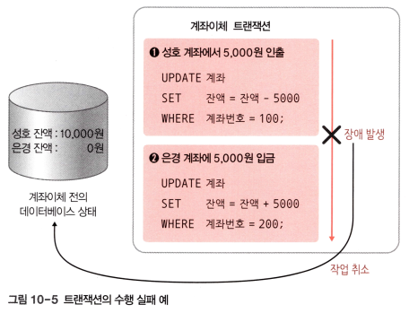
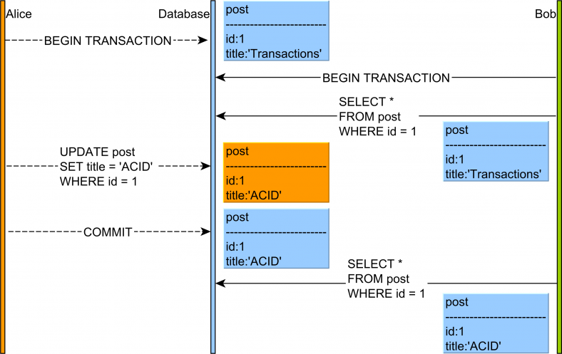
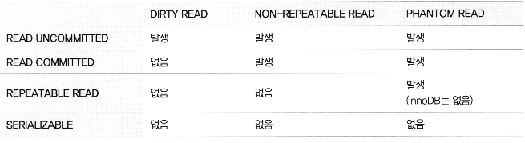

# <a href = "../README.md" target="_blank">스프링 DB 1편 - 데이터 접근 핵심 원리</a>
## Chapter 03. 트랜잭션 이해
### 3.01 트랜잭션 - 개념 
1) 트랜잭션(Transaction)
2) 커밋과 롤백
3) 트랜잭션의 4대 특성 : ACID
4) 트랜잭션의 격리 수준 완화에 따라 일어나는 현상들
5) 트랜잭션 격리 수준 - Isolation level

---

# 3.01 트랜잭션 - 개념 이해

---

## 1) 트랜잭션(Transaction)

### 1.1 트랜잭션이란
- 하나의 작업을 수행하는데 필요한 데이터베이스의 연산들을 모아놓은 것. SQL의 모임.
- 논리적 작업의 단위
- 장애가 발생했을 때 데이터를 복구하는 작업의 단위
- 영단어 transaction은 거래를 의미함. 데이터베이스에서 트랜잭션은 하나의 거래, 더 일반화해서 '논리적인 작업'을 안전하게 처리하도록 보장해주기 위해 도입.

### 1.2 트랜잭션의 필요성 : 5000원 계좌이체 사례
1. "5000원 계좌이체"라는 거래는 아래의 2가지 작업이 합쳐져서 하나의 작업처럼 동작해야 한다.
   - A의 잔고를 5000원 감소 
   - B의 잔고를 5000원 증가

2. 만약 1번은 성공했는데 2번에서 시스템에 문제가 발생하면 계좌이체는 실패하고, A의 잔고만 5000원 감소하는 심각한 문제가 발생한다.

3. 트랜잭션이 있다면
   - 둘다 함께 성공해야 저장하고, 중간에 하나라도 실패하면 거래 전의 상태로 돌아갈 수 있다.
   - 만약 1번은 성공했는데 2번에서 시스템에 문제가 발생하면 계좌이체는 실패하고, 거래 전의 상태로 완전히 돌아갈 수 있다.

---

## 2) 커밋과 롤백

### 2.1 커밋(Commit)
- 모든 작업이 성공해서 데이터베이스에 정상 반영되는 것

### 2.2 롤백(Rollback)
- 트랜잭션 내의 연산 중 하나라도 실패했을 경우 이전 상태로 되돌리는 것
- 롤백이 일어나는 덕분에 데이터 무결성을 유지할 수 있다.

---

## 3) 트랜잭션의 4대 특성 : ACID
트랜잭션은 데이터베이스의 무결성과 일관성을 보장하기 위해 ACID(https://en.wikipedia.org/wiki/ACID)라 하는 4가지 특성을 보장해야한다.

### 3.1 원자성(Atomicity)

- ALL or Nothing
- 트랜잭션 내에서 실행한 작업들이 마치 하나의 작업인 것처럼 모두 성공 하거나 모두 실패됨이 보장되어야 함.

### 3.2 일관성(Consistency)

- 데이터 조작 전 후에 데이터베이스가 일관된 상태를 유지하는 것을 보증
  - 예) 계좌이체 거래 후, 구매자의 잔고에서 구매액이 빠져나가고, 판매자의 잔고에 딱 맞는 판매액이 입금되어 있어야 함.
- 테이블에서 정의된 무결성 제약조건을 항상 만족해야함
  - 예) 트랜잭션 후, 중복된 이메일을 가진 사용자가 새로 등록되어서는 안 됨.

### 3.3 격리성(Isolation)
- 동시에 실행되는 트랜잭션들이 서로에게 영향을 미치지 않도록 격리
  - 동시에 같은 데이터를 수정하지 못하도록해야함.
- 격리성을 완전히 보장하기 위해서는 트랜잭션 간에 격리성을 완벽히 보장하려면 트랜잭션을 거의 순서대로 실행해야 한다.
  - 이렇게 하면 동시 처리 성능이 매우 나빠진다. 이런 문제로 인해 ANSI 표준은 트랜잭션의 격리 수준을 4단계로 나누어 정의했다.

---

### 3.4 지속성(Durability)
- 트랜잭션이 성공적으로 완료된 후 데이터베이스에 반영한 수행 결과는 어떠한 경우에도 손실되지 않고 영구적이어야 함.
- 시스템에 장애가 발생하더라도, 트랜잭션 작업 결과는 없어지지 않고 데이터베이스 '로그' 등을 통해 데이터베이스에 그대로 남아 있어야 함.
- 언제든 데이터베이스 '로그' 등을 통해 성공된 트랜잭션 내용을 복구해야함.
  - 실제로 MySQL뿐만 아니라, 많은 데이터베이스의 구현에서는 트랜잭션 조작을 하드 디스크에 '로그'로 기록하고 시스템에 이상이 발생 시 그 로그를 사용해 이상 발생 전의 상태까지 복원하는 것으로 지속성을 실현하고 있다.

---

## 4) 트랜잭션의 격리 수준 완화에 따라 일어나는 현상들

### 4.1 더티 읽기(Dirty Read)

- 어떤 트랜잭션이 커밋되기 전에 다른 트랜잭션에서 데이터를 읽는 현상
- 사용자 A가 값을 변경하고 아직 커밋하지 않았는데 사용자 B가 변경 이전의 더럽혀진 데이터(Dirty Data)를 읽는 것
- `READ UNCOMMITTED` 격리 수준에서 이 현상이 발생한다.

### 4.2 반복 불가능한 읽기, 애매한 읽기(Non-Repeatable Read / Fuzzy Read)

- 어떤 트랜잭션이 이전에 읽어들인 데이터를 다시 읽어들일 때 2회 이후의 결과가 1회 때와 다른 현상
- 트랜잭션 B가 데이터를 최초에 조회하고 트랜잭션 A에서 데이터가 변경, 커밋된 뒤, 다시 트랜잭션 B에서 데이터를 조회하면 처음 조회했을 때와 다른 데이터가 조회됨
- 읽어들인 행의 속성값의 신뢰성을 보장하지 못 하는 현상
- `READ COMMITTED` 격리 수준 이하에서 이 현상이 발생한다.

### 4.3 팬텀 읽기(Phantom Read)

- 어떤 트랜잭션을 읽을 때 선택할 수 있는(SELECT) 데이터가 나타나거나 사라지는 현상
  - 나타났다 사라지는 유령(Phantom) 같다는 의미에서 붙여짐
- 처음 조회했을 때와, 나중에 조회했을 때의 선택되는 데이터의 갯수가 달라짐
- `REPEATABLE READ` 격리수준에서 이런 현상이 발생한다.

---

## 5) 트랜잭션 격리 수준 - Isolation level

- ANSI가 정의하는 트랜잭션 격리 수준들은 아래의 4가지이다.
  - READ UNCOMMITTED
  - READ COMMITTED
  - REPEATABLE READ
  - SERIALIZABLE

### 5.1 READ UNCOMMITTED(커밋되지 않은 읽기)
- **Dirty Read**, Non-Repeatable Read, Phantom Read 발생
  - 아직 커밋되지도 않은 더럽혀진 데이터가 읽힌다.
- RDBMS 표준에서는 트랜잭션의 격리수준으로 인정하지 않을 정도로 정합성에 문제가 많은 격리 수준

### 5.2 READ COMMITTED(커밋된 읽기)
- Oracle DBMS에서 기본으로 사용되는 격리 수준
- **Non-Repeatable Read**, Phantom Read 발생
  - Dirty Read는 발생하지 않음
  - 같은 트랜잭션에서 데이터를 다시 조회했을 때 데이터가 변경되어져 있을 가능성이 있음.
- 동일 데이터를 여러번 읽고 변경하는 금전적인 처리와 관련되면 문제가 발생할 여지가 있음.

### 5.3 REPEATABLE READ(반복 가능한 읽기)
- MySQL에서 기본으로 사용되는 격리수준
- Phantom Read 발생(InnoDB는 갭락, 넥스트 키 락 덕분에 없음!)

### 5.4 SERIALIZABLE(직렬화 가능)
- 한 트랜잭션에서 읽고 쓰는 레코드를 다른 트랜잭션에서 절대 접근할 수 없음
- 동시 처리 성능이 매우 느리므로 실무에서 사용하지 않음

---
