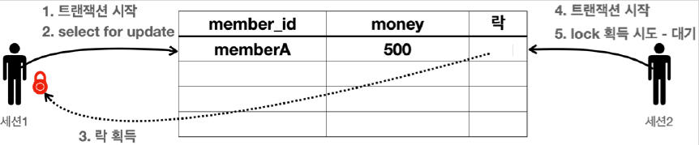

# <a href = "../README.md" target="_blank">스프링 DB 1편 - 데이터 접근 핵심 원리</a>
## Chapter 03. 트랜잭션 이해
### 3.09 DB 락 - 조회
1) 일반적인 조회는 락을 사용하지 않는다.
2) 조회 시 락을 획득하는 방법 : SELECT ~ FOR UPDATE
3) 조회 시점에 락이 필요한 경우 : 강제로 외부의 수정을 막아야 할 때
4) (실습) 조회 시 락 획득
5) 각 DB마다 트랜잭션, 락 동작이 다르다.

---

# 3.09 DB 락 - 조회

---

## 1) 일반적인 조회는 락을 사용하지 않는다.
- 데이터베이스마다 다르지만, 보통 데이터를 조회할 때는 락을 획득하지 않고 바로 데이터를 조회할 수 있다.
  - 예) 세션1이 락을 획득하고 데이터를 변경하고 있어도, 세션2에서 데이터를 조회는 할 수 있다.
- 물론 세션2에서 조회가 아니라 데이터를 변경하려면 락이 필요하기 때문에 락이 돌아올 때 까지 대기해야한다.

---

## 2) 조회 시 락을 획득하는 방법 : SELECT ~ FOR UPDATE
```sql
SELECT [칼럼명]
FROM [테이블명]
WHERE 조건
FOR UPDATE;
```
- `SELECT ~ FOR`문을 사용하면 세션1이 조회 시점에 락을 가져감
- 다른 세션에서 해당 데이터를 변경할 수 없다.
- 물론 이 경우도 트랜잭션을 커밋하면 락을 반납한다.

---

## 3) 조회 시점에 락이 필요한 경우 : 강제로 외부의 수정을 막아야 할 때
- 트랜잭션 종료 시점까지 해당 데이터를 다른 곳에서 변경하지 못하도록 강제로 막아야 할 때 사용
  - 예)
    - 애플리케이션 로직에서 memberA 의 금액을 조회한 다음에 이 금액 정보로 애플리케이션에서 어떤 계산을 수행 
    - 그런데 이 계산이 돈과 관련된 매우 중요한 계산이어서 계산을 완료할 때 까지 memberA 의 금액을 다른곳에서 변경하면 안됨
    - 이럴 때 조회 시점에 락을 획득하면 다른 트랜잭션에서 수정 자체를 막을 수 있다.

---

## 4) (실습) 조회 시 락 획득

### 4.1 기본 데이터 입력
```sql
set autocommit true;
delete from member;
insert into member(member_id, money) values ('memberA', 10000);
```
- 초기에 memberA의 돈은 10000원이다.

### 4.2 세션 1의 조회 시 락 획득

```sql
-- 세션 1

set autocommit false;
select * from member where member_id='memberA' for update;
```
- `select for update` 구문을 사용하면 조회를 하면서 동시에 선택한 row의 락도 획득한다.
  - 물론 락이 없다면 락을 획득할 때 까지 대기해야 한다.
- 세션1은 트랜잭션을 종료할 때 까지 memberA 의 row의 락을 보유한다.

### 4.3 락을 획득하려는 세션 2는 락 때문에 대기
```sql
-- 세션 2
set autocommit false;
update member set money=500 where member_id = 'memberA';    
```
- 세션2는 데이터를 변경하고 싶다. 데이터를 변경하려면 락이 필요하다.
- 세션1이 memberA row의 락을 획득했기 때문에 세션2는 락을 획득할 때 까지 대기한다.
  - 만약 락 타임아웃 시간이 지나면 락 타임아웃 예외가 발생한다.

### 4.4 세션 1의 커밋 후 락 반납
```sql
-- 세션1
commit;
```
- 이후에 세션1이 커밋을 수행하면 락이 반납된다.

### 4.5 세션 2의 락 획득, update 수행
- 세션2가 락을 획득하고 데이터를 변경한다.

### 4.6 세션 2의 커밋, 락 반납
```sql
-- 세션2
commit;
```
- 세션2도 커밋해서 데이터를 반영해준다.
- 커밋을 했으므로 락도 반납된다.

---

## 5) 각 DB마다 트랜잭션, 락 동작이 다르다.
- 트랜잭션과 락은 데이터베이스마다 실제 동작하는 방식이 조금씩 다름
- 해당 데이터베이스 메뉴얼을 확인해보고, 의도한대로 동작하는지 테스트한 이후에 사용하자.
- 트랜잭션과 락에 대한 더 깊이있는 내용은 JPA 책 16.1 트랜잭션과 락을 참고하자.

---
