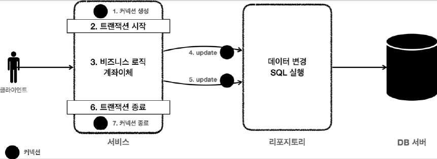

# <a href = "../README.md" target="_blank">스프링 DB 1편 - 데이터 접근 핵심 원리</a>
## Chapter 03. 트랜잭션 이해
### 3.11 트랜잭션 - 적용2
1) 트랜잭션은 서비스 계층에서 시작되고 끝나야 한다.
2) 트랜잭션을 사용하는 동안 같은 커넥션을 유지해야한다.
3) (실습) 리포지토리에 커넥션 전달 - MemberRepositoryV2
4) (실습) 서비스 계층에 트랜잭션 도입 - MemberServiceV2
5) (실습) 테스트 환경 준비 - MemberServiceV2Test
6) (실습) 정상 이체 상황 테스트
7) (실습) 이체중 예외 발생 상황 테스트
8) 한계점 - 트랜잭션 적용 후 서비스 계층의 코드가 복잡해짐

---

# 3.11 트랜잭션 - 적용2

---

## 1) 트랜잭션은 서비스 계층에서 시작되고 끝나야 한다.

- 트랜잭션은 비즈니스 로직이 있는 서비스 계층에서 시작해야 한다.
- 비즈니스 로직이 잘못되면 해당 비즈니스 로직으로 인해 문제가 되는 부분을 함께 롤백해야 하기 때문이다.

---

## 2) 트랜잭션을 사용하는 동안 같은 커넥션을 유지해야한다.

### 2.1 커넥션 - 세션 - 트랜잭션
- 커넥션을 맺으면서 DB에 세션이 생성되고, 세션이 트랜잭션을 수행한다.
- 하나의 트랜잭션은 하나의 세션에서 처음부터 끝까지 동작한다.

### 2.2 같은 커넥션을 유지해야한다.

- 트랜잭션을 시작하려면 커넥션이 필요하다.
- 결국 서비스 계층에서 커넥션을 만들고, 트랜잭션 커밋 이후에 커넥션을 종료해야 한다.
- 애플리케이션에서 DB 트랜잭션을 사용하려면 **트랜잭션을 사용하는 동안 같은 커넥션을 유지**해야한다.
  - 그래야 같은 세션을 사용할 수 있다.

### 2.3 어떻게 커넥션을 유지할까?
- 가장 단순한 방법은 **커넥션을 파라미터로 전달해서 같은 커넥션이 사용되도록 유지**하는 것이다.

---

## 3) (실습) 리포지토리에 커넥션 전달 - MemberRepositoryV2


### 3.1 커넥션을 외부에서 주입
```java
    public Member findById(Connection conn, String memberId) throws SQLException {
        String sql = "SELECT member_id, money\n" +
                "FROM member\n" +
                "WHERE member_id = ?";

        // Connection conn = null;  
        PreparedStatement pstmt = null;
        ResultSet rs = null;

        try {
            // conn = getConnection(); -- 커넥션을 외부에서 가져오므로 코드를 지움
            pstmt = conn.prepareStatement(sql);

          // 생략
        }
    }   
```
- 커넥션 유지가 필요한 두 메서드는 파라미터로 넘어온 커넥션을 사용해야 한다.
- 따라서 `con = getConnection()` 코드가 있으면 안된다.

### 3.2 커넥션을 반환하지 않도록 함
```java
        } finally {
            // 커넥션(Connection)은 여기서 닫지 않는다!!!

            JdbcUtils.closeResultSet(rs);
            JdbcUtils.closeStatement(pstmt);
            // JdbcUtils.closeConnection(conn); // 커넥션을 유지해야함. 여기서 커넥션을 닫으면 안 된다.
        }
```
- 커넥션 유지가 필요한 두 메서드는 리포지토리에서 커넥션을 닫으면 안된다.
- 커넥션을 전달 받은 리포지토리 뿐만 아니라 이후에도 커넥션을 계속 이어서 사용하기 때문이다.
- 이후 **서비스 로직이 끝날 때** 서비스 계층에서 트랜잭션을 종료하고 닫아야 한다.

---

## 4) (실습) 서비스 계층에 트랜잭션 도입 - MemberServiceV2

### 4.1 커넥션을 서비스 계층에서 생성
```java
    public void accountTransfer(String fromId, String toId, int money) throws SQLException {

        Connection conn = dataSource.getConnection(); // 트랜잭션을 시작하려면 커넥션이 필요하다.
        try {
            conn.setAutoCommit(false); // 트랜잭션 시작
            // 비즈니스 로직
            businessLogic(conn, fromId, toId, money);

            // 커밋, 롤백
            conn.commit(); // 성공 시 커밋
        } catch (Exception e) {
            conn.rollback(); // 실패 시 롤백
            throw  new IllegalStateException(e); // 일단 예외를 감싸서 덤지도록 처리함
        } finally {
            release(conn);
        }
    }
```
- 서비스 계층에서 트랜잭션이 시작되고 종료되어야하므로 서비스 계층에서 커넥션을 얻어온다.
  - `Connection con = dataSource.getConnection()`
- 트랜잭션을 시작할 때 `conn.setAutoCommit(false)`를 호출하여 트랜잭션을 시작한다.
  - 트랜잭션을 시작하려면 자동 커밋 모드를 꺼야한다.
  - 커넥션을 통해 세션에 `set autocommit false` 가 전달되고, 이후부터는 수동 커밋 모드로 동작한다.


### 4.2 비즈니스 로직을 별도로 분리
```java
      businessLogic(conn, fromId, toId, money);
```
```java
    private void businessLogic(Connection conn, String fromId, String toId, int money) throws SQLException {
        // 비즈니스 로직 수행
        Member fromMember = memberRepository.findById(conn, fromId);
        Member toMember = memberRepository.findById(conn, toId);

        memberRepository.update(conn, fromId, fromMember.getMoney()- money);

        validation(toMember);

        memberRepository.update(conn, toId, toMember.getMoney() + money);
    }
```
- 트랜잭션이 시작된 커넥션을 리포지토리에 전달하면서 비즈니스 로직을 수행한다.
- 이렇게 분리한 이유는 트랜잭션을 관리하는 로직과 실제 비즈니스 로직을 구분하기 위함이다.
- `memberRepository.update(con..)`
  - 비즈니스 로직을 보면 리포지토리를 호출할 때 커넥션을 전달하는 것을 확인할 수 있다.

### 4.3 커밋, 롤백
```java
        // 커밋, 롤백
            conn.commit(); // 성공 시 커밋
        } catch (Exception e) {
            conn.rollback(); // 실패 시 롤백
            throw  new IllegalStateException(e); // 일단 예외를 감싸서 덤지도록 처리함
        } 
```
- 비즈니스 로직을 수행하고 성공 시 커밋, 실패 시 롤백을 시킨다.
  - `conn.commit()` : 커밋
  - `conn.rollback()` : 롤백
    서비스 계층에서 트랜잭션이 시작되고 종료되어야하므로 서비스 계층에서 커넥션을 얻어온다.


## 4.4 커넥션 반환, 트랜잭션 종료
```java
        } finally {
            release(conn);
        }
```
```java
    private void release(Connection conn) {
        if (conn != null) {
            try {
                conn.setAutoCommit(true); // 자동커밋은 기본적으로 활성화되어 있기 때문에 다시 true로 바꾸고 반환해야한다.
                conn.close();
            } catch (Exception e) {
                log.info("error message = {}", e);
            }
        }
    }
```
- `finally {..}` 를 사용해서 커넥션을 모두 사용하고 나면 안전하게 종료한다.
- 그런데 커넥션 풀을 사용하면 `conn.close()` 를 호출 했을 때 커넥션이 종료되는 것이 아니라 풀에 반납된다.
- 현재 수동 커밋 모드로 동작하기 때문에 풀에 돌려주기 전에 기본 값인 자동 커밋 모드로 변경하는 것이 안전하다.
  - 기본적으로 모든 세션에서는 자동 커밋 모드가 디폴트다.
  - 수동 커밋 모드의 커넥션을 반환하면 의도치 않게 동작할 위험이 있다.

---

## 5) (실습) 테스트 환경 준비 - MemberServiceV2Test

### 5.1 데이터베이스 초기화
```sql
DELETE FROM member;
```
- 테스트를 수행하기 전에 데이터베이스의 데이터를 모두 삭제

### 5.2 Test 클래스 초기화 설정
```java
class MemberServiceV2Test {

    public static final String MEMBER_A = "memberA";
    public static final String MEMBER_B = "memberB";
    public static final String MEMBER_EX = "ex";

    private MemberRepositoryV2 memberRepository;
    private MemberServiceV2 memberService;

    @BeforeEach
    void before() {
        DriverManagerDataSource datasource = new DriverManagerDataSource(URL, USERNAME, PASSWORD);
        memberRepository = new MemberRepositoryV2(datasource);
        memberService = new MemberServiceV2(memberRepository, datasource);
    }
}
```
- 리포지토리, 서비스를 V2로 변경
- 의존관계 주입에 주의(service가 datasource를 의존해야한다.)
- 그 외에는 별 달리 변경할 코드가 없다.

---

## 6) (실습) 정상 이체 상황 테스트
```java
    @Test
    @DisplayName("정상 이체")
    public void accountTransfer() throws Exception {
        //given
        Member memberA = new Member(MEMBER_A, 10000);
        Member memberB = new Member(MEMBER_B, 10000);
        memberRepository.save(memberA);
        memberRepository.save(memberB);

        //when
        memberService.accountTransfer(memberA.getMemberId(), memberB.getMemberId(), 2000);

        //then
        Member afterMemberA = memberRepository.findById(memberA.getMemberId());
        Member afterMemberB = memberRepository.findById(memberB.getMemberId());
        assertThat(afterMemberA.getMoney()).isEqualTo(8000);
        assertThat(afterMemberB.getMoney()).isEqualTo(12000);
    }

```
- 별달리 수정할 코드가 없고 결과도 이전과 같다.

---

## 7) (실습) 이체중 예외 발생 상황 테스트

```java
    @Test
    @DisplayName("이체 중 예외 발생")
    public void accountTransferEx() throws Exception {
        //given
        Member memberA = new Member(MEMBER_A, 10000);
        Member memberEx = new Member(MEMBER_EX, 10000);
        memberRepository.save(memberA);
        memberRepository.save(memberEx);

        //when
        assertThatThrownBy(() ->
                memberService.accountTransfer(memberA.getMemberId(), memberEx.getMemberId(), 2000))
                .isInstanceOf(IllegalStateException.class);
        
        // 예외 발생 -> 롤백
        
        Member afterMemberA = memberRepository.findById(memberA.getMemberId());
        Member afterMemberEx = memberRepository.findById(memberEx.getMemberId());
        assertThat(afterMemberA.getMoney()).isEqualTo(10000);
        assertThat(afterMemberEx.getMoney()).isEqualTo(10000);
    }
```
- `given`: 다음 데이터를 저장해서 테스트를 준비한다.
  - `memberA` 10000원
  - `memberEx` 10000원
- `when`: 계좌이체 로직을 실행한다.
  - `memberService.accountTransfer()`를 실행한다.
  - `memberA` → `memberEx` 로 2000원 계좌이체 한다.
  - `memberA` 의 금액이 2000원 감소한다.
  - `memberEx` 회원의 ID는 ex 이므로 중간에 예외가 발생한다.
- **예외가 발생했으므로 트랜잭션을 롤백한다.**
- 계좌이체는 실패했다. 롤백을 수행해서 memberA 의 돈이 기존 10000원으로 복구되었다.
  - `memberA` 10000원 - 트랜잭션 롤백으로 복구된다.
  - `memberB` 10000원 - 중간에 실패로 로직이 수행되지 않았다. 따라서 그대로 10000원으로 남아있게 된다.
- 결론
  - 트랜잭션 덕분에 계좌이체가 실패할 때 롤백을 수행해서 모든 데이터를 정상적으로 초기화 할 수 있게 되었다.
  - 결과적으로 계좌이체를 수행하기 직전으로 돌아가게 된다.

## 8) 한계점 - 트랜잭션 적용 후 서비스 계층의 코드가 복잡해짐
```java
    public void accountTransfer(String fromId, String toId, int money) throws SQLException {

        Connection conn = dataSource.getConnection(); // 트랜잭션을 시작하려면 커넥션이 필요하다.
        try {
            conn.setAutoCommit(false); // 트랜잭션 시작
            // 비즈니스 로직
            businessLogic(conn, fromId, toId, money);

            // 커밋, 롤백
            conn.commit(); // 성공 시 커밋
        } catch (Exception e) {
            conn.rollback(); // 실패 시 롤백
            throw  new IllegalStateException(e); // 일단 예외를 감싸서 덤지도록 처리함
        } finally {
            release(conn);
        }
    }
```
- 애플리케이션에서 DB 트랜잭션을 적용하려 해보니, 서비스 계층의 코드가 복잡해짐
  - 커넥션을 서비스에서 얻어와야함 (+서비스가 DataSource를 알아야함)
  - 리포지토리의 각 계층에 커넥션을 매번 전달해야함
    - Repository도 전달받은 커넥션을 사용할 수 있도록 구현되어 있어야한다.
  - 커넥션을 반환하는 과정도 생각보다 복잡함
- 이런 복잡함을 스프링에서 어떻게 추상화하고 해결했는 지 학습해야한다.

---
