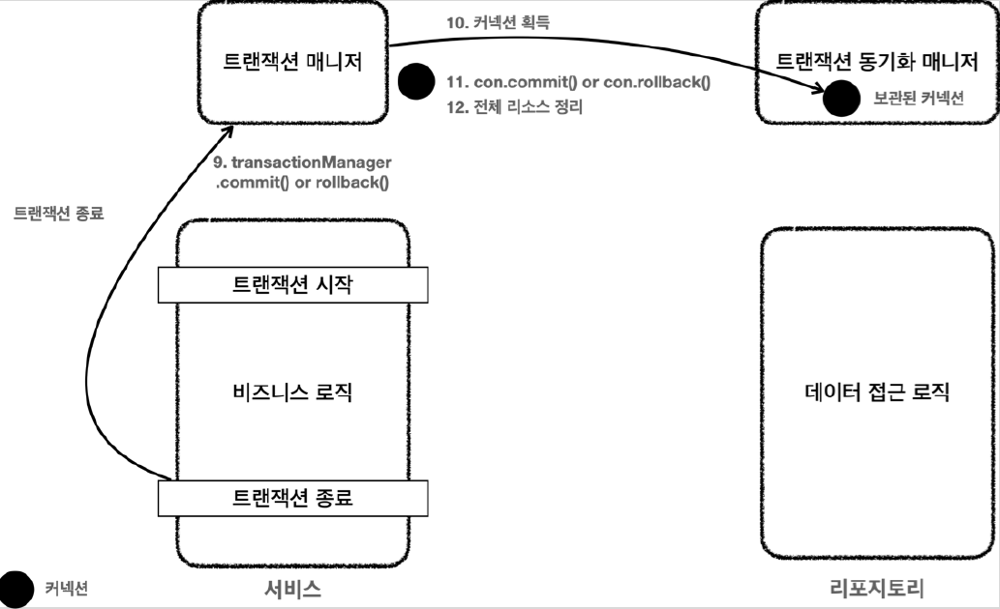

# <a href = "../README.md" target="_blank">스프링 DB 1편 - 데이터 접근 핵심 원리</a>
## Chapter 04. 스프링과 문제 해결 - 트랜잭션
### 4.05 트랜잭션 문제 해결 - 트랜잭션 매니저2
1) 트랜잭션 매니저 기반 트랜잭션 흐름1 : 트랜잭션 시작
2) 트랜잭션 매니저 기반 트랜잭션 흐름2 : 로직 실행
3) 트랜잭션 매니저 기반 트랜잭션 흐름3 : 트랜잭션 종료
4) 결론 : 트랜잭션의 추상화, 동기화 성공
5) 아직 남아있는 문제 : 예외 누수
---

# 4.05 트랜잭션 문제 해결 - 트랜잭션 매니저2

---

## 1) 트랜잭션 매니저 기반 트랜잭션 흐름1 : 트랜잭션 시작


클라이언트의 요청으로 서비스 로직을 실행한다.

1. `서비스 계층에서 transactionManager.getTransaction()` 을 호출해서 트랜잭션을 시작한다.
2. 트랜잭션을 시작하려면 먼저 데이터베이스 커넥션이 필요하다. 트랜잭션 매니저는 내부에서 데이터소스를 사용해서 커넥션을 생성한다.
   - 서비스 계층에서 커넥션을 직접적으로 다루지 않아도 된다.
3. 커넥션을 수동 커밋 모드로 변경(`set autocommit false`)해서 실제 데이터베이스 트랜잭션을 시작한다.
4. 커넥션을 트랜잭션 동기화 매니저에 보관한다.
   - 트랜잭션 동기화 매니저는 쓰레드 로컬에 커넥션을 보관한다.
   - 따라서 멀티 쓰레드 환경에 안전하게 커넥션을 보관할 수 있다.

---

## 2) 트랜잭션 매니저 기반 트랜잭션 흐름2 : 로직 실행


1. 서비스는 비즈니스 로직을 실행하면서 리포지토리의 메서드들을 호출한다. 
   - 이때 커넥션을 파라미터로 전달하지 않는다.
2. 리포지토리 메서드들은 트랜잭션이 시작된 커넥션이 필요하다. 리포지토리는 `DataSourceUtils.getConnection(datasource)` 을 사용해서 트랜잭션 동기화 매니저에 보관된 커넥션을 꺼내서 사용한다.
   - 이 메서드는 트랜잭션 동기화 매니저에 이 과정을 통해서 같은 스레드의 커넥션이 있을 경우 꺼내서 쓰고, 커넥션이 없을 경우 datasource를 통해 커넥션을 얻어온다.
   - 이 과정을 통해서 자연스럽게 같은 커넥션을 사용하고, 트랜잭션도 유지된다.
3. 획득한 커넥션을 사용해서 SQL을 데이터베이스에 전달해서 실행한다.
4. SQL을 실행 후 `DataSourceUtils.releaseConnection(con, datasource)`를 통해 커넥션을 유지한다.
   - 트랜잭션 동기화 매니저를 통해 관리되는 커넥션은 유지
   - 트랜잭션 동기화 매니저를 통해 관리되지 않는 커넥션은 종료/반환

---

## 3) 트랜잭션 매니저 기반 트랜잭션 흐름3 : 트랜잭션 종료



1. 비즈니스 로직이 끝나고 트랜잭션을 종료한다.
   - 트랜잭션은 커밋(`transactionManager.commit`)하거나 롤백(`transactionManager.rollback`)하면 종료된다.
2. 트랜잭션을 종료하려면 동기화된 커넥션이 필요하다. 트랜잭션 동기화 매니저를 통해 동기화된 커넥션을 획득한다.
3. 획득한 커넥션을 통해 데이터베이스에 트랜잭션을 커밋하거나 롤백한다.
   - `con.commit()`, `con.rollback()`
4. 전체 리소스를 정리한다.
   - 트랜잭션 동기화 매니저를 정리한다. 쓰레드 로컬(`ThreadLocal`)은 사용후 꼭 정리해야 한다.
   - `con.setAutoCommit(true)` 로 되돌린다. 커넥션 풀을 고려해야 한다.
   - `con.close()` 를 호출해셔 커넥션을 종료한다. 커넥션 풀을 사용하는 경우 `con.close()` 를 호출하면 커넥션 풀에 반환된다.

---

## 4) 결론 : 트랜잭션의 추상화, 동기화 성공

- 트랜잭션 추상화 덕분에 서비스 코드는 이제 JDBC 기술에 의존하지 않는다.
  - 이후 JDBC에서 JPA로 변경해도 서비스 코드를 그대로 유지할 수 있다.
  - 기술 변경시 의존관계 주입만 `DataSourceTransactionManager` 에서 `JpaTransactionManager` 로 변경해주면 된다.
- 트랜잭션 동기화 매니저 덕분에 커넥션을 파라미터로 넘기지 않아도 된다.

---

## 5) 아직 남아있는 문제 : 예외 누수
```java
    private void businessLogic(String fromId, String toId, int money) throws SQLException {
        // 비즈니스 로직 수행
        Member fromMember = memberRepository.findById(fromId);
        Member toMember = memberRepository.findById(toId);

        memberRepository.update(fromId, fromMember.getMoney()- money);

        validation(toMember);

        memberRepository.update(toId, toMember.getMoney() + money);
    }
```
- 리포지토리 계층에서 throw된 `java.sql.SQLException` 이 아직 남아있음.
- 서비스 계층에서 jdbc 기술에서 발생한 예외 `SQLException`을 알고 있음.
- 이 부분은 뒷 부분에서 다룸

---