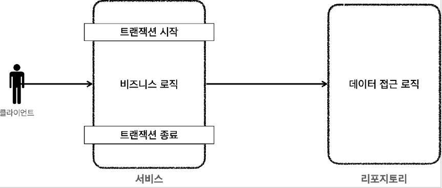

# <a href = "../README.md" target="_blank">스프링 DB 1편 - 데이터 접근 핵심 원리</a>
## Chapter 04. 스프링과 문제 해결 - 트랜잭션
### 4.07 트랜잭션 문제 해결 - 트랜잭션 AOP 이해
1) 프록시 도입 이전 : 서비스에서 트랜잭션, 비즈니스 로직 모두 사용
2) 프록시 도입 이후 : 트랜잭션 프록시가 트랜잭션 관리
3) 스프링이 제공하는 트랜잭션 AOP : `@Transactional`

---

# 4.07 트랜잭션 문제 해결 - 트랜잭션 AOP 이해

---

## 1) 프록시 도입 이전 : 서비스에서 트랜잭션, 비즈니스 로직 모두 사용

```java
public void accountTransfer(String fromId, String toId, int money) {
    txTemplate.executeWithoutResult(
            status -> {
                try {
                    businessLogic(fromId, toId, money);
                } catch (SQLException e) {
                    throw new IllegalStateException(e);
                }
            }
    );
}
```
- 프록시를 도입하기 전에는 기존처럼 서비스의 로직에서 트랜잭션을 직접 시작한다.
- 서비스에 비즈니스 로직과 트랜잭션 처리 로직이 함께 섞여있다.

---

## 2) 프록시 도입 이후 : 트랜잭션 프록시가 트랜잭션 관리

```java
    public void accountTransfer(String fromId, String toId, int money) {
        businessLogic(fromId, toId, money);
    }
```
- 프록시를 사용하면 트랜잭션을 처리하는 객체와 비즈니스 로직을 처리하는 서비스 객체를 명확하게 분리할 수 있다.
- 트랜잭션 프록시가 트랜잭션 처리 로직을 모두 가져간다. 그리고 트랜잭션을 시작한 후에 실제 서비스를 대신 호출한다.
- 트랜잭션 프록시 덕분에 서비스 계층에는 순수한 비즈니즈 로직만 남길 수 있다.

---

## 3) 스프링이 제공하는 트랜잭션 AOP : `@Transactional`
- 스프링이 제공하는 AOP 기능을 사용하면 프록시를 매우 편리하게 적용할 수 있다.
- `@Aspect` , `@Advice` , `@Pointcut` 를 사용하여 트랜잭션 AOP를 처리할 수 있다.
  - 스프링 핵심원리 고급편에서 이 부분을 다룸
- 물론 스프링 AOP를 직접 사용해서 트랜잭션을 처리해도 되지만, 트랜잭션은 매우 중요한 기능이고, 전세계 누구나 다 사용하는 기능이라서 스프링은 트랜잭션 AOP를 처리하기 위한 모든 기능을 제공한다.
  - 어드바이저: `BeanFactoryTransactionAttributeSourceAdvisor`
  - 포인트컷: `TransactionAttributeSourcePointcut`
  - 어드바이스: `TransactionInterceptor`
- 스프링 부트를 사용하면 트랜잭션 AOP를 처리하기 위해 필요한 스프링 빈들도 자동으로 등록해준다.
- 개발자는 트랜잭션 처리가 필요한 곳에 `@Transactional` 어노테이션만 붙여주면 된다.
  - `org.springframework.transaction.annotation.Transactional`
  - 스프링의 트랜잭션 AOP는 이 어노테이션을 인식해서 트랜잭션 프록시를 적용해준다.

---
