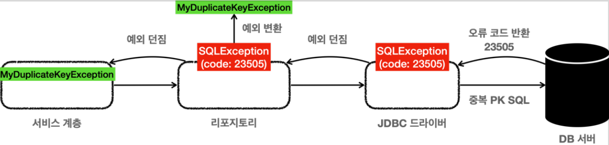

# <a href = "../README.md" target="_blank">스프링 DB 1편 - 데이터 접근 핵심 원리</a>
## Chapter 06. 스프링과 문제 해결 - 예외 처리, 반복
### 6.3 데이터 접근 예외 직접 만들기
1) 요구사항 : 특정 DB 오류에 한해서는 개발자 의도대로 복구, 임의 처리
2) 데이터베이스 에러코드와 Jdbc의 SQLException
3) 리포지토리는 DB예외를 서비스 예외로 추상화해서 던져야한다.
4) (실습) 중복키 예외 정의 : MyDuplicateKeyException
5) (실습) 예외 변환 - ExTranslatorV1Test
6) (한계) 너무 많은 DB예외, 각 DB마다 예외코드가 다름
---

# 6.3 데이터 접근 예외 직접 만들기

---

## 1) 요구사항 : 특정 DB 오류에 한해서는 개발자 의도대로 복구, 임의 처리
- 데이터베이스 오류에 따라서 특정 예외는 개발자 의도대로 복구, 임의 처리하고 싶을 수 있다.
- 예외 메시지를 발생시키는게 아니라, 특정 예외 상황일 때는 개발자 임의대로 처리
- 예) 중복 회원 가입시 중복된 id가 `hello`이면 -> `hello12345` 로 가입시키기

## 2) 데이터베이스 에러코드와 Jdbc의 SQLException

### 2.1 Jdbc 데이터베이스 오류 코드 전달 과정

```shell
# H2 데이터베이스의 키 중복 오류 코드
e.getErrorCode() == 23505
```
- 데이터를 DB에 저장할 때 같은 ID가 이미 데이터베이스에 저장되어 있다면, 데이터베이스는 오류 코드를 반환함
- 이 오류 코드를 받은 JDBC 드라이버는 SQLException 을 던진다.
- `SQLException` 에는 데이터베이스가 제공하는 `errorCode` 라는 것이 들어있다.
- `errorCode` 를 활용하면 데이터베이스에서 어떤 문제가 발생했는지 확인할 수 있다.

### 2.2 H2 데이터베이스의 오류코드 예
- 23505 : 키 중복 오류
- 42000 : SQL 문법 오류

### 2.3 각 데이터베이스 제품군별로 같은 오류더라도, 오류코드가 다르다
예를 들어 같은 키 중복 오류 코드더라도
- H2 DB: 23505
- MySQL: 1062
  - (cf) H2 데이터베이스의 에러코드 : [링크](https://www.h2database.com/javadoc/org/h2/api/ErrorCode.html)

---

## 리포지토리는 DB예외를 서비스 예외로 추상화해서 던져야한다.

### 3.1 데이터베이스 예외 확인, 복구
- 서비스 계층에서는 예외 복구를 위해 키 중복 오류를 확인할 수 있어야 한다.
- 그래야 새로운 ID를 만들어서 다시 저장을 시도할 수 있기 때문이다.
- 이러한 과정이 바로 예외를 확인해서 복구하는 과정이다.

### 3.2 리포지토리에서 특정 기술인 SQLException을 바로 던지기?
- 리포지토리는 `SQLException` 을 서비스 계층에 던진다.
- 서비스 계층은 이 예외의 오류 코드를 확인해서 키 중복 오류( 23505 )인 경우 새로운 ID를 만들어서 다시 저장하면 된다.
- SQLException 에 들어있는 오류 코드를 활용하기 위해 SQLException 을 서비스 계층으로 던지게 되면, 서비스 계층이 SQLException 이라는 JDBC 기술에 의존하게 되면서, 지금까지 우리가  고민했던 서비스 계층의 순수성이 무너진다.

### 3.3 특정 기술 종속성 문제 해결 방법
- 이 문제를 해결하려면 앞서 배운 것 처럼 리포지토리에서 예외를 변환해서 던지면 된다.
- `SQLException(특정 기술)` -> `MyDuplicateKeyException(서비스 로직 예외)`

---

## 4) (실습) 중복키 예외 정의 : MyDuplicateKeyException
```java
public class MyDuplicateKeyException extends MyDbException {

    public MyDuplicateKeyException() {
    }

    public MyDuplicateKeyException(String message) {
        super(message);
    }

    public MyDuplicateKeyException(String message, Throwable cause) {
        super(message, cause);
    }

    public MyDuplicateKeyException(Throwable cause) {
        super(cause);
    }
}
```
### 4.1 예외의 계층화
- 기존에 사용했던 `MyDbException`을 상속받아서 의미있는 계층을 형성한다.
- 이렇게하면 데이터베이스 관련 예외라는 계층을 만들 수 있다.

### 4.2 데이터베이스 중복에 국한된 예외
- 이름도 MyDuplicateKeyException 이라는 이름을 지었다. 
- 예외는 데이터 중복의 경우에만 던져야 한다.

### 4.3 특정 기술에 종속되지 않은 예외
- 이 예외는 우리가 직접 만든 것이기 때문에, JDBC나 JPA 같은 특정 기술에 종속적이지 않다.
- 따라서 이 예외를 사용하더라도 서비스 계층의 순수성을 유지할 수 있다. (향후 JDBC에서 다른 기술로 바꾸어도 이 예외는 그대로 유지할 수 있다.)

---

## 5) (실습) 예외 변환 - ExTranslatorV1Test

### 5.1 리포지토리 - DB 중복키 예외를 서비스 중복키 예외로 별도 변환 
```java
    @RequiredArgsConstructor
    static class Repository {

        private final DataSource dataSource;

        public Member save(Member member) {
            // 생략
            try {
                // 생략
              
            } catch (SQLException e) {
                // h2 db 중복 예외
                if (e.getErrorCode() == 23505) { // db 중복 예외 -> 서비스 중복 예외 변환
                    throw new MyDuplicateKeyException(e);
                }
                throw new MyDbException(e); // 중복 예외가 아닐 경우 db 예외로 퉁친다.
            } finally {
                JdbcUtils.closeStatement(pstmt);
                JdbcUtils.closeConnection(con);
            }
        }
    }
```
- `e.getErrorCode() == 23505` : 오류 코드가 키 중복 오류( 23505 )인 경우
- `MyDuplicateKeyException` 을 새로 만들어서 서비스 계층에 던진다.
- 나머지 경우 기존에 만들었던 `MyDbException` 을 던진다.

### 5.2 서비스 - 중복키 발생 시, 별도로 복구 처리
```java
        public void create(String memberId) {
            try {
                repository.save(new Member(memberId, 0));
                log.info("saveId = {}", memberId);
            } catch (MyDuplicateKeyException e) { // 중복 예외가 catch됐을 시
                log.info("키 중복, 복구 시도");
                String retryId = generateNewId(memberId);
                log.info("retryId = {}",retryId);
                repository.save(new Member(retryId, 0));
            } catch (MyDbException e) { // 처리할 수 없으므로 외부로 떠넘긴다.
                log.info("데이터 접근 계층 예외", e);
                throw e;
            }

        }

        private String generateNewId(String memberId) { // 랜덤 회원 식별자 생성
            return new StringBuilder(memberId)
                    .append(new Random().nextInt(10000))
                    .toString();
        }
```
- 처음에 저장을 시도한다. 만약 리포지토리에서 `MyDuplicateKeyException` 예외가 올라오면 이 예외를 잡는다.
- 예외를 잡아서 `generateNewId(memberId)` 로 새로운 ID 생성을 시도한다. 그리고 다시 저장한다. 여기가 예외를 복구하는 부분이다.
- 만약 복구할 수 없는 예외(`MyDbException`)면 로그만 남기고 다시 예외를 던진다.
  - 이 경우 여기서 예외 로그를 남기지 않아도 된다. 어차피 복구할 수 없는 예외는 예외를 공통으로 처리하는 부분까지 전달되기 때문이다.
  - 따라서 이렇게 복구 할 수 없는 예외는 공통으로 예외를 처리하는 곳에서 예외 로그를 남기는 것이 좋다.
  - 여기서는 다양하게 예외를 잡아서 처리할 수 있는 점을 보여주기 위해 이곳에 코드를 만들어두었다.

### 5.3 실행
```java
    @Test
    public void duplicateKeySave() {
        service.create("myId");
        service.create("myId"); // 같은 id 저장 시도
    }
```
```shell
Service - saveId=myId
Service - 키 중복, 복구 시도
Service - retryId=myId492
```
- 같은 ID를 저장했지만, 중간에 예외를 잡아서 복구한 것을 확인할 수 있다.

---

## 6) (한계) 너무 많은 DB예외, 각 DB마다 예외코드가 다름
- SQL ErrorCode는 각각의 데이터베이스 마다 다르다.
- 결과적으로 데이터베이스가 변경될 때 마다 ErrorCode도 모두 변경해야 한다.
  - 예) 키 중복 오류 코드
    - H2: 23505 
    - MySQL: 1062
- 데이터베이스가 전달하는 오류는 키 중복 뿐만 아니라 락이 걸린 경우, SQL 문법에 오류 있는 경우 등등 수십 수백가지 오류 코드가 있다. 이 모든 상황에 맞는 예외를 지금처럼 다 만들 수는 없다.

---