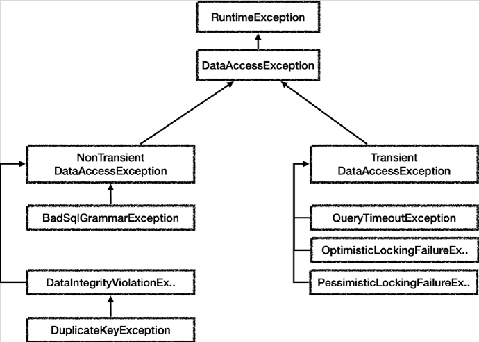
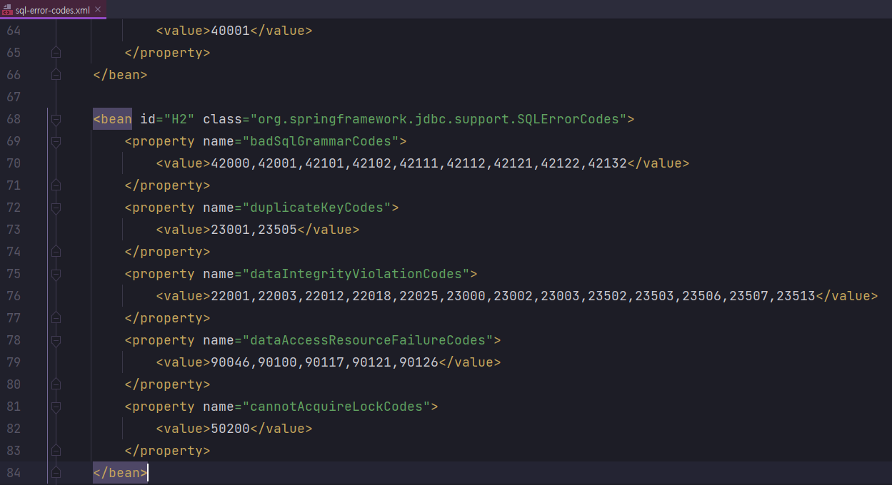

# <a href = "../README.md" target="_blank">스프링 DB 1편 - 데이터 접근 핵심 원리</a>
## Chapter 06. 스프링과 문제 해결 - 예외 처리, 반복
### 6.4 스프링 예외 추상화 이해
1) 스프링이 제공하는 데이터 접근 예외들과 그 계층관계
2) (실습) SQL ErrorCode를 직접 리포지토리에서 확인
3) 스프링이 제공하는 SQL 예외 변환기
4) (실습) SQL 예외 변환기 사용
5) 스프링은 ErrorCode를 읽고 추상화된 예외로 변환한다. : `sql-error-codes.xml`
6) 결론 : 스프링의 공통화된 예외 추상화, 특정 기술 종속성 제거

---

# 6.4 스프링 예외 추상화 이해

---

## 1) 스프링이 제공하는 데이터 접근 예외들과 그 계층관계


※ 그림을 단순화 하기 위해 일부 계층을 생략했다.  

### 1.1 스프링 데이터 접근 예외
- 스프링은 데이터 접근 계층에 대한 수십 가지 예외를 정리해서 일관된 예외 계층을 제공한다.
- 각각의 예외는 특정 기술에 종속적이지 않게 설계되어 있다.
  - 서비스 계층에서도 스프링이 제공하는 예외를 사용하면 된다.
  - JDBC 기술을 사용하든, JPA 기술을 사용하든 스프링이 제공하는 예외를 사용하면 된다.
- JDBC나 JPA를 사용할 때 발생하는 예외를 스프링이 제공하는 예외로 변환해주는 역할도 스프링이 제공한다.
- 스프링 메뉴얼에 모든 예외가 정리되어 있지는 않기 때문에 코드를 직접 열어서 확인해보는 것이 필요하다.

### 1.2 계층 관계 
- 예외의 최고 상위는 `org.springframework.dao.DataAccessException` 이다.
- 그림에서 보는 것 처럼 런타임 예외를 상속 받았기 때문에 스프링이 제공하는 데이터 접근 계층의 모든 예외는 런타임 예외이다.
- DataAccessException 은 크게 2가지로 구분하는데 NonTransient 예외와 Transient 예외이다.
  - `Transient` 는 일시적이라는 뜻이다. Transient 하위 예외는 동일한 SQL을 다시 시도했을 때 성공할 가능성이 있다.
    - 예) 쿼리 타임아웃, 락과 관련된 오류들이다. 이런 오류들은 데이터베이스 상태가 좋아지거나, 락이 풀렸을 때 다시 시도하면 성공할 수 도 있다.
  - `NonTransient` 는 일시적이지 않다는 뜻이다. 같은 SQL을 그대로 반복해서 실행하면 실패한다. 
    - 예) SQL 문법 오류, 데이터베이스 제약조건 위배 등이 있다.

---

## 2) (실습) SQL ErrorCode를 직접 리포지토리에서 확인
```java
    @Test
    public void sqlExceptionErrorCode() {
        String sql = "SELECT bad grammar";
        try {
            Connection con = dataSource.getConnection();
            PreparedStatement stmt = con.prepareStatement(sql);
            stmt.executeQuery();
        } catch (SQLException e) {
            int errorCode = e.getErrorCode();
            assertThat(errorCode).isEqualTo(42122);
            log.info("errorCode = {}",errorCode);

            //org.h2.jdbc.JdbcSQLSyntaxErrorException
            log.info("error!", e);
        }
    }
```
- 이전에 살펴봤던 SQL ErrorCode를 직접 확인하는 방법이다.
- 이렇게 직접 예외를 확인하고 하나하나 스프링이 만들어준 예외로 변환하는 것은 현실성이 없다.
- 이렇게 하려면 해당 오류 코드를 확인하고 스프링의 예외 체계에 맞추어 예외를 직접 변환해야 할 것이다.
- 그리고 데이터베이스마다 오류 코드가 다르다는 점도 해결해야 한다.
- 그래서 스프링은 예외 변환기를 제공한다.

---

## 3) 스프링이 제공하는 SQL 예외 변환기
```java
SQLExceptionTranslator exTranslator = new SQLErrorCodeSQLExceptionTranslator(dataSource);
DataAccessException resultEx = exTranslator.translate("select", sql, e);
```
- `translate(...)` : DB 예외를 적절한 스프링 데이터 접근 계층의 예외로 변환해서 반환
  - 첫번째 파라미터는 읽을 수 있는 설명
  - 두번째 파라미터는 실행한 sql
  - 마지막 파라미터는 발생된 `SQLException` 을 전달 

---

## 4) (실습) SQL 예외 변환기 사용
```java
    @Test
    public void exceptionTranslator() {
        String sql = "SELECT bad grammar";
        try {
            // 생략
        } catch (SQLException e) {
            int errorCode = e.getErrorCode();
            assertThat(errorCode).isEqualTo(42122); // 기존 방식대로면 개발자가 에러코드 일일이 확인하고 그에 맞춰 수동으로 예외를 만들었음
            
            SQLErrorCodeSQLExceptionTranslator exTranslator = new SQLErrorCodeSQLExceptionTranslator(dataSource);
            DataAccessException resultEx = exTranslator.translate("select", sql, e); // 스프링 예외로 변환
            
            log.info("resultEx", resultEx);
            assertThat(resultEx).isInstanceOf(BadSqlGrammarException.class);
        }
    }
```
- 예제에서는 SQL 문법이 잘못되었으므로 `BadSqlGrammarException` 을 반환하는 것을 확인할 수 있다.
- 눈에 보이는 반환 타입은 최상위 타입인 `DataAccessException` 이지만 실제로는 `BadSqlGrammarException` 예외가 반환된다.
  - `BadSqlGrammarException` 은 최상위 타입인 DataAccessException 를 상속 받아서 만들어진다.

---

## 5) 스프링은 ErrorCode를 읽고 추상화된 예외로 변환한다. : `sql-error-codes.xml`

- 각각의 DB마다 SQL ErrorCode는 다르다.
- 그런데 스프링은 어떻게 각각의 DB가 제공하는 SQL ErrorCode까지 고려해서 예외를 변환할 수 있을까?
- `org.springframework.jdbc.support.sql-error-codes.xml`
  - 스프링 SQL 예외 변환기는 SQL ErrorCode를 이 파일에 대입해서 어떤 스프링 데이터 접근 예외로 전환해야 할지 찾아낸다.
  - 예를 들어서 H2 데이터베이스에서 42000 이 발생하면 badSqlGrammarCodes 이기 때문에 BadSqlGrammarException 을 반환한다.
  - 해당 파일을 확인해보면 10개 이상의 우리가 사용하는 대부분의 관계형 데이터베이스를 지원하는 것을 확인할 수 있다.

---

## 6) 결론 : 스프링의 공통화된 예외 추상화, 특정 기술 종속성 제거
- 스프링은 데이터 접근 계층에 대한 일관된 예외 추상화를 제공한다.
- 스프링은 예외 변환기를 통해서 `SQLException` 의 ErrorCode 에 맞는 적절한 스프링 데이터 접근 예외로 변환해준다.
- 만약 서비스, 컨트롤러 계층에서 예외 처리가 필요하면 특정 기술에 종속적인 `SQLException` 같은 예외를 직접 사용하는 것이 아니라, 스프링이 제공하는 데이터 접근 예외를 사용하면 된다.
- 스프링 예외 추상화와 덕분에 특정 기술에 종속적이지 않게 되었다.
  - 이제 JDBC에서 JPA같은 기술로 변경되어도 예외로 인한 변경을 최소화 할 수 있다.
  - 향후 JDBC에서 JPA로 구현 기술을 변경하더라도, 스프링은 JPA 예외를 적절한 스프링 데이터 접근 예외로 변환해준다.
- 물론 스프링이 제공하는 예외를 사용하기 때문에 스프링에 대한 기술 종속성은 발생한다.
  - 스프링에 대한 기술 종속성까지 완전히 제거하려면 예외를 모두 직접 정의하고 예외 변환도 직접 하면 되지만, 실용적인 방법은 아니다.

---
