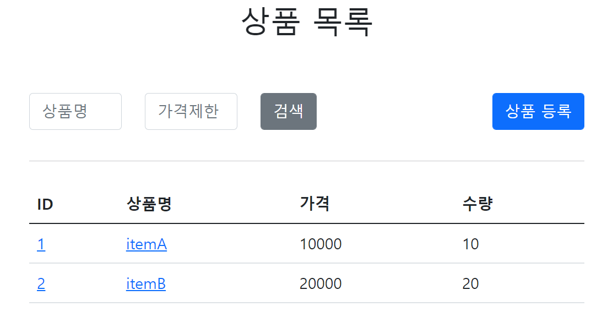

# <a href = "../README.md" target="_blank">스프링 DB 2편 - 데이터 접근 활용 기술</a>
## Chapter 01. 데이터 접근 기술 - 시작
### 1.2 프로젝트 설정과 메모리 저장소
1) 프로젝트 설정 순서
2) 실행 확인

---

# 1.2 프로젝트 설정과 메모리 저장소

---

## 1) 프로젝트 설정 순서
1. itemservice-db-start 의 폴더 이름을 itemservice-db 로 변경
2. 프로젝트 임포트 
   - File Open 해당 프로젝트의 `build.gradle` 을 선택
   - 그 다음에 선택창이 뜨는데, Open as Project를 선택
3. `ItemServiceApplication.main()`을 실행해서 프로젝트가 정상 수행되는지 확인

---

## 2) 실행 확인

- 프로젝트를 실행해서 각각의 기능이 잘 동작하는지 확인
- http://localhost:8080

---
