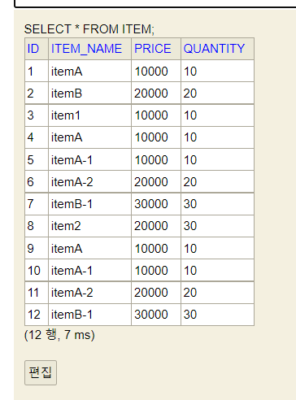

# <a href = "../README.md" target="_blank">스프링 DB 2편 - 데이터 접근 활용 기술</a>
## Chapter 03. 데이터 접근 기술 - 테스트
### 3.1 테스트 - 데이터베이스 연동
1) 테스트 실행 시, 데이터베이스 연동
2) `@SpringBootTest` : `@SpringBootApplication`을 찾아 설정으로 사용
3) 실사용 DB를 연동하여 테스트 실행 - 실패
4) 실사용 DB와 테스트용 DB는 격리되어야 한다.
---

# 3.1 테스트 - 데이터베이스 연동

---

## 1) 테스트 실행 시, 데이터베이스 연동

### 1.1 필요성
사용하는 데이터 접근 기술이, 실제 데이터베이스에 접근해서 데이터를 잘 저장하고 조회할 수 있는지 확인하는 것이 필요하다.

### 1.2 설정정보 수정

`src/main/resources/application.properties`
```properties
spring.profiles.active=local

# DataSource 설정
spring.datasource.url=jdbc:h2:tcp://localhost/~/itemservice-db
spring.datasource.username=sa
spring.datasource.password=

#jdbcTemplate sql log
logging.level.org.springframework.jdbc=debug
```
`src/test/resources/application.properties`
```properties
spring.profiles.active=test

# 테스트 - DataSource 설정
spring.datasource.url=jdbc:h2:tcp://localhost/~/itemservice-db
spring.datasource.username=sa
spring.datasource.password=

#jdbcTemplate sql log
logging.level.org.springframework.jdbc=debug
```
- 테스트 케이스는 `src/test` 에 있기 때문에, 실행하면 src/test 에 있는 `application.properties`파일이 우선순위를 가지고 실행된다. 
- 문제는, 기존 설정대로라면 테스트용 설정에는 `spring.datasource.url` 과 같은 데이터베이스 연결 설정이 없는 상태가 된다.
  - 테스트 케이스에서도 데이터베이스에 접속할 수 있게 test의 `application.properties` 를 위와 같이 수정한다.

---

## 2) `@SpringBootTest` : `@SpringBootApplication`을 찾아 설정으로 사용

### 2.1 `@SpringBootTest`
```java
@SpringBootTest
class ItemRepositoryTest {
```
- `ItemRepositoryTest` 는 `@SpringBootTest` 를 사용한다.
- `@SpringBootTest` 는 package 선언문을 거슬러 올라, `@SpringBootApplication` 를 찾아서 설정으로 사용한다.
  
### 2.2 `@SpringBootApplication`
```java
//@Import(MemoryConfig.class)
//@Import(JdbcTemplateV1Config.class)
//@Import(JdbcTemplateV2Config.class)
@Import(JdbcTemplateV3Config.class)
@SpringBootApplication(scanBasePackages = "hello.itemservice.web")
public class ItemServiceApplication {
```
- `@SpringBootApplication`의 컴포넌트 스캔 덕에 스프링 빈들을 끌어와서 테스트에 사용하게 된다.
- `@SpringBootApplication` 설정이 과거에는 `MemoryConfig.class` 를 사용하다가 이제는 `@JdbcTemplateV3Config.class` 를 사용하도록 변경되었다.
- 따라서 테스트도 JdbcTemplate 을 통해 실제 데이터베이스를 호출하게 된다. 
  - ~~`MemoryItemRepository`~~ → `JdbcTemplateItemRepositoryV3`

---

## 3) 실사용 DB를 연동하여 테스트 실행 - 실패
### 3.1 실행 결과
```shell
java.lang.AssertionError:
Expecting actual:
[Item(id=7, itemName=ItemTest, price=10000, quantity=10),
Item(id=8, itemName=itemA, price=10000, quantity=10),
Item(id=9, itemName=itemB, price=20000, quantity=20),
Item(id=10, itemName=itemA, price=10000, quantity=10),

...

```
- `updateItem()` : 성공
- `save()` : 성공
- `findItems()` : **실패 ← ?**

### 3.2 findItems 실패 이유 : 실사용 환경, 테스트 환경 
```java
    @Test
    void findItems() {
        //given
        Item item1 = new Item("itemA-1", 10000, 10);
        Item item2 = new Item("itemA-2", 20000, 20);
        Item item3 = new Item("itemB-1", 30000, 30);

        itemRepository.save(item1); // 저장
        itemRepository.save(item2);
        itemRepository.save(item3);

        test(null, null, item1, item2, item3); // 여기서 3개 이상이 찾아와짐.
            
        // 생략
    }
```
- 현상 : 결과적으로 테스트에서 저정한 3개의 데이터가 조회 되어야 하는데, 기대보다 더 많은 데이터가 조회되었다.
- 실패원인
  - 테스트를 실행할 때 `TestDataInit`이 실행되는 것의 영향을 받아서 인가? (x)
    - `TestDataInit` 은 프로필이 `local` 일때만 동작하는데, 테스트 케이스를 실행할 때는 프로필이 `spring.profiles.active=test`이기 때문에 초기화 데이터가 추가되지 않는다.
  - H2 데이터베이스에 이미 과거에 서버를 실행하면서 저장했던 데이터가 보관되어 있기 때문!!!  
    
  - **실사용 환경의 데이터가 현재 테스트에 영향을 준다.**

---

## 4) 실사용 DB와 테스트용 DB는 격리되어야 한다.
- 실제 운영 중인 로컬 서버의 애플리케이션과, 테스트 쪽에서 같은 데이터베이스를 사용하고 있음
- 실사용 환경이 테스트에 영향을 줌.
- 테스트의 독립성을 보장하기 위해서는 두 환경은 격리 되어야한다.

---
