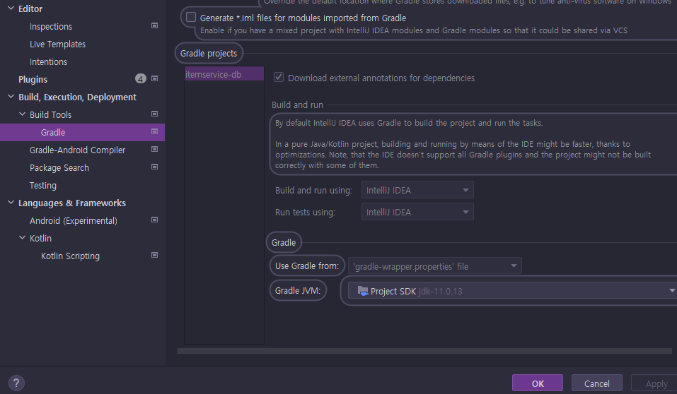

# <a href = "../README.md" target="_blank">스프링 DB 2편 - 데이터 접근 활용 기술</a>
## Chapter 07. 데이터 접근 기술 - Querydsl
### 7.3 Querydsl 설정
1) `build.gradle` 의존성 추가
2) Build Tools 설정
3) Gradle 방식 - Q타입 생성 확인 방법
4) IntelliJ IDEA 방식 - Q타입 생성 확인 
5) 각 버전마다 설정이 조금씩 다르다.

---

# 7.3 Querydsl 설정

---

## 1) `build.gradle` 의존성 추가
```groovy
dependencies {
    //Querydsl 추가
    implementation 'com.querydsl:querydsl-jpa'
    annotationProcessor "com.querydsl:querydsl-apt:${dependencyManagement.importedProperties['querydsl.version']}:jpa"
    annotationProcessor "jakarta.annotation:jakarta.annotation-api"
    annotationProcessor "jakarta.persistence:jakarta.persistence-api"
}


//Querydsl 추가, 자동 생성된 Q클래스 gradle clean으로 제거
clean {
    delete file('src/main/generated')
}
```
- 2022.08.23 기준으로는 이 방식을 사용하면 된다.

---

## 2) Build Tools 설정


Settigs → Build, Execution, Deployment → Build Tools → Gradle  
여기서 크게 2가지 옵션을 선택할 수 있다.  
1. Gradle: Gradle을 통해서 빌드한다.
2. IntelliJ IDEA: IntelliJ가 직접 자바를 실행해서 빌드한다.

---

## 3) Gradle 방식 - Q타입 생성 확인 방법

### 3.1 IntelliJ를 통한 확인 방법
- `Gradle -> Tasks -> build -> clean`
- `Gradle -> Tasks -> other -> compileJava`

### 3.2 Gradle 콘솔을 통한 확인 방법
- `./gradlew clean compileJava`

### 3.3 Q 타입 생성 확인
`build -> generated -> sources -> annotationProcessor -> java/main` 하위에  
`hello.itemservice.domain.QItem` 이 생성되어 있어야 한다.

### 3.4 Q타입 파일과 `.gitignore`
- Q타입은 컴파일 시점에 자동 생성되므로 버전관리(GIT)에 포함하지 않는 것이 좋다.
- `gradle` 옵션을 선택하면 Q타입은 `gradle build` 폴더 아래에 생성되기 때문에 여기를 포함하지 않아야 한다.
  - 대부분 gradle build 폴더를 git에 포함하지 않기 때문에 이 부분은 자연스럽게 해결된다.

### 3.5 Q타입 삭제
- `gradle clean` 을 수행하면 build 폴더 자체가 삭제된다. 따라서 별도의 설정은 없어도 된다.

---

## 4) IntelliJ IDEA 방식 - Q타입 생성 확인 방법

### 4.1 확인 방법
- 상단 `Build -> Build Project` 또는
- 상단 `Build -> Rebuild` 또는
- `main()` 실행 또는
- 테스트 실행

### 4.2 Q 타입 생성 확인
`src/main/generated` 하위에 `hello.itemservice.domain.QItem` 이 생성되어 있어야 한다.

### 4.3 Q타입 파일과 `.gitignore`
- Q타입은 컴파일 시점에 자동 생성되므로 버전관리(GIT)에 포함하지 않는 것이 좋다.
- IntelliJ IDEA 옵션을 선택하면 Q타입은 `src/main/generated` 폴더 아래에 생성되기 때문에 여기를 포함하지 않는 것이 좋다.
  - 이 부분을 따로 `.gitignore`에 등록할 필요가 있다.

### 4.4 Q타입 삭제
```groovy
//Querydsl 추가, 자동 생성된 Q클래스 gradle clean으로 제거
clean {
delete file('src/main/generated')
}
```
- IntelliJ IDEA 옵션을 선택하면 `src/main/generated` 에 파일이 생성되고, 필요한 경우 Q파일을 직접 삭제해야 한다.
- `build.gradle` 에 해당 스크립트를 추가하면 `gradle clean` 명령어를 실행할 때 `src/main/generated` 의 파일도 함께 삭제해준다.

---

## 5) 각 버전마다 설정이 조금씩 다르다.
- `Querydsl`은 이렇게 설정하는 부분이 사용하면서 조금 귀찮은 부분이고, 가장 큰 단점이다.
- `IntelliJ`가 버전업 하거나 `Querydsl`의 `Gradle` 설정이 버전업 하면서 적용 방법이 조금씩 달라지기도 한다.
- 그리고 본인의 환경에 따라서 잘 동작하지 않기도 한다.
- 공식 메뉴얼에 소개 되어 있는 부분이 아니기 때문에, 설정에 수고로움이 있지만 "querydsl gradle" 로 검색하면 본인 환경에 맞는 대안을 금방 찾을 수 있을 것이다.

---
