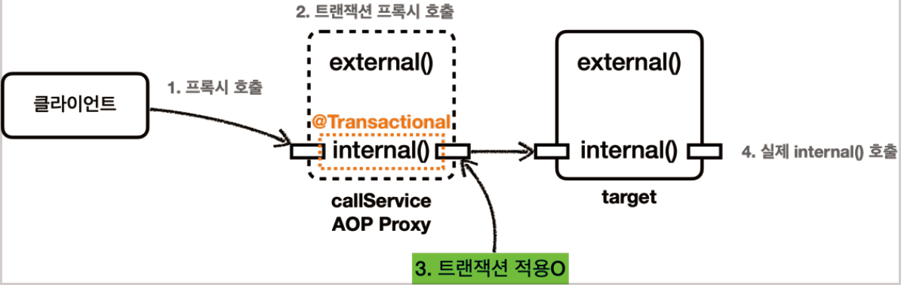

# <a href = "../README.md" target="_blank">스프링 DB 2편 - 데이터 접근 활용 기술</a>
## Chapter 09. 스프링 트랜잭션 이해
### 9.05 트랜잭션 AOP 주의 사항 - 프록시 내부 호출1
1) (복습) 스프링 트랜잭션 프록시의 동작 원리
2) InternalCallV1Test - 프록시 내부 호출 확인
3) `internalCall()` : 트랜잭션 적용 메서드 호출
4) `externalCall()` : 트랜잭션 미적용 메서드에서 트랜잭션 메서드 내부 호출
5) 문제 원인 : `this.xxx()`를 통한 내부 호출
6) 프록시 방식의 AOP 한계 : 메서드 내부 호출에 프록시를 사용 할 수 없다.

---

# 9.05 트랜잭션 AOP 주의 사항 - 프록시 내부 호출1
> 여기서 설명하는 내용은 스프링 핵심원리 고급편 13. 실무 주의사항 - 프록시와 내부 호출 문제에서 다루는
내용과 같은 문제를 다룬다. 이렇게 한번 더 언급하는 이유는 그 만큼 실무에서 많이 만나는 주제이고, 많은
개발자들이 이 문제를 이해하지 못해서 고통받기 때문이다.
>
> 여기서는 트랜잭션 AOP에 관점에서 설명한다.

---

## 1) (복습) 스프링 트랜잭션 프록시의 동작 원리

### 1.1 스프링 트랜잭션 AOP
- `@Transactional` 을 사용하면 스프링의 트랜잭션 AOP가 적용된다.
- 트랜잭션 AOP는 기본적으로 프록시 방식의 AOP를 사용한다.
- 앞서 배운 것 처럼 `@Transactional` 을 적용하면 프록시 객체가 요청을 먼저 받아서 트랜잭션을 처리하고, 실제 객체를 호출해준다.
- 따라서 트랜잭션을 적용하려면 항상 프록시를 통해서 대상 객체(Target)을 호출해야 한다.
- 이렇게 해야 프록시에서 먼저 트랜잭션을 적용하고, 이후에 대상 객체를 호출하게 된다.
- 만약 프록시를 거치지 않고 대상 객체를 직접 호출하게 되면 AOP가 적용되지 않고, 트랜잭션도 적용되지 않는다.

### 1.2 프록시가 스프링 빈으로 등록된다.

- AOP를 적용하면 스프링은 대상 객체 대신에 프록시를 스프링 빈으로 등록한다.
- 따라서 스프링은 의존관계 주입시에 항상 실제 객체 대신에 프록시 객체를 주입한다.
- 프록시 객체가 주입되기 때문에 대상 객체를 직접 호출하는 문제는 일반적으로 발생하지 않는다.

### 1.3 트랜잭션 미적용 메서드에서 트랜잭션 적용 내부 메서드를 호출하면?
- 하지만 대상 객체의 내부에서 메서드 호출이 발생하면 프록시를 거치지 않고 대상 객체를 직접 호출하는 문제가 발생한다.
- 이렇게 되면 `@Transactional` 이 있어도 트랜잭션이 적용되지 않는다.
- 실무에서 반드시 한번은 만나서 고생하는 문제이기 때문에 꼭 이해하고 넘어가야한다.

---

## 2) InternalCallV1Test - 프록시 내부 호출 확인

### 2.1 CallService
```java
@Slf4j
static class CallService {

    public void external() {
        log.info("call external");
        printTxInfo(); // this.printTxInfo();
        internal(); // this.internal();
    }

    @Transactional
    public void internal() {
        log.info("call internal");
        printTxInfo();
    }

    public void printTxInfo() {
        boolean txActive = TransactionSynchronizationManager.isActualTransactionActive();
        log.info("tx active : {}", txActive);
    }
}
```
- `external()` 은 트랜잭션이 없다.
  - 여기서 주의깊게 봐야할 부분은 `internal()` 호출 부분이다.
  - 메서드 호출 시 메서드 앞에 참조가 없으면 `this`가 호출된 것으로 간주된다.
- `internal()` 은 `@Transactional` 을 통해 트랜잭션을 적용한다.
- `@Transactional` 이 하나라도 있으면 트랜잭션 프록시 객체가 만들어진다.
- 그리고 `callService` 빈을 주입 받으면 트랜잭션 프록시 객체가 대신 주입된다.

### 2.2 프록시 적용 확인
```java
    @Test
    void printProxy() {
        log.info("callService class= {}", callService.getClass());
        assertThat(AopUtils.isAopProxy(callService)).isTrue();
    }
```
```shell
callService class= class com.ttasjwi.springtx.
apply.InternalCallV1Test$CallService$$EnhancerBySpringCGLIB$$f31a5c64
```
- 외부에서 `@TestConfiguration`을 통해 CallService를 스프링 빈으로 등록하고, 위 테스트 코드를 실행한다.
- 여기서는 테스트에서 `callService` 를 주입 받는데, 해당 클래스를 출력해보면 뒤에 `CGLIB...`이 붙은 것을 확인할 수 있다.
  - 원본 객체 대신에 트랜잭션을 처리하는 프록시 객체를 주입 받은 것이다.

---

## 3) `internalCall()` : 트랜잭션 적용 메서드 호출

### 3.1 `internal()`
```java
@Slf4j
static class CallService {
    
    // 생략

    @Transactional
    public void internal() {
        log.info("call internal");
        printTxInfo();
    }

    public void printTxInfo() {
        boolean txActive = TransactionSynchronizationManager.isActualTransactionActive();
        log.info("tx active : {}", txActive);
    }
}
```
- internal 메서드 호출 시 트랜잭션이 활성화 되어있는지 여부를 로깅한다.
- `@Transactional`의 적용대상이므로, 트랜잭션이 활성화되어 있을 것이다.

### 3.2 실행 결과

1. 클라이언트인 테스트 코드는 `callService.internal()` 을 호출한다.
   - 여기서 `callService` 는 트랜잭션 프록시이다.
2. `callService` 의 트랜잭션 프록시가 호출된다.
3. `internal()` 메서드에 `@Transactional` 이 붙어 있으므로 트랜잭션 프록시는 트랜잭션을 적용한다.
4. 트랜잭션 적용 후 실제 `callService` 객체 인스턴스의 `internal()` 을 호출한다.
   - 실제 `callService` 가 처리를 완료하면 응답이 트랜잭션 프록시로 돌아오고, 트랜잭션 프록시는 트랜잭션을 완료한다.

### 3.3 실행 로그 분석
```shell
TransactionInterceptor           : Getting transaction for [com.ttasjwi.springtx.apply.InternalCallV1Test$CallService.internal]
InternalCallV1Test$CallService   : call internal
InternalCallV1Test$CallService   : tx active : true
TransactionInterceptor           : Completing transaction for [com.ttasjwi.springtx.apply.InternalCallV1Test$CallService.internal]
```
- `TransactionInterceptor` 가 남긴 로그를 통해 트랜잭션 프록시가 트랜잭션을 적용한 것을 확인할 수 있다.
- `CallService` 가 남긴 `tx active=true` 로그를 통해 트랜잭션이 적용되어 있음을 확인할 수 있다.

---

## 4) `externalCall()` : 트랜잭션 미적용 메서드에서 트랜잭션 메서드 내부 호출

### 4.1 `external()`
```java
    @Slf4j
    static class CallService {

        public void external() {
            log.info("call external");
            printTxInfo(); // this.printTxInfo();
            internal(); // this.internal();
        }

        @Transactional
        public void internal() {
            log.info("call internal");
            printTxInfo();
        }

        public void printTxInfo() {
            boolean txActive = TransactionSynchronizationManager.isActualTransactionActive();
            log.info("tx active : {}", txActive);
        }
    }
```
- `external()` 은 `@Transactional` 어노테이션이 없다. 따라서 트랜잭션 없이 시작한다.
- 그런데 내부에서 `@Transactional` 이 있는 `internal()` 을 호출하는 것을 확인할 수 있다.
- 이 경우 `external()` 은 트랜잭션이 없지만, `internal()` 에서는 트랜잭션이 적용되는 것 처럼 보인다.
- 하지만 실제는 생각과 다르다...!

### 4.2 실행 결과

1. 클라이언트인 테스트 코드는 `callService.external()` 을 호출한다.
   - 여기서 `callService` 는 트랜잭션 프록시이다.
2. `callService` 의 트랜잭션 프록시가 호출된다.
3. `external()` 메서드에는 `@Transactional` 이 없다. 따라서 트랜잭션 프록시는 트랜잭션을 적용하지 않는다.
4. 트랜잭션 적용하지 않고, 실제 `callService` 객체 인스턴스의 `external()` 을 호출한다.
5. `external()` 은 내부에서 `internal()` 메서드를 호출한다. 그런데 여기서 문제가 발생한다.

### 4.3 실행 로그 확인
```shell
InternalCallV1Test$CallService   : call external
InternalCallV1Test$CallService   : tx active : false
InternalCallV1Test$CallService   : call internal
InternalCallV1Test$CallService   : tx active : false
```
- 실행 로그를 보면 트랜잭션 관련 코드가 전혀 보이지 않는다.
- 프록시가 아닌 실제 callService 에서 남긴 로그만 확인된다.
- 추가로 `internal()` 내부에서 호출한 `tx active=false` 로그를 통해 확실히 트랜잭션이 수행되지 않은 것을 확인할 수 있다.
- 우리의 기대와 다르게 `internal()` 에서 트랜잭션이 전혀 적용되지 않았다.
- 왜 이런 문제가 발생하는 것일까?

---

## 5) 문제 원인 : `this.xxx()`를 통한 내부 호출
- 자바 언어에서 메서드 앞에 별도의 참조가 없으면 `this` 라는 뜻으로 자기 자신의 인스턴스를 가리킨다.
- 결과적으로 자기 자신의 내부 메서드를 호출하는 `this.internal()` 이 되는데, 여기서 `this` 는 자기 자신을 가리키므로, 실제 대상 객체( `target` )의 인스턴스를 뜻한다.
- 결과적으로 이러한 내부 호출은 프록시를 거치지 않는다.
- 따라서 트랜잭션을 적용할 수 없다. 결과적으로 `target` 에 있는 `internal()`을 직접 호출하게 된 것이다.

---

## 6) 프록시 방식의 AOP 한계 : 메서드 내부 호출에 프록시를 사용 할 수 없다.
- `@Transactional` 를 사용하는 트랜잭션 AOP는 프록시를 사용한다.
- 프록시를 사용하면 메서드 내부 호출에 프록시를 적용할 수 없다.
- 그렇다면 이 문제를 어떻게 해결할 수 있을까?
- 가장 단순한 방법은 내부 호출을 피하기 위해 `internal()` 메서드를 별도의 클래스로 분리하는 것이다.

---
