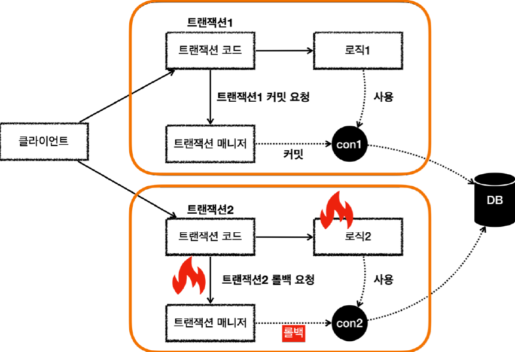

# <a href = "../README.md" target="_blank">스프링 DB 2편 - 데이터 접근 활용 기술</a>
## Chapter 10. 스프링 트랜잭션 전파1 - 기본
### 10.2 스프링 트랜잭션 전파2 - 트랜잭션 두 번 사용
1) 서로 다른 두 트랜잭션 커밋, 커밋
2) 서로 다른 두 트랜잭션 커밋, 롤백

---

# 10.2 스프링 트랜잭션 전파2 - 트랜잭션 두 번 사용

---

## 1) 서로 다른 두 트랜잭션 커밋, 커밋

### 1.1 `double_commit()`
```java
@Test
public void double_commit() {
    log.info("트랜잭션1 시작");
    TransactionStatus tx1 = txManager.getTransaction(new DefaultTransactionAttribute());
    log.info("트랜잭션1 커밋");
    txManager.commit(tx1);

    log.info("트랜잭션2 시작");
    TransactionStatus tx2 = txManager.getTransaction(new DefaultTransactionAttribute());
    log.info("트랜잭션2 커밋");
    txManager.commit(tx2);
}
```
- 트랜잭션1이 완전히 끝나고나서 트랜잭션2를 수행한다.

### 1.2 로그 확인
```shell
트랜잭션1 시작
Creating new transaction with name [null]: PROPAGATION_REQUIRED,ISOLATION_DEFAULT
Acquired Connection [HikariProxyConnection@1080517451 wrapping conn0: url=jdbc:h2:mem:a86ceaa1-3d27-4d17-adfa-57d6713aa74f user=SA] for JDBC transaction
Switching JDBC Connection [HikariProxyConnection@1080517451 wrapping conn0: url=jdbc:h2:mem:a86ceaa1-3d27-4d17-adfa-57d6713aa74f user=SA] to manual commit
트랜잭션1 커밋
Initiating transaction commit
Committing JDBC transaction on Connection [HikariProxyConnection@1080517451 wrapping conn0: url=jdbc:h2:mem:a86ceaa1-3d27-4d17-adfa-57d6713aa74f user=SA]
Releasing JDBC Connection [HikariProxyConnection@1080517451 wrapping conn0: url=jdbc:h2:mem:a86ceaa1-3d27-4d17-adfa-57d6713aa74f user=SA] after transaction

트랜잭션2 시작
Creating new transaction with name [null]: PROPAGATION_REQUIRED,ISOLATION_DEFAULT
Acquired Connection [HikariProxyConnection@1676857380 wrapping conn0: url=jdbc:h2:mem:a86ceaa1-3d27-4d17-adfa-57d6713aa74f user=SA] for JDBC transaction
Switching JDBC Connection [HikariProxyConnection@1676857380 wrapping conn0: url=jdbc:h2:mem:a86ceaa1-3d27-4d17-adfa-57d6713aa74f user=SA] to manual commit
트랜잭션2 커밋
Initiating transaction commit
Committing JDBC transaction on Connection [HikariProxyConnection@1676857380 wrapping conn0: url=jdbc:h2:mem:a86ceaa1-3d27-4d17-adfa-57d6713aa74f user=SA]
Releasing JDBC Connection [HikariProxyConnection@1676857380 wrapping conn0: url=jdbc:h2:mem:a86ceaa1-3d27-4d17-adfa-57d6713aa74f user=SA] after transaction
```
#### 트랜잭션1
- `Acquired Connection [HikariProxyConnection@1064414847 wrapping conn0] for JDBC transaction`
  - 트랜잭션1을 시작하고, 커넥션 풀에서 conn0 커넥션을 획득했다.
- `Releasing JDBC Connection [HikariProxyConnection@1064414847 wrapping conn0] after transaction`
  - 트랜잭션1을 커밋하고, 커넥션 풀에 conn0 커넥션을 반납했다.

#### 트랜잭션2
- `Acquired Connection [HikariProxyConnection@1676857380 wrapping conn0] for JDBC transaction`
  - 트랜잭션2을 시작하고, 커넥션 풀에서 conn0 커넥션을 획득했다.
- `Releasing JDBC Connection [HikariProxyConnection@1676857380 wrapping conn0] after transaction`
  - 트랜잭션2을 커밋하고, 커넥션 풀에 conn0 커넥션을 반납했다.

### 1.3 두 트랜잭션이 사용하는 커넥션이 다르다.
- 이들 커넥션은 같은 `conn0`을 사용하지만, 실제로는 커넥션 풀을 통해 같은 커넥션을 재사용하고 있다.
- 커넥션 풀은 실제 커넥션을 감싼 커넥션 프록시 인스턴스를 생성해서 반환하였다. 순차적으로 생성, 파괴, 생성을 했기 이들 주소가 다른 것을 확인할 수 있다.
- 커넥션 프록시 객체 인스턴스의 주소가 다른 것을 통해 두 트랜잭션이 다른 커넥션을 사용한 것을 확인할 수 있다.
- 커넥션 프록시에 관한 자세한 개념은 `Spring DB 1편 2.5 DataSource 적용`에 옮겨서 정리해뒀다.

### 1.4 그림으로 확인


- 트랜잭션1이 커밋 후 종료되고, 트랜잭션2가 커밋하고 종료되므로 각각 따로 커밋된다.
- 트랜잭션이 각각 수행되면서 사용되는 DB 커넥션도 각각 다르다.
- 이 경우 트랜잭션을 각자 관리하기 때문에 전체 트랜잭션을 묶을 수 없다.

---

## 2) 서로 다른 두 트랜잭션 커밋, 롤백
트랜잭션1이 커밋하고, 트랜잭션2가 롤백하는 경우 트랜잭션1에서 저장한 데이터는 커밋되고, 트랜잭션2에서 저장한 데이터는 롤백된다. 다음 예제를 확인해보자.  


### 2.1 `double_commit_rollback()`
```java
    @Test
    public void double_commit_rollback() {
        log.info("트랜잭션1 시작");
        TransactionStatus tx1 = txManager.getTransaction(new DefaultTransactionAttribute());
        log.info("트랜잭션1 커밋");
        txManager.commit(tx1);

        log.info("트랜잭션2 시작");
        TransactionStatus tx2 = txManager.getTransaction(new DefaultTransactionAttribute());
        log.info("트랜잭션2 롤백");
        txManager.rollback(tx2);
    }
```
- 예제에서는 트랜잭션1은 커밋하고, 트랜잭션2는 롤백한다.
- 전체 트랜잭션을 묶지 않고 각각 관리했기 때문에, 트랜잭션1에서 저장한 데이터는 커밋되고, 트랜잭션2 에서 저장한 데이터는 롤백된다.


### 2.2 로그 확인
```shell
트랜잭션1 시작
Creating new transaction with name [null]: PROPAGATION_REQUIRED,ISOLATION_DEFAULT
Acquired Connection [HikariProxyConnection@1080517451 wrapping conn0: url=jdbc:h2:mem:7adfd80a-edd9-42ac-a079-5db666936142 user=SA] for JDBC transaction
Switching JDBC Connection [HikariProxyConnection@1080517451 wrapping conn0: url=jdbc:h2:mem:7adfd80a-edd9-42ac-a079-5db666936142 user=SA] to manual commit
트랜잭션1 커밋
Initiating transaction commit
Committing JDBC transaction on Connection [HikariProxyConnection@1080517451 wrapping conn0: url=jdbc:h2:mem:7adfd80a-edd9-42ac-a079-5db666936142 user=SA]
Releasing JDBC Connection [HikariProxyConnection@1080517451 wrapping conn0: url=jdbc:h2:mem:7adfd80a-edd9-42ac-a079-5db666936142 user=SA] after transaction

트랜잭션2 시작
Creating new transaction with name [null]: PROPAGATION_REQUIRED,ISOLATION_DEFAULT
Acquired Connection [HikariProxyConnection@1676857380 wrapping conn0: url=jdbc:h2:mem:7adfd80a-edd9-42ac-a079-5db666936142 user=SA] for JDBC transaction
Switching JDBC Connection [HikariProxyConnection@1676857380 wrapping conn0: url=jdbc:h2:mem:7adfd80a-edd9-42ac-a079-5db666936142 user=SA] to manual commit
트랜잭션2 롤백
Initiating transaction rollback
Rolling back JDBC transaction on Connection [HikariProxyConnection@1676857380 wrapping conn0: url=jdbc:h2:mem:7adfd80a-edd9-42ac-a079-5db666936142 user=SA]
Releasing JDBC Connection [HikariProxyConnection@1676857380 wrapping conn0: url=jdbc:h2:mem:7adfd80a-edd9-42ac-a079-5db666936142 user=SA] after transaction
```
로그를 보면 트랜잭션1은 커밋되지만, 트랜잭션2는 롤백되는 것을 확인할 수 있다.

### 2.3 그림으로 확인




- 위의 커밋-커밋 예제와 원리가 같다.
- 트랜잭션1이 커밋 후 종료되고, 트랜잭션2가 롤백하고 종료되는데 이들은 각각 따로 커밋, 롤백 된다.
- 트랜잭션이 각각 수행되면서 사용되는 DB 커넥션도 각각 다르다.
- 이 경우 트랜잭션을 각자 관리하기 때문에 전체 트랜잭션을 묶을 수 없다.
