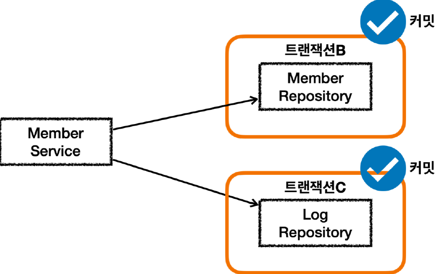
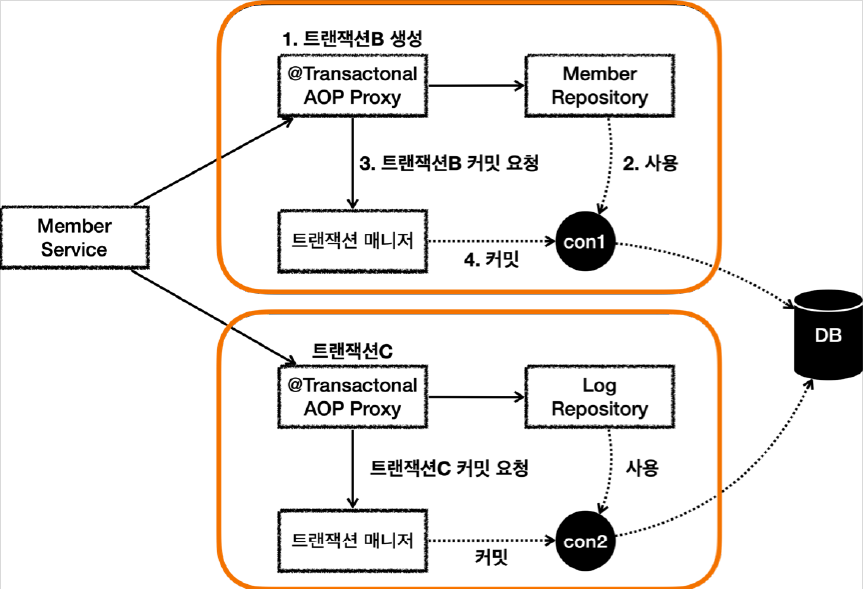

# <a href = "../README.md" target="_blank">스프링 DB 2편 - 데이터 접근 활용 기술</a>
## Chapter 11. 스프링 트랜잭션 전파2 - 활용
### 11.2 트랜잭션 전파 활용2 - 커밋, 롤백
1) 서비스 트랜잭션 없이 두 독립된 트랜잭션이 커밋, 커밋
2) 서비스 트랜잭션 없이 두 독립된 트랜잭션이 커밋, 롤백

---

# 11.2 트랜잭션 전파 활용2 - 커밋, 롤백

---

## 1) 서비스 트랜잭션 없이 두 독립된 트랜잭션이 커밋, 커밋

### 1.1 상황
- 서비스 계층에 트랜잭션이 없다.
- 회원, 로그 리포지토리가 각각 트랜잭션을 가지고 있다.
- 회원, 로그 리포지토리 둘다 커밋에 성공한다.

### 1.2 테스트 코드 : `outerTxOff_success()`
```java
    @Test
    public void outerTxOff_success() {
        //given
        String username = "outerTxOff_success";

        //when
        memberService.joinV1(username);

        //then : 모든 데이터가 정상 저장된다.
        assertTrue(memberRepository.find(username).isPresent());
        assertTrue(logRepository.find(username).isPresent());

    }
```


### 1.3 분석




1. MemberService 에서 MemberRepository 를 호출한다. MemberRepository 에는
   `@Transactional` 어노테이션이 있으므로 트랜잭션 AOP가 작동한다. 여기서 트랜잭션 매니저를 통해
   트랜잭션을 시작한다. 이렇게 시작한 트랜잭션을 트랜잭션B라 하자.
   - 그림에서는 생략했지만, 트랜잭션 매니저에 트랜잭션을 요청하면 데이터소스를 통해 커넥션 `con1` 을 획득하고, 해당 커넥션을 수동 커밋 모드로 변경해서 트랜잭션을 시작한다.
   - 그리고 트랜잭션 동기화 매니저를 통해 트랜잭션을 시작한 커넥션을 보관한다.
   - 트랜잭션 매니저의 호출 결과로 `status` 를 반환한다. 여기서는 신규 트랜잭션 여부가 참이 된다.
2. `MemberRepository` 는 JPA를 통해 회원을 저장하는데, 이때 JPA는 트랜잭션이 시작된 con1 을
   사용해서 회원을 저장한다.
3. `MemberRepository` 가 정상 응답을 반환했기 때문에 트랜잭션 AOP는 트랜잭션 매니저에 커밋을
   요청한다.
4. 트랜잭션 매니저는 `con1` 을 통해 물리 트랜잭션을 커밋한다.
   - 물론 이 시점에 앞서 설명한 신규 트랜잭션 여부, `rollbackOnly` 여부를 모두 체크한다. 
5. 이렇게 해서 `MemberRepository` 와 관련된 모든 데이터는 정상 커밋되고, 트랜잭션B는 완전히 종료된다.
6. 이후에 `LogRepository` 를 통해 트랜잭션C를 시작하고, 정상 커밋한다.
7. 결과적으로 둘다 커밋되었으므로 `Member` , `Log` 모두 안전하게 저장된다.

---

## 2) 서비스 트랜잭션 없이 두 독립된 트랜잭션이 커밋, 롤백

### 2.1 상황
- 서비스 계층에 트랜잭션이 없다.
- 회원, 로그 리포지토리가 각각 트랜잭션을 가지고 있다.
- 회원 리포지토리는 정상 동작하지만 로그 리포지토리에서 예외가 발생한다.

### 2.2 `outerTxOff_fail()`
```java
    @Test
    public void outerTxOff_fail() {
        //given
        String username = "로그예외";

        //when
        assertThatThrownBy(() -> memberService.joinV1(username))
                .isInstanceOf(RuntimeException.class);

        //then : 모든 데이터가 정상 저장된다.
        assertTrue(memberRepository.find(username).isPresent());
        assertTrue(logRepository.find(username).isEmpty());

    }
```
- 사용자 이름에 로그예외 라는 단어가 포함되어 있으면 `LogRepository` 에서 런타임 예외가 발생한다.
  ```java
  if (logMessage.getMessage().contains("로그예외")) {
        log.info("log 저장시 예외 발생");
        throw new RuntimeException("예외 발생");
  }
  ```
- 트랜잭션 AOP는 해당 런타임 예외를 확인하고 롤백 처리한다.


### 2.3 MemberRepository 커밋 (트랜잭션 B)
- `MemberService` 에서 `MemberRepository` 를 호출하는 부분은 앞서 설명한 내용과 같다.
- 트랜잭션이 정상 커밋되고, 회원 데이터도 DB에 정상 반영된다.

### 2.4 LogRepository 트랜잭션 시작 (트랜잭션 C)
- `MemberService` 에서 `LogRepository` 를 호출하는데, 로그예외 라는 이름을 전달한다.
- 이 과정에서 새로운 트랜잭션 C가 만들어진다.

### 2.4 LogRepository 트랜잭션 응답 로직 (롤백)
1. `LogRepository` 는 트랜잭션C와 관련된 `con2` 를 사용한다.
2. 로그예외 라는 이름을 전달해서 `LogRepository` 에 런타임 예외가 발생한다.
3. `LogRepository` 는 해당 예외를 밖으로 던진다. 이 경우 트랜잭션 AOP가 예외를 받게된다.
4. 런타임 예외가 발생해서 트랜잭션 AOP는 트랜잭션 매니저에 롤백을 호출한다.
5. 트랜잭션 매니저는 신규 트랜잭션이므로 물리 롤백을 호출한다.

### 2.5 문제점
- 이 경우 회원은 저장되지만, 회원 이력 로그는 롤백된다.
- 따라서 데이터 정합성에 문제가 발생할 수 있다.
- 둘을 하나의 트랜잭션으로 묶어서 처리하는게 나을 듯 하다.

---
