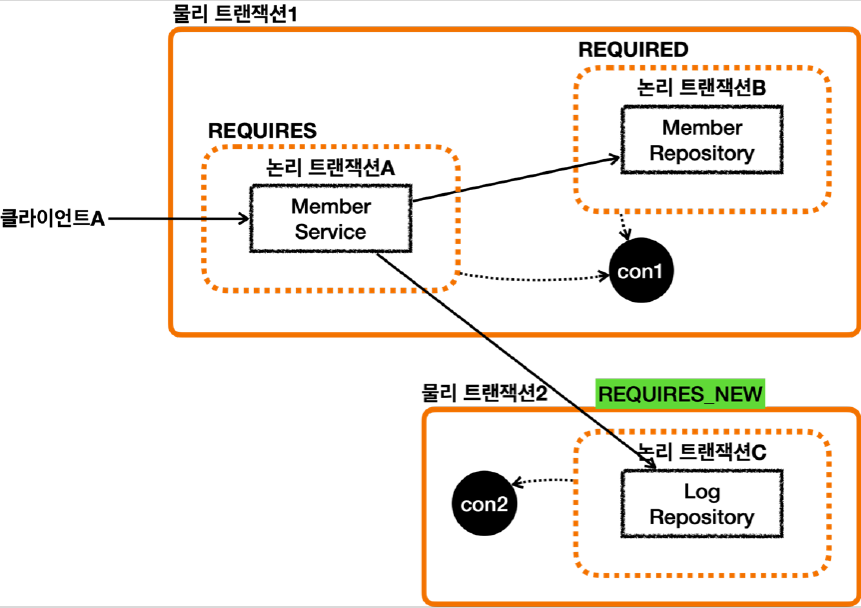
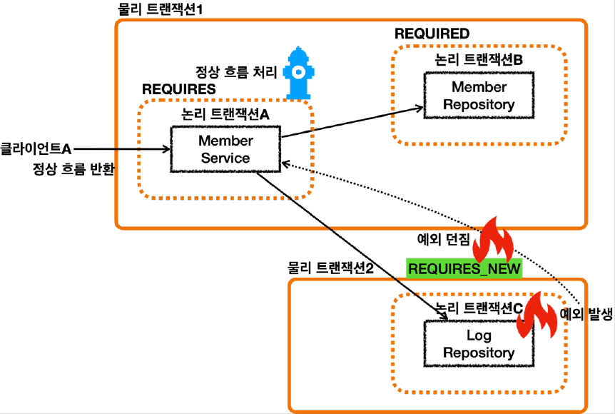
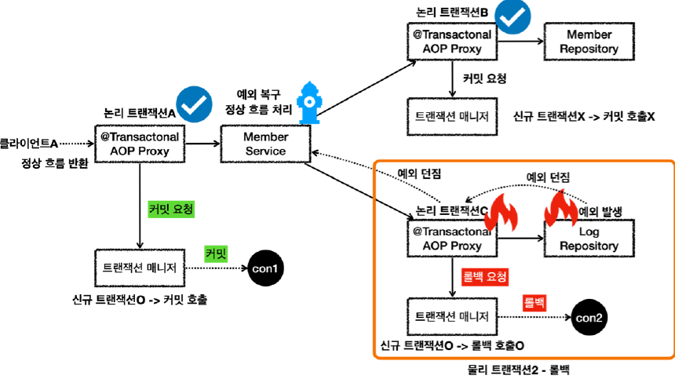
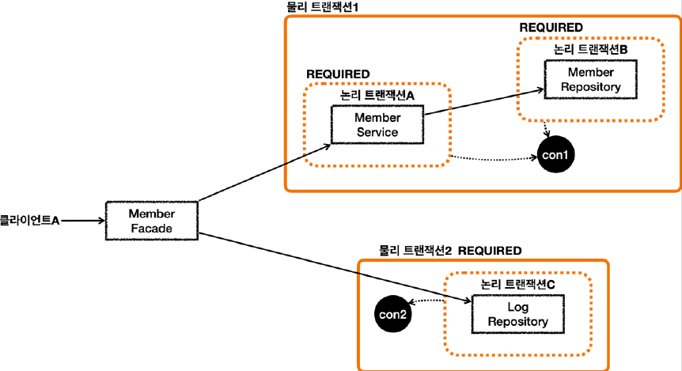

# <a href = "../README.md" target="_blank">스프링 DB 2편 - 데이터 접근 활용 기술</a>
## Chapter 11. 스프링 트랜잭션 전파2 - 활용
### 11.7 트랜잭션 전파 활용7 - 복구 REQUIRES_NEW
1) 물리 트랜잭션 분리(`REQUIRES_NEW`) 적용
2) 물리 트랜잭션이 분리됐으므로 외부 트랜잭션이 롤백되지 않는다.
3) 상세 분석 - `REQUIRES_NEW`
4) 다만, `REQUIRES_NEW` 를 사용하면 데이터베이스 커넥션 비용이 비싸다.
5) 대안 : 퍼사드 패턴(Facade Pattern)
---

# 11.7 트랜잭션 전파 활용7 - 복구 REQUIRES_NEW

---

## 1) 물리 트랜잭션 분리(`REQUIRES_NEW`) 적용

### 1.1 `recoverException_success()`
```java
    /**
     * memberService    @Transactional:ON Recover
     * memberRepository @Transactional:ON
     * logRepository    @Transactional:ON (REQUIRES_NEW) Exception
     */
    @Test
    public void recoverException_success() {
        //given
        String username = "로그예외_recoverException_success";

        //when
        memberService.joinV2(username);

        //then : 회원은 등록되고, 로그는 등록되지 않는다.
        assertTrue(memberRepository.find(username).isPresent());
        assertTrue(logRepository.find(username).isEmpty());
    }
```
- 모든 계층에 트랜잭션을 적용한다.
- `LogRepository`의 save 메서드에 걸린 `@Transactional`에 `REQUIRES_NEW` 옵션을 줘야한다.

### 1.2 LogRepository의  save 메서드에 걸린 `@Transactional`에 `REQUIRES_NEW` 옵션 적용
```java
@Transactional(propagation = Propagation.REQUIRES_NEW)
public void save(Log logMessage)
```
기존 트랜잭션에 참여하는 `REQUIRED` 대신에, 항상 신규 트랜잭션을 생성하는 `REQUIRES_NEW` 를 적용

### 1.3 물리 트랜잭션 분리

- `MemberRepository` 는 `REQUIRED` 옵션을 사용한다. 따라서 기존 트랜잭션에 참여한다.
- `LogRepository` 의 트랜잭션 옵션에 `REQUIRES_NEW` 를 사용했다.
- `REQUIRES_NEW` 는 항상 새로운 트랜잭션을 만든다. 따라서 해당 트랜잭션 안에서는 DB 커넥션도 별도로
사용하게 된다.

---

## 2) 물리 트랜잭션이 분리됐으므로 외부 트랜잭션이 롤백되지 않는다.

- 논리 트랜잭션은 하나라도 롤백되면 관련된 물리 트랜잭션은 롤백되어 버린다.
- 이 문제를 해결하려면 `REQUIRES_NEW` 를 사용해서 트랜잭션을 분리해야 한다.
- `REQUIRES_NEW` 를 사용하게 되면 물리 트랜잭션 자체가 완전히 분리되어 버린다.
- 그리고 `REQUIRES_NEW` 는 신규 트랜잭션이므로 `rollbackOnly` 표시가 되지 않는다. 그냥 해당 트랜잭션이 물리 롤백되고 끝난다.
- 참고로 예제를 단순화 하기 위해 `MemberService` 가 `MemberRepository` , `LogRepository` 만
  호출하지만 실제로는 더 많은 리포지토리들을 호출하고 그 중에 `LogRepository` 만 트랜잭션을
  분리한다고 생각해보면 이해하는데 도움이 될 것이다. 전체 복잡한 긴 로직을 롤백시키는 비용을 경감한 것이다.

---

## 3) 상세 분석 - `REQUIRES_NEW`


### 3.1 LogRepository - 물리 트랜잭션2 롤백, 예외 throw
- `LogRepository` 에서 예외가 발생한다.
- 예외를 던지면 `LogRepository` 의 트랜잭션 AOP가 해당 예외를 받는다.
- `REQUIRES_NEW` 를 사용한 신규 트랜잭션이므로 물리 트랜잭션을 롤백한다.
- 물리 트랜잭션을 롤백했으므로 `rollbackOnly` 를 표시하지 않는다.
- 여기서 REQUIRES_NEW 를 사용한 물리 트랜잭션은 롤백되고 완전히 끝이 나버린다.
- 이후 트랜잭션 AOP는 전달 받은 예외를 밖으로 던진다.

### 3.2 MemberService의 예외 복구, 물리 트랜잭션1 커밋
- 예외가 `MemberService` 에 던져지고, `MemberService` 는 해당 예외를 복구한다.
- 그리고 정상적으로 리턴한다.
- 정상 흐름이 되었으므로 `MemberService` 의 트랜잭션 AOP는 커밋을 호출한다.
- 커밋을 호출할 때 신규 트랜잭션이므로 실제 물리 트랜잭션을 커밋해야 한다.
- 이때 `rollbackOnly` 를 체크한다.
- `rollbackOnly` 가 없으므로 물리 트랜잭션을 커밋한다.
- 이후 정상 흐름이 반환된다.

---

## 4) 다만, `REQUIRES_NEW` 를 사용하면 데이터베이스 커넥션 비용이 비싸다.
- `REQUIRES_NEW` 를 사용하면 하나의 HTTP 요청에 동시에 2개의 데이터베이스 커넥션을 사용하게 된다.
- 따라서 성능이 중요한 곳에서는 이런 부분을 주의해서 사용해야 한다.
- `REQUIRES_NEW` 를 사용하지 않고 문제를 해결할 수 있는 단순한 방법이 있다면, 그 방법을 선택하는 것이
더 좋다.

---

## 5) 대안 : 퍼사드 패턴(Facade Pattern)

- `REQUIRES_NEW` 를 사용하지 않고, 구조를 변경하여 트랜잭션을 분리하는 방법이 있다.
- 서비스 계층 외부에 퍼사드 계층을 하나 두고, 이 계층에서 1개 이상의 트랜잭션을 호출하는 것이다.
- 로직이 하나의 트랜잭션만 사용한다면 하나의 트랜잭션을 호출하여 응답하면 된다.
- 로직이 두개 이상의 트랜잭션을 별도로 분리해야한다면 두 트랜잭션을 순차적으로 호출하면 된다. 
- 이렇게 하면 HTTP 요청에 동시에 2개의 커넥션을 사용하지는 않는다. 순차적으로 사용하고 반환하게 된다.
- 물론 구조상 `REQUIRES_NEW` 를 사용하는 것이 더 깔끔한 경우도 있으므로 각각의 장단점을 이해하고 적절하게 선택해서 사용하면 된다.

---
