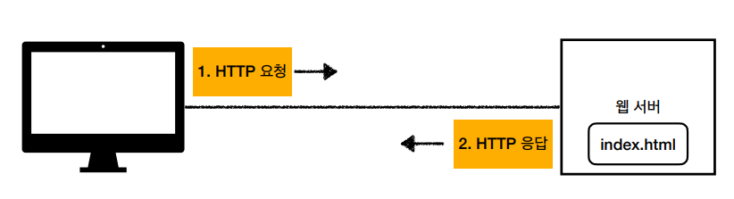
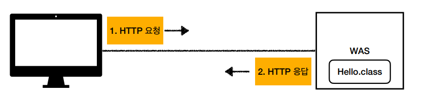
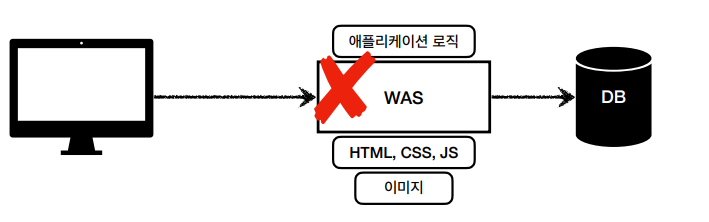
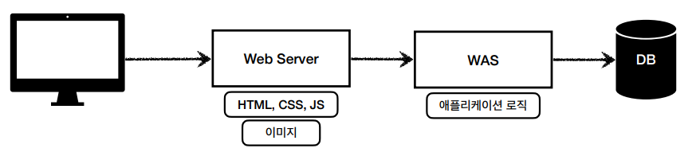
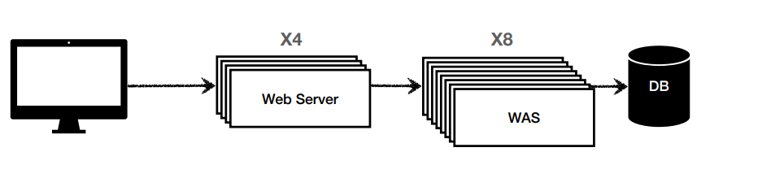

# <a href = "../README.md" target="_blank">스프링 MVC 1편 - 백엔드 웹 개발 핵심 기술</a>
## Chapter 01. 웹 어플리케이션의 이해
### 1.1 웹 서버, 웹 어플리케이션 서버
1) 대부분의 모던 웹 애플리케이션은 HTTP 기반
2) 웹 서버(Web Server)
3) 웹 애플리케이션 서버(WAS - Web Application Server)
4) 웹 서버 vs  웹 애플리케이션 서버(WAS)
5) 웹 시스템 구성 - WAS, DB
6) 웹 시스템 구성 - WEB, WAS, DB

---

# 1.1 웹 서버, 웹 어플리케이션 서버

---

## 1) 대부분의 모던 웹 애플리케이션은 HTTP 기반
### HTTP (HyperText Transfer Protocol)
  
- HyperText : 링크를 통해 문서를 연결할 수 있는 텍스트 (예 : HTML - HyperText Markup Language)
- 프로토콜(protocol) : 컴퓨터 간에 정보를 주고받을 때의 통신하는 방법에 위한 규칙이나 표준
  - 예) HTTP, HTTPS, FTP, SFTP, SSH, SSL, SOAP, Telnet, ...
- HTTP는 전 세계의 여러 종류(거의 모든 형태)의 파일, 데이터를 끊임없이 빠르고 간편하고 정확하게 전달해주고 있다.
  - HTML, TEXT
  - IMAGE, 음성, 영상, 파일
  - JSON, XML (API)
- 신뢰성 있는 데이터 전송 프로토콜
    - 전송 중 파괴, 중복, 왜곡에 대한 부담이 줄어듬
    - 개발자 입장에서는 인터넷의 결함/약점에 대한 걱정 없 이 애플리케이션 고유의 기능을 구현하는데 집중 가능.
- 서버 간에 데이터를 주고 받을 때도 대부분 HTTP 사용

---

## 2) 웹 서버(Web Server)

1. 웹 서버 : **HTTP 또는 HTTPS**를 통해 웹 브라우저에서 요청하는 HTML 문서나 오브젝트(이미지 파일 등)을 전송해주는 서비스 프로그램(혹은 서비스 프로그램을 실행하는 컴퓨터)
2. HTTP/HTTPS 기반!!!
3. 역할 : 정적 리소스 제공, 기타 부가 기능
   - 정적 리소스 : HTML, CSS, JS, 이미지, 텍스트, 오디오, 영상, ...
4. 제품 : NGINX, APACHE

---

## 3) 웹 애플리케이션 서버(WAS - Web Application Server)

- 웹 서버로부터 오는 동적인 요청을 처리하는 애플리케이션이 내장된 서버.
- HTTP/HTTPS 기반으로 동작
- 프로그램 코드를 실행해서 애플리케이션 로직 수행 
  - 동적 HTML, HTTP API(JSON)
  - 서블릿, JSP, 스프링 MVC
- 웹 서버의 기능도 내장하고 있음(정적 리소스 제공 가능)
- 제품 : 톰캣(Tomcat), Jetty, Undertow

---

## 4) 웹 서버 vs  웹 애플리케이션 서버(WAS)
웹 서버는 정적 리소스(파일) 응답, WAS는 애플리케이션 로직
   - 사실은 둘의 용어도 경계도 모호함
   - 웹 서버도 프로그램을 실행하는 기능을 포함하기도 함
   - 웹 애플리케이션 서버도 웹 서버의 기능을 제공함
   - 자바는 서블릿 컨테이너 기능을 제공하면 WAS
   - 서블릿 없이 자바코드를 실행하는 서버 프레임워크도 있음
   - WAS는 애플리케이션 코드를 실행하는데 더 특화

---

## 5) 웹 시스템 구성 - WAS, DB

### WAS, DB만으로 시스템 구성 가능

- WAS는 정적 리소스, 애플리케이션 로직 모두 제공 가능

### 가급적 웹서버, WAS를 분리해서 사용하는 것이 좋다.

- WAS가 너무 많은 역할을 담당, 서버 과부하 우려
- 가장 비싼 애플리케이션 로직이 정적 리소스 때문에 수행이 어려울 수 있음
- WAS 장애시 오류 화면도 노출 불가능

---

## 6) 웹 시스템 구성 - WEB, WAS, DB
### 역할, 책임의 분리

- Web Server
  - 정적 콘텐츠 리소스 제공.
  - 중요한 애플리케이션 로직이 필요할 경우 WAS에게 위임
- WAS(Web Application Server)
  - 동적 콘텐츠 리소스 제공
  - 중요한 애플리케이션 로직 처리 전담

### 효율적인 리소스 관리 가능

- 정적 리소스가 많이 사용되면 Web 서버 증설
- 애플리케이션 리소스가 많이 사용되면 WAS 증설

### WAS가 죽었을 때 유연한 대응 가능

- 정적 리소스만 제공하는 웹 서버는 잘 죽지 않음 
- 애플리케이션 로직이 동작하는 WAS 서버는 잘 죽음
- WAS, DB 장애시 WEB 서버가 오류 화면 제공 가능

---