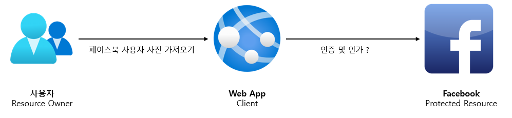

# <a href = "../README.md" target="_blank">스프링 시큐리티 OAuth2</a>
## Chapter 01. Spring Security Fundamentals
### 2.1 OAuth 2.0 소개
1) 개요
2) 등장 배경
3) 장점
---

# 2.1 OAuth 2.0 소개

---

## 1) 개요
- OAuth = Open + Authorization
- OAuth 2.0 Authorization Framework
    - [https://www.rfc-editor.org/rfc/rfc6749](https://www.rfc-editor.org/rfc/rfc6749)
    - 애플리케이션이 사용자를 대신하여, 사용자의 자원에 대한 액세스를 얻어야함
    - 사용자의 승인 → 그에 따른 상호작용 → 애플리케이션이 자체적으로 액세스 권한을 획득
- OAuth 2.0 프레임워크는 결국, 위임 인가 프레임워크이다.
    - 애플리케이션이 사용자의 데이터에 접근할 수 있는 권한을 부여하는 작업

---

## 2) 등장 배경

- 페이스북과 같은 사이트에서 리소스를 가져오려면 결국 인증/인가 작업을 거쳐야한다.
- 클라이언트 서비스에서 페이스북 연동을 통해, 사용자 사진을 가져와야하는데 기존 방식대로라면 사용자의 아이디/패스워드를 직접
웹 애플리케이션에 전달 후 이 값을 이용해 직접적으로 인증/인가를 거쳐야했다.
- 하지만 이 방식은 매우 큰 단점을 가지고 있다.
  - 아이디/패스워드가 노출되어 보약에 매우 취약
  - 클라이언트 서비스에서는 아이디/패스워드를 직접 사용자로부터 받아오기 때문에 모든 서비스를 제한없이 사용 가능
  - 클라이언트 서비스를 신뢰할 수 있는가? 클라이언트가 악의적인 의도를 가진 서비스이거나 보안상 취약하다면?

---

## 3) 장점

- 아이디, 패스워드를 우리 클라이언트에 전달할 필요가 없다.
- 페이스북/구글/카카오, … 의 서비스를 범위에 따라 제한할 수 있다.
- 클라이언트 애플리케이션의 신뢰 여부를 판단할 필요가 없다.

---
