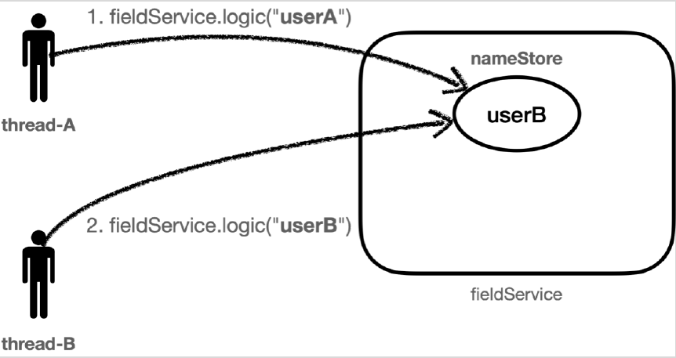
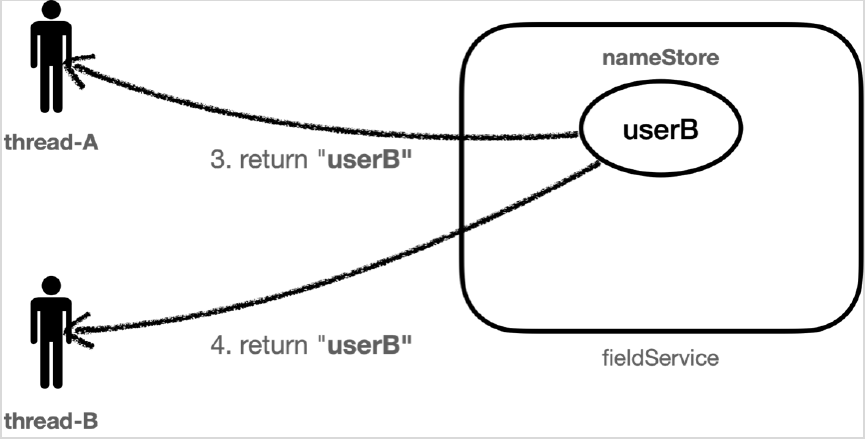

# <a href = "../README.md" target="_blank">스프링 핵심 원리 - 고급편</a>
## Chapter 02. 스레드 로컬 - ThreadLocal
### 2.4 동시성 문제 - 예제 코드
1) `FieldService` : `nameStore`에 `name`을 저장하고 조회하는 로직
2) (실습) 동시성 문제 없는 코드
3) (실습) 동시성 문제 발생 코드
4) 동시성 문제 : 여러 스레드가 같은 인스턴스, static 필드를 변경 후 조회하면서 발생

---

# 2.4 동시성 문제 - 예제 코드

---

## 1) `FieldService` : `nameStore`에 `name`을 저장하고 조회하는 로직

### 1.1 `build.gradle`에 테스트 lombok 의존성 추가
```groovy
dependencies {
    //테스트에서 lombok 사용
    testCompileOnly 'org.projectlombok:lombok'
    testAnnotationProcessor 'org.projectlombok:lombok'
}
```
- 테스트에서도 lombok을 사용하기 위해 다음 코드를 추가하자.
- 이렇게 해야 테스트 코드에서 @Slfj4 같은 애노테이션이 작동한다.

### 1.2 FieldService
```java
@Slf4j
public class FieldService {

    private String nameStore;

    public String logic(String name) {
        log.info("저장 name={} -> nameStore = {}", name, nameStore);
        nameStore = name;
        sleep(1000);
        log.info("조회 nameStore = {}", nameStore);
        return nameStore;
    }

    private void sleep(int millis) {
        try {
            Thread.sleep(millis);
        } catch (InterruptedException e) {
            e.printStackTrace();
        }
    }
}
```
- 매우 단순한 로직이다.
- 파라미터로 넘어온 name 을 필드인 nameStore 에 저장한다.
- 그리고 1초간 쉰 다음 필드에 저장된 nameStore 를 반환한다.

---

## 2) (실습) 동시성 문제 없는 코드

### 2.1 순서대로 실행
```java
@Slf4j
public class FieldServiceTest {

    private FieldService fieldService = new FieldService();

    @Test
    void field() {
        log.info("main start");
        Runnable userA = () -> fieldService.logic("userA");
        Runnable userB = () -> fieldService.logic("userB");

        Thread threadA = new Thread(userA);
        threadA.setName("thread-A");
        Thread threadB = new Thread(userB);
        threadB.setName("thread-B");

        threadA.start();
        sleep(2000); // 동시성 문제 발생 x
        threadB.start();
        sleep(3000); // 메인 스레드 종료 대기
        log.info("main exit");
    }
}
```
- `sleep(2000)` 을 설정해서 `thread-A` 의 실행이 끝나고 나서 `thread-B` 가 실행되도록 한다.
  - `FieldService.logic()` 메서드는 내부에 `sleep(1000)` 으로 1초의 지연이 있다. 따라서 1초 이후에 호출하면 순서대로 실행할 수 있다.
  - 여기서는 넉넉하게 2초 (2000ms)를 설정했기에 순서대로 작업이 실행된다.
- `threadB.start()` 호출 후 로그 확인을 원활하게 하기 위해서 메인 스레드를 3000ms 대기시킨다.
  - 별도로 대기시키지 않으면 메인스레드가 바로 종료되어 로그가 제대로 찍히지 않는다.

### 2.2 실행 결과
```shell
[Test worker] main start
[Thread-A] 저장 name=userA -> nameStore=null
[Thread-A] 조회 nameStore=userA
[Thread-B] 저장 name=userB -> nameStore=userA
[Thread-B] 조회 nameStore=userB
[Test worker] main exit
```


실행 결과를 보면 문제가 없다.
- `Thread-A` 가 `userA` 를 `nameStore` 에 저장했다.
- `Thread-A` 가 `userA` 를 `nameStore` 에서 조회했다.
- `Thread-B` 가 `userB` 를 `nameStore` 에 저장했다.
- `Thread-B` 가 `userB` 를 `nameStore` 에서 조회했다.

---

## 3) (실습) 동시성 문제 발생 코드

### 3.1 이전 작업이 끝나기 전에 작업 실행
```java
threadA.start();
//sleep(2000); //동시성 문제 발생X
sleep(100); //동시성 문제 발생O
threadB.start();
```
이번에는 `sleep(100)` 을 설정해서 `thread-A` 의 작업이 끝나기 전에 `thread-B` 가 실행되도록 한다.
- `FieldService.logic()` 메서드는 내부에 `sleep(1000)` 으로 1초의 지연이 있다. 따라서 1초 이후에 호출하면 순서대로 실행할 수 있다.
- **이번에 설정할 `100(ms)`는 0.1초이기 때문에 `thread-A` 의 작업이 끝나기 전에 `thread-B` 가 실행된다.**

### 3.2 실행 결과
```shell
[Test worker] main start
[Thread-A] 저장 name=userA -> nameStore=null
[Thread-B] 저장 name=userB -> nameStore=userA
[Thread-A] 조회 nameStore=userB
[Thread-B] 조회 nameStore=userB
[Test worker] main exit
```
저장하는 부분은 문제가 없다. 문제는 조회하는 부분에서 발생한다.


#### 3.2.1 스레드 A의 "userA"보관
먼저 `thread-A` 가 `userA` 값을 `nameStore` 에 보관한다.




#### 3.2.2 스레드 B의 "userB" 덮어쓰기
- 0.1초 이후에 `thread-B` 가 `userB` 의 값을 `nameStore` 에 보관한다.
- 기존에 `nameStore` 에 보관되어 있던 `userA` 값은 제거되고 `userB` 값이 저장된다.




#### 3.2.3 덮어 씌워진 "userB"를 스레드 A, 스레드 B가 각각 조회
- `thread-A` 의 호출이 끝나면서 `nameStore` 의 결과를 반환받는데, 이때 `nameStore` 는 앞의 2번에서 `userB` 의 값으로 대체되었다.
따라서 기대했던 `userA` 의 값이 아니라 `userB` 의 값이 반환된다.
- `thread-B` 의 호출이 끝나면서 `nameStore` 의 결과인 `userB` 를 반환받는다.

#### 3.2.4 정리
1. `Thread-A` 는 `userA` 를 `nameStore` 에 저장했다.
2. `Thread-B` 는 `userB` 를 `nameStore` 에 덮어씌웠다.
3. `Thread-A` 는 `userB` 를 `nameStore` 에서 조회했다.
4. `Thread-B` 는 `userB` 를 `nameStore` 에서 조회했다.

---

## 4) 동시성 문제 : 여러 스레드가 같은 인스턴스, static 필드를 변경 후 조회하면서 발생

### 4.1 동시성 문제
- 결과적으로 Thread-A 입장에서는 저장한 데이터와 조회한 데이터가 다른 문제가 발생한다.
- 이처럼 **여러 스레드가 동시에 같은 인스턴스의 필드 값을 변경하면서 발생하는 문제를 동시성 문제라 한다.**
- 이런 동시성 문제는 여러 쓰레드가 같은 인스턴스의 필드에 접근해야 하기 때문에 트래픽이 적은 상황에서는 확률상 잘
나타나지 않고, 트래픽이 점점 많아질 수록 자주 발생한다.
- 특히 스프링 빈 처럼 싱글톤 객체의 필드를 변경하며 사용할 때 이러한 동시성 문제를 조심해야 한다.

### 4.2 같은 인스턴스의 필드, 같은 클래스의 static 필드를 변경 후 조회 시 발생
- 이런 동시성 문제는 지역 변수에서는 발생하지 않는다. 지역 변수는 쓰레드마다 각각 다른 메모리 영역이
할당된다.
- 동시성 문제가 발생하는 곳은 같은 인스턴스의 필드(주로 싱글톤에서 자주 발생), 또는 static 같은 공용
필드에 접근할 때 발생한다.
- 동시성 문제는 값을 읽기만 하면 발생하지 않는다. **어디선가 값을 변경하기 때문에 발생한다.**

### 4.3 해결책
- 그렇다면 지금처럼 싱글톤 객체의 필드를 사용하면서 동시성 문제를 해결하려면 어떻게 해야할까?
- 다시 파라미터를 전달하는 방식으로 돌아가야 할까?
- 이럴 때 사용하는 것이 바로 쓰레드 로컬이다.

---
