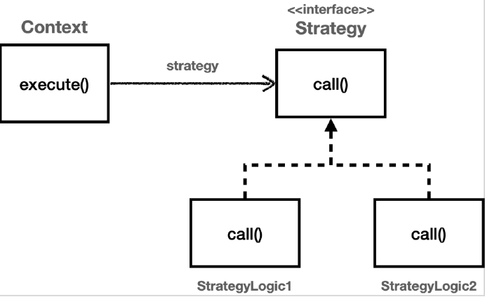

# <a href = "../README.md" target="_blank">스프링 핵심 원리 - 고급편</a>
## Chapter 03. 템플릿 메서드 패턴과 콜백 패턴
### 3.09 전략 패턴 - 예제1
1) 템플릿 메서드 패턴 vs 전략 패턴
2) `ContextV1`, `Strategy` : 전략 패턴 예제 코드
3) `strategyV1()` : 전략 패턴 적용 예제 코드 실행
4) 전략 패턴 실행 흐름
5) 스프링과 전략 패턴의 공통점

---

# 3.09 전략 패턴 - 예제1

---

## 1) 템플릿 메서드 패턴 vs 전략 패턴

### 1.1 템플릿 메서드 패턴
- 탬플릿 메서드 패턴은 부모 클래스에 변하지 않는 템플릿을 두고, 변하는 부분을 자식 클래스에 두어서
상속을 사용해서 문제를 해결했다.

### 1.2 전략 패턴


> 알고리즘 제품군을 정의하고 각각을 캡슐화하여 상호 교환 가능하게 만들자.
> 
> 전략을 사용하면 알고리즘을 사용하는 클라이언트와 독립적으로 알고리즘을 변경할 수 있다.

- 전략 패턴은 변하지 않는 부분을 Context 라는 곳에 두고, 변하는 부분을 Strategy 라는 인터페이스를
만들고 해당 인터페이스를 구현하도록 해서 문제를 해결한다. 상속이 아니라 위임으로 문제를 해결하는
것이다.
- 전략 패턴에서 Context 는 변하지 않는 템플릿 역할을 하고, Strategy 는 변하는 알고리즘 역할을 한다.

---

## 2) `ContextV1`, `Strategy` : 전략 패턴 예제 코드

### 2.1 Strategy 인터페이스 : 전략
```java
public interface Strategy {
    void call();
}
```
- 변하는 알고리즘은 Strategy 인터페이스를 구현하면 된다.

### 2.2 StrategyLogic1, StrategyLogic2 : 전략 구현체
```java
@Slf4j
public class StrategyLogic1 implements Strategy {
    @Override
    public void call() {
        log.info("비즈니스 로직1 실행");
    }
}
```
```java
@Slf4j
public class StrategyLogic2 implements Strategy {
    @Override
    public void call() {
        log.info("비즈니스 로직2 실행");
    }
}
```
- `StrategyLogic1`, `StrategyLogic2`는 Strategy 인터페이스를 구현했다.

### 2.3 ContextV1 : 필드에 전략 보관
```java
/**
 * 필드에 전략을 보관하는 방식
 */
@Slf4j
public class ContextV1 {

    private Strategy strategy;

    public ContextV1(Strategy strategy) {
        this.strategy = strategy;
    }

    public void execute() {
        long startTime = System.currentTimeMillis();

        // 비즈니스 로직 실행
        strategy.call(); // 위임
        // 비즈니스 로직 종료

        long endTime = System.currentTimeMillis();
        long resultTime = endTime - startTime;
        log.info("resultTime = {}", resultTime);
    }
}
```
- `ContextV1` 은 변하지 않는 로직을 가지고 있는 템플릿 역할을 하는 코드이다. 전략 패턴에서는 이것을
컨텍스트(문맥)이라 한다.
- 쉽게 이야기해서 컨텍스트(문맥)는 크게 변하지 않지만, 그 문맥 속에서 strategy 를 통해 일부 전략이
변경된다 생각하면 된다.
- Context 는 내부에 `Strategy strategy` 필드를 가지고 있다. 이 필드에 변하는 부분인 `Strategy` 의
구현체를 주입하면 된다.
- 전략 패턴의 핵심은 `Context` 는 `Strategy` 인터페이스에만 의존한다는 점이다. 덕분에 `Strategy` 의
구현체를 변경하거나 새로 만들어도 `Context` 코드에는 영향을 주지 않는다.
- `Strategy` 구현체 입장에서는 `Strategy` 인터페이스 사양이 변하는 일이 일어나지 않는 한 변경이 일어날 가능성이 거의 없다.

---

## 3) `strategyV1()` : 전략 패턴 적용 예제 코드 실행

### 3.1 코드
```java
    /**
     * 전략 패턴 사용
     */
    @Test
    void strategyV1() {
        StrategyLogic1 strategyLogic1 = new StrategyLogic1(); // 변하는 부분(전략, 인터페이스 구현체)
        ContextV1 context1 = new ContextV1(strategyLogic1); // 변하지 않는 부분(문맥, 인터페이스를 의존함)
        context1.execute();

        StrategyLogic2 strategyLogic2 = new StrategyLogic2();
        ContextV1 context2 = new ContextV1(strategyLogic2);
        context2.execute();
    }
```
- 코드를 보면 의존관계 주입을 통해 `ContextV1` 에 `Strategy` 의 구현체인 `strategyLogic1` 를 주입하는
것을 확인할 수 있다. 이렇게해서 `Context` 안에 원하는 전략을 주입한다.
- 이렇게 원하는 모양으로 조립을 완료하고 난 다음에 `context1.execute()` 를 호출해서 `context` 를 실행한다.

### 3.2 실행 로그
```shell
StrategyLogic1 - 비즈니스 로직1 실행
ContextV1 - resultTime=3
StrategyLogic2 - 비즈니스 로직2 실행
ContextV1 - resultTime=0
```

---

## 4) 전략 패턴 실행 흐름

1. `Context` 에 원하는 `Strategy` 구현체를 주입한다.(조립)
2. 클라이언트는 `context` 를 실행한다.
3. context 는 context 로직을 시작한다.
4. context 로직 중간에 `strategy.call() `을 호출해서 주입 받은 strategy 로직을 실행한다.
5. context 는 나머지 로직을 실행한다.

---

## 5) 스프링과 전략 패턴의 공통점

어디서 많이 본 코드 같지 않은가? 그렇다. 바로 스프링에서 의존관계 주입에서 사용하는 방식이 바로 전략
패턴이다.

### 5.1 스프링의 의존관계 주입
- 클라이언트 계층이 인터페이스를 의존하고, 인터페이스로 구현체 빈이 애플리케이션 로딩 시점에 주입(조립)된다.
- 클라이언트 코드를 실행할 때는 도중에 주입된 인터페이스 구현체에 위임한 코드가 실행된다.
- 인터페이스의 구현체 빈을 변경하거나 새로 만들어도 클라이언트의 코드는 변경되지 않는다.
- 구현체 빈 입장에서는 인터페이스 사양이 변하는 일이 일어나지 않는 한 변경이 일어날 가능성이 거의 없다.

### 5.2 전략 패턴
- Context가 Strategy 인터페이스를 의존하고, 생성 시점에 Strategy 구현체가 주입(조립)된다.
- Context를 실행할 때는 도중에 주입된 strategy에 위임한 코드가 실행된다.
- Strategy 구현체를 변경하거나 새로 만들어도 Context의 코드는 변경되지 않는다.
- Strategy 구현체 입장에서는 Strategy 인터페이스 사양이 변하는 일이 일어나지 않는 한 변경이 일어날 가능성이 거의 없다.

---
