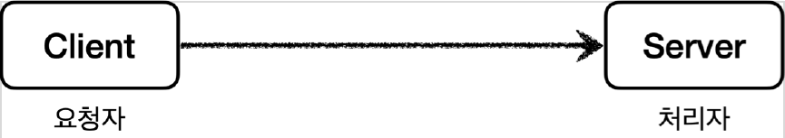
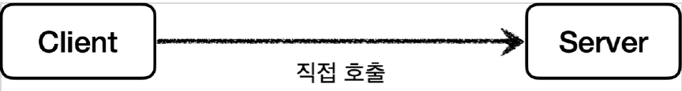
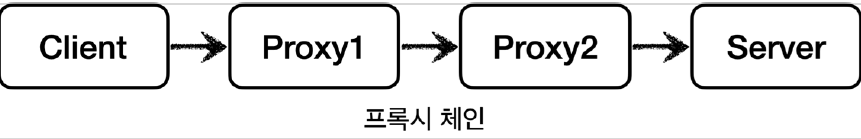
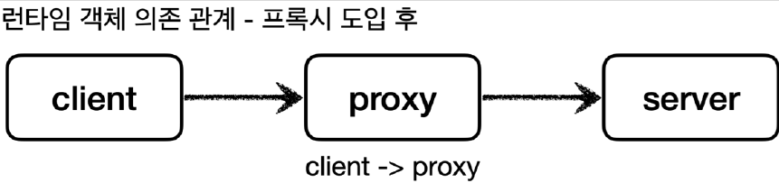

# <a href = "../README.md" target="_blank">스프링 핵심 원리 - 고급편</a>
## Chapter 04. 프록시 패턴과 데코레이터 패턴
### 4.06 프록시, 프록시 패턴, 데코레이터 패턴 - 소개
1) 클라이언트와 서버 : 요청하는 측, 요청을 처리하는 측
2) 직접 호출, 프록시를 통한 간접 호출
3) 프록시 체인 : 프록시는 여러 개를 둘 수 있다
4) 프록시는 서버와 같은 인터페이스를 구현하고, 대체하여 주입된다.
5) 프록시의 주요기능 : 접근제어, 부가 기능 추가
6) 프록시, 프록시 패턴, 데코레이터 패턴

---

# 4.06 프록시, 프록시 패턴, 데코레이터 패턴 - 소개

---

## 1) 클라이언트와 서버 : 요청하는 측, 요청을 처리하는 측

- 클라이언트( Client )와 서버( Server )라고 하면 개발자들은 보통 서버 컴퓨터를 생각한다.
- 사실 클라이언트와 서버의 개념은 상당히 넓게 사용된다. 클라이언트는 의뢰인이라는 뜻이고, 서버는
'서비스나 상품을 제공하는 사람이나 물건'을 뜻한다. 따라서 클라이언트와 서버의 기본 개념을 정의하면
**클라이언트는 서버에 필요한 것을 요청**하고, **서버는 클라이언트의 요청을 처리**하는 것이다.
- 이 개념을 우리가 익숙한 컴퓨터 네트워크에 도입하면 클라이언트는 웹 브라우저가 되고, 요청을 처리하는
서버는 웹 서버가 된다.
- 이 개념을 객체에 도입하면, 요청하는 객체는 클라이언트가 되고, 요청을 처리하는 객체는 서버가 된다.

---

## 2) 직접 호출, 프록시를 통한 간접 호출

### 2.1 직접 호출

- 클라이언트와 서버 개념에서 일반적으로 클라이언트가 서버를 직접 호출하고, 처리 결과를 직접 받는다.
- 이것을 직접 호출이라 한다.

### 2.2 프록시를 통한 간접 호출

- 그런데 클라이언트가 요청한 결과를 서버에 직접 요청하는 것이 아니라 어떤 대리자를 통해서 대신
간접적으로 서버에 요청할 수 있다. 예를 들어서 내가 직접 마트에서 장을 볼 수도 있지만, 누군가에게 대신
장을 봐달라고 부탁할 수도 있다.
- 여기서 대신 장을 보는 대리자를 영어로 프록시(Proxy)라 한다.

### 2.3 프록시의 기능 예 - 접근제어, 캐싱
- 엄마에게 라면을 사달라고 부탁 했는데, 엄마는 그 라면은 이미 집에 있다고 할 수도 있다.
- 그러면 기대한 것보다 더 빨리 라면을 먹을 수 있다.

### 2.4 프록시의 기능 예 - 부가기능 추가
- 아버지께 자동차 주유를 부탁했는데, 아버지가 주유 뿐만 아니라 세차까지 하고 왔다.
- 클라이언트가 기대한 것 외에 세차라는 부가 기능까지 얻게 되었다.

---

## 3) 프록시 체인 : 프록시는 여러 개를 둘 수 있다

- 대리자가 또 다른 대리자를 부를 수도 있다.
- 예를 들어서 내가 동생에게 라면을 사달라고 했는데, 동생은 또 다른 누군가에게 라면을 사달라고 다시 요청할 수도 있다.
- 중요한 점은 클라이언트는 대리자를 통해서 요청했기 때문에 그 이후 과정은 모른다는 점이다. 동생을 통해서 라면이 나에게 도착하기만 하면 된다.

---

## 4) 프록시는 서버와 같은 인터페이스를 구현하고, 대체하여 주입된다.

### 4.1 클라이언트는 어떤 서버 구현체를 의존하는지 몰라야한다.
- 여기까지 듣고 보면 아무 객체나 프록시가 될 수 있는 것 같다.
- 객체에서 프록시가 되려면, 클라이언트는 서버에게 요청을 한 것인지, 프록시에게 요청을 한 것인지 조차
몰라야 한다.

### 4.2 프록시는 서버와 같은 인터페이스를 구현해야한다.

- 클라이언트가 사용하는 서버 객체를 프록시 객체로 변경해도 클라이언트 코드를 변경하지 않고 동작할 수 있어야 한다.
- 클래스 의존관계를 보면 클라이언트는 서버 인터페이스(`ServerInterface`)에만 의존한다.
  그리고 서버와 프록시가 같은 인터페이스를 사용한다. 따라서 DI를 사용해서 대체 가능하다.

### 4.3 런타임 의존관계 : 프록시가 서버를 대체하여 의존관계 주입된다.

- 런타임(애플리케이션 실행 시점)에 클라이언트 객체에 DI를 사용해서 `Client -> Server` 에서
`Client -> Proxy` 로 객체 의존관계를 변경해도 클라이언트 코드를 전혀 변경하지 않아도 된다.
- 클라이언트 입장에서는 변경 사실 조차 모른다.
- DI를 사용하면 클라이언트 코드의 변경 없이 유연하게 프록시를 주입할 수 있다.

---

## 5) 프록시의 주요기능 : 접근제어, 부가 기능 추가
프록시를 통해서 할 수 있는 일은 크게 2가지로 구분할 수 있다.  
프록시 객체가 중간에 있으면 크게 접근 제어와 부가 기능 추가를 수행할 수 있다.  

### 5.1 접근 제어
- 권한에 따른 접근 차단
- 캐싱
- 지연 로딩

### 5.2 부가 기능 추가
원래 서버가 제공하는 기능에 더해서 부가 기능을 수행한다.
- 예) 요청 값이나, 응답 값을 중간에 변형한다.
- 예) 실행 시간을 측정해서 추가 로그를 남긴다.

--- 

## 6) 프록시, 프록시 패턴, 데코레이터 패턴

### 6.1 프록시 : 클라이언트 - 서버 사이에 위치한 '계층'
- 프록시 : 여러가지 형태의 클라이언트-서버 사이에 위치한 '계층'
- 프록시라는 개념은 클라이언트 서버라는 큰 개념안에서 자연스럽게 발생할 수 있다.
- 프록시는 객체안에서의 개념도 있고, 웹 서버에서의 프록시도 있다.
- 객체안에서 객체로 구현되어있는가, 웹 서버로 구현되어 있는가 처럼 규모의 차이가 있을 뿐 근본적인 역할은 같다.

### 6.2 프록시 패턴, 데코레이터 패턴 : 모양은 같으나, 의도(intent)에 따라 구분된다.
둘다 프록시를 사용하는 방법이지만 GOF 디자인 패턴에서는 이 둘을 의도(intent)에 따라서 프록시 패턴과 데코레이터 패턴으로 구분한다.
- 프록시 패턴 : 접근 제어가 목적
- 데코레이터 패턴 : 부가기능 추가

### 6.3 용어에 주의할 것
- 프록시는 클라이언트와 서버 사이에 위치한 '계층'이다.
- 프록시 패턴/데코레이터 패턴은 이를 특정 목적으로 사용하는 디자인 패턴이다.

---
