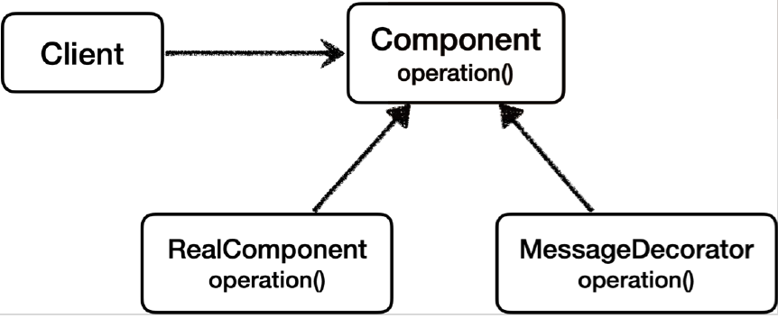

# <a href = "../README.md" target="_blank">스프링 핵심 원리 - 고급편</a>
## Chapter 04. 프록시 패턴과 데코레이터 패턴
### 4.10 데코레이터 패턴 - 예제 코드2
1) 데코레이터 패턴 : 프록시를 통해 부가기능 추가
2) 예제 코드 : 응답 값을 꾸며주는 데코레이터
3) 실행 : 데코레이터를 통해 부가기능을 추가

---

# 4.10 데코레이터 패턴 - 예제 코드2

---

## 1) 데코레이터 패턴 : 프록시를 통해 부가기능 추가
- 원래 서버가 제공하는 기능에 더해서 부가 기능을 수행한다. 
- 요청 값이나, 응답 값을 중간에 변형한다.
- 예) 실행 시간을 측정해서 추가 로그를 남긴다.

---

## 2) 예제 코드 : 응답 값을 꾸며주는 데코레이터

### 2.1 데코레이터 패턴 적용 후 클래스 의존 관계


### 2.2 데코레이터 패턴 적용 후 런타임 객체 의존 관계


### 2.3 MessageDecorator
```java

@Slf4j
public class MessageDecorator implements Component {

    private Component component;

    public MessageDecorator(Component component) {
        this.component = component;
    }

    @Override
    public String operation() {
        log.info("MessageDecorator 실행");

        // data --> *****data*****
        String result = component.operation();
        String decoResult = "*****" + result + "*****";
        log.info("MessageDecorator 꾸미기 적용 전 = {}, 적용 후 = {}", result, decoResult);
        return decoResult;
    }
}
```
- `MessageDecorator` 는 `Component` 인터페이스를 구현한다.
- 프록시가 호출해야 하는 대상을 `component` 에 저장한다.
- `operation()` 을 호출하면 프록시와 연결된 대상을 호출(`component.operation()`) 하고, 그 응답 값에
`*****` 을 더해서 꾸며준 다음 반환한다.
- 예를 들어서 응답 값이 data 라면 다음과 같다.
  - 꾸미기 전: data
  - 꾸민 후 : `*****data*****`

### 2.4 `DecoratorPatternTest.decorator1()`
```java
    @Test
    void decorator1() {
        Component realComponent = new RealComponent();
        Component messageDecorator = new MessageDecorator(realComponent);
        DecoratorPatternClient client = new DecoratorPatternClient(messageDecorator);
        client.execute();
    }
```
`client -> messageDecorator -> realComponent` 의 객체 의존 관계를 만들고 `client.execute()`
를 호출한다.

---

## 3) 실행 : 데코레이터를 통해 부가기능을 추가
```shell
MessageDecorator - MessageDecorator 실행
RealComponent - RealComponent 실행
MessageDecorator - MessageDecorator 꾸미기 적용 전=data, 적용 후=*****data*****
DecoratorPatternClient - result=*****data*****
```
실행 결과를 보면 `MessageDecorator` 가 `RealComponent` 를 호출하고 반환한 응답 메시지를 꾸며서
반환한 것을 확인할 수 있다.

---
