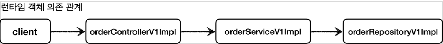

# <a href = "../README.md" target="_blank">스프링 핵심 원리 - 고급편</a>
## Chapter 04. 프록시 패턴과 데코레이터 패턴
### 4.13 인터페이스 기반 프록시 - 적용
1) V1 기존 클래스 의존관계
2) V1에 인터페이스 기반 프록시 적용
3) V1에 인터페이스 기반 프록시 적용 - 의존관계 상세 분석
4) 실행 및 로그 확인 : 원본 코드를 손대지 않고 로그 기능 추가 성공
5) 정리 : 요구사항은 만족하긴 하는데, 프록시를 매번 새로 만드는게 귀찮다.
---

# 4.13 인터페이스 기반 프록시 - 적용

---

## 1) V1 기존 클래스 의존관계
### 1.1 클래스 의존 관계


### 1.2 런타임 객체 의존 관계


---

## 2) V1에 인터페이스 기반 프록시 적용

### 2.1 클래스 의존 관계

- `Controller` , `Service` , `Repository` 각각 인터페이스에 맞는 프록시 구현체를 추가한다.
  (그림에서 리포지토리는 생략했다.)

### 2.2 런타임 객체 의존 관계

- 애플리케이션 실행 시점에 프록시를 사용하도록 의존 관계를 설정해주어야 한다.
- 이 부분은 빈을 등록하는 설정 파일을 활용하면 된다. (그림에서 리포지토리는 생략했다.)

### 2.3 OrderRepositoryInterfaceProxy
```java
@RequiredArgsConstructor
public class OrderRepositoryInterfaceProxy implements OrderRepositoryV1 {

    private final OrderRepositoryV1 target;
    private final LogTrace logTrace;

    @Override
    public void save(String itemId) {
        TraceStatus status = null;
        try {
            status = logTrace.begin("OrderRepository.save()");
            // target 호출
            target.save(itemId);
            logTrace.end(status);
        } catch (Exception e) {
            logTrace.exception(status, e);
            throw e;
        }
    }
}
```
- 프록시를 만들기 위해 인터페이스를 구현하고 구현한 메서드에 `LogTrace` 를 사용하는 로직을 추가한다.
지금까지는 `OrderRepositoryImpl` 에 이런 로직을 모두 추가해야했다.
프록시를 사용한 덕분에 이 부분을 프록시가 대신 처리해준다.
따라서 `OrderRepositoryImpl` 코드를 변경하지 않아도 된다.
- `OrderRepositoryV1 target` : 프록시가 실제 호출할 원본 리포지토리의 참조를 가지고 있어야 한다.

### 2.4 OrderServiceInterfaceProxy
```java
@RequiredArgsConstructor
public class OrderServiceInterfaceProxy implements OrderServiceV1{

    private final OrderServiceV1 target;
    private final LogTrace logTrace;

    @Override
    public void orderItem(String itemId) {
        TraceStatus status = null;
        try {
            status = logTrace.begin("OrderService.orderItem()");
            // target 호출
            target.orderItem(itemId);
            logTrace.end(status);
        } catch (Exception e) {
            logTrace.exception(status, e);
            throw e;
        }
    }
}
```
앞과 같다.

### 2.5 OrderControllerInterfaceProxy
```java

@RequiredArgsConstructor
public class OrderControllerInterfaceProxy implements OrderControllerV1 {

    private final OrderControllerV1 target;
    private final LogTrace logTrace;

    @Override
    public String request(String itemId) {
        TraceStatus status = null;
        try {
            status = logTrace.begin("OrderController.request()");
            // target 호출
            String result = target.request(itemId);
            logTrace.end(status);
            return result;
        } catch (Exception e) {
            logTrace.exception(status, e);
            throw e;
        }
    }

    @Override
    public String noLog() {
        return target.noLog();
    }
}
```
- `noLog()` 메서드는 로그를 남기지 않아야 한다. 따라서 별도의 로직 없이 단순히 `target` 을 호출하면 된다.

### 2.6 InterfaceProxyConfig
```java
@Configuration
public class InterfaceProxyConfig {

    @Bean
    public OrderControllerV1 orderController(LogTrace logTrace) {
        OrderControllerV1Impl controllerImpl = new OrderControllerV1Impl(orderService(logTrace));
        return new OrderControllerInterfaceProxy(controllerImpl, logTrace);
    }

    @Bean
    public OrderServiceV1 orderService(LogTrace logTrace) {
        OrderServiceV1Impl serviceImpl = new OrderServiceV1Impl(orderRepository(logTrace));
        return new OrderServiceInterfaceProxy(serviceImpl, logTrace);
    }

    @Bean
    public OrderRepositoryV1 orderRepository(LogTrace logTrace) {
        OrderRepositoryV1Impl repositoryImpl = new OrderRepositoryV1Impl();
        return new OrderRepositoryInterfaceProxy(repositoryImpl, logTrace);
    }
}
```
- 런타임 의존관계를 보면 프록시를 실제 빈 대신 등록한다.
- 프록시는 실제 객체 target을 가지고 있다.
- 프록시 패턴, 데코레이터 패턴의 의도를 고려해보면 이 원리가 쉽긴 한데, 헷갈릴 수 있으니 아래에서 상세히 다시 설명할 것이다.
- `LogTrace` 가 아직 스프링 빈으로 등록되어 있지 않은데, 이 부분은 바로 다음에 등록할 것이다.

### 2.7 ProxyApplication
```java
//@Import(AppV1Config.class)
//@Import({AppV1Config.class, AppV2Config.class})
@Import(InterfaceProxyConfig.class)
@SpringBootApplication(scanBasePackages = "hello.proxy.app")
public class ProxyApplication {
    // 생략
    @Bean
    public LogTrace logTrace() { // 추가
        return new ThreadLocalLogTrace();
    }
}
```
- `@Bean`
  - 먼저 `LogTrace` 스프링 빈 추가를 먼저 해주어야 한다.
  - 이것을 여기에 등록한 이유는 앞으로 사용할 모든 예제에서 함께 사용하기 위해서다.
- `@Import(InterfaceProxyConfig.class)`
  - 프록시를 적용한 설정 파일을 사용하자.
  - 기존의 설정을 `//@Import({AppV1Config.class, AppV2Config.class})`와 같이 주석 처리한다.

---

## 3) V1에 인터페이스 기반 프록시 적용 - 의존관계 상세 분석

### 3.1 기존 런타임 객체 의존관계

- 기존에는 스프링 빈이 `orderControlerV1Impl`, `orderServiceV1Impl` 같은 실제 객체를 반환했다.
- 실제 객체가 스프링 빈으로 등록된다. 빈 객체의 마지막에 `@x0..` 라고 해둔 것은 인스턴스라는 뜻이다.

### 3.2 프록시 적용 후 런타임 객체 의존관계

- 이제는 프록시를 사용해야한다. 따라서 프록시를 생성하고 프록시를 실제 스프링 빈 대신 등록한다. 실제 객체는 스프링 빈으로 등록하지 않는다.
- 프록시는 내부에 실제 객체를 참조하고 있다. 예를 들어서 `OrderServiceInterfaceProxy` 는 내부에 실제
대상 객체인 `OrderServiceV1Impl` 을 가지고 있다.

### 3.3 프록시 적용 후 런타임 스프링 컨테이너 상태

- 정리하면 다음과 같은 의존 관계를 가지고 있다.
  - `proxy(스프링 빈 등록) -> target`
  - `orderServiceInterfaceProxy -> orderServiceV1Impl -> orderRepositoryInterfaceProxy -> ...`
- 스프링 빈으로 실제 객체 대신에 프록시 객체를 등록했기 때문에, 스프링 컨테이너는 이제 프록시 객체를 스프링 빈으로 관리한다.
앞으로 스프링 빈을 주입 받으면 실제 객체 대신에 프록시 객체가 주입된다.
- 실제 객체가 스프링 빈으로 등록되지 않는다고 해서 사라지는 것은 아니다. 스프링 컨테이너와 상관 없을 뿐이지, 자바 힙 메모리에는 분명히 올라가 존재한다. 
스프링 빈으로 등록된 프록시를 통해서 내부적으로 의존하고 있는 실제 객체가 호출된다. 쉽게 이야기해서 프록시 객체 안에 실제 객체가 포함되어 있는 것이다.

---

## 4) 실행 및 로그 확인 : 원본 코드를 손대지 않고 로그 기능 추가 성공
```shell
[65b39db2] OrderController.request()
[65b39db2] |-->OrderService.orderItem()
[65b39db2] | |-->OrderRepository.save()
[65b39db2] | |<--OrderRepository.save() time=1002ms
[65b39db2] |<--OrderService.orderItem() time=1002ms
[65b39db2] OrderController.request() time=1003ms
```
- http://localhost:8080/v1/request?itemId=hello
- 실행 결과를 확인해보면 로그 추적 기능이 프록시를 통해 잘 동작하는 것을 확인할 수 있다.

---

## 5) 정리 : 요구사항은 만족하긴 하는데, 프록시를 매번 새로 만드는게 귀찮다.

### 5.1 추가된 요구사항 다시 확인해보기
- ~~원본 코드를 전혀 수정하지 않고, 로그 추적기를 적용해라.~~
- ~~특정 메서드는 로그를 출력하지 않는 기능~~
  - ~~보안상 일부는 로그를 출력하면 안된다.~~
- 다음과 같은 다양한 케이스에 적용할 수 있어야 한다.
  - ~~`v1` - 인터페이스가 있는 구현 클래스에 적용~~
  - v2 - 인터페이스가 없는 구체 클래스에 적용
  - v3 - 컴포넌트 스캔 대상에 기능 적용

### 5.2 요구사항은 만족하는데 매번 프록시를 만드는게 귀찮다.
- 프록시와 DI 덕분에 원본 코드를 전혀 수정하지 않고, 로그 추적기를 도입할 수 있었다.
- 물론 너무 많은 프록시 클래스를 만들어야 하는 단점이 있기는 하다.

---
