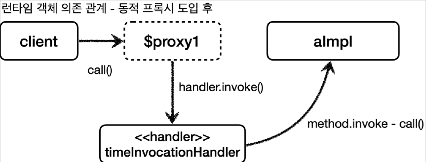
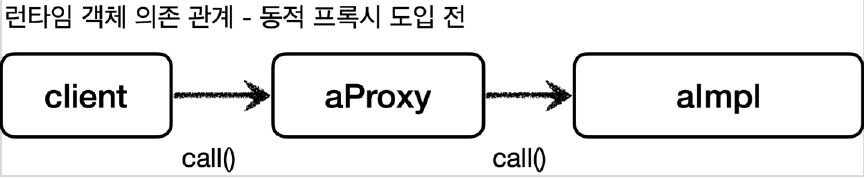
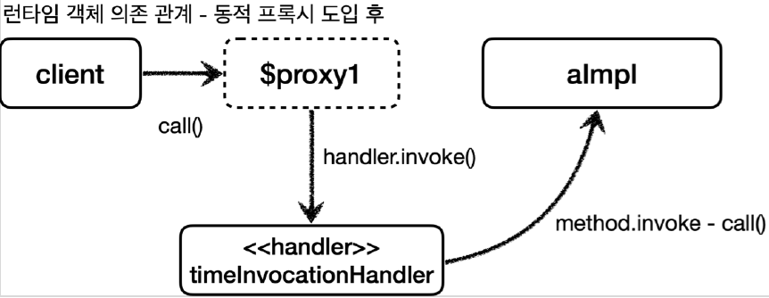

# <a href = "../README.md" target="_blank">스프링 핵심 원리 - 고급편</a>
## Chapter 05. 동적 프록시 기술
### 5.3 JDK 동적 프록시 - 예제 코드
1) JDK 동적 프록시 기술 - `InvocationHandler` 인터페이스
2) 실습 코드 : `TimeInvocationHandler`
3) JDK 동적 프록시 기술 사용법 : `JdkDynamicProxyTest`
4) JDK 동적 프록시의 실행 흐름
5) 공통 로직을 한 곳에서 집중적으로 관리할 수 있다. (SRP)
6) 동적 프록시 도입 전 vs 동적 프록시 도입 후

---

# 5.3 JDK 동적 프록시 - 예제 코드

---

## 1) JDK 동적 프록시 기술 - `InvocationHandler` 인터페이스
```java
package java.lang.reflect;

public interface InvocationHandler {
    
    public Object invoke(Object proxy, Method method, Object[] args)
        throws Throwable;
}
```
### 1.1 프록시 로직 구현 방법
- `InvocationHandler` 인터페이스의 invoke 메서드를 구현하면 된다.

### 1.2 메서드 설명
- `Object proxy` : 프록시 자신
- `Method method` : 호출한 메서드
- `Object[] args` : 메서드를 호출할 때 전달한 인수

---

## 2) 실습 코드 : `TimeInvocationHandler`
```java
@Slf4j
public class TimeInvocationHandler implements InvocationHandler {

    private final Object target;

    public TimeInvocationHandler(Object target) {
        this.target = target;
    }

    @Override
    public Object invoke(Object proxy, Method method, Object[] args) throws Throwable {
        log.info("TimeProxy 실행");
        long startTime = System.currentTimeMillis();

        Object result = method.invoke(target, args); // target의 메서드 실행

        long endTime = System.currentTimeMillis();
        long resultTime = endTime - startTime;
        log.info("TimeProxy 종료 resultTime = {}", resultTime);
        return result;
    }
}
```
- `TimeInvocationHandler` 은 `InvocationHandler` 인터페이스를 구현한다. 이렇게해서 JDK 동적
  프록시에 적용할 공통 로직을 개발할 수 있다.
- `Object target` : 동적 프록시가 호출할 대상
- `method.invoke(target, args)` : 리플렉션을 사용해서 `target` 인스턴스의 메서드를 실행한다. `args`
  는 메서드 호출시 넘겨줄 인수이다.


---

## 3) JDK 동적 프록시 기술 사용법 : `JdkDynamicProxyTest`
```java
@Slf4j
public class JdkDynamicProxyTest {
    @Test
    void dynamicA() {
        AInterface target = new AImpl(); // target 생성
        TimeInvocationHandler handler = new TimeInvocationHandler(target); // 동적 프록시의 로직

        // 프록시 생성 : 인터페이스 클래스 로더 정보, 인터페이스 정보, 핸들러(동적 프록시의 로직)를 통해 생성
        AInterface proxy = (AInterface) Proxy.newProxyInstance(AInterface.class.getClassLoader(), new Class[]{AInterface.class}, handler);

        proxy.call();
        log.info("targetClass = {}", target.getClass());
        log.info("proxyClass = {}", proxy.getClass());
    }
    
    // dynamicB 생략
}
```

### 3.1 JDK 동적 프록시 기술 사용방법
- `new TimeInvocationHandler(target)` : 동적 프록시에 적용할 핸들러 로직이다.
- `Proxy.newProxyInstance(AInterface.class.getClassLoader(), new Class[]{AInterface.class}, handler)`
    - 동적 프록시는 `java.lang.reflect.Proxy` 를 통해서 생성할 수 있다.
    - 클래스 로더 정보, 인터페이스, 그리고 핸들러 로직을 넣어주면 된다. 그러면 해당 인터페이스를 기반으로 동적 프록시를 생성하고 그 결과를 반환한다.

### 3.2 실행 결과
```shell
TimeInvocationHandler - TimeProxy 실행
AImpl - A 호출
TimeInvocationHandler - TimeProxy 종료 resultTime=0
JdkDynamicProxyTest - targetClass=class hello.proxy.jdkdynamic.code.AImpl
JdkDynamicProxyTest - proxyClass=class com.sun.proxy.$Proxy1
```
- 출력 결과를 보면 프록시가 정상 수행된 것을 확인할 수 있다.
- `proxyClass=class com.sun.proxy.$Proxy1`
    - 이 부분이 동적으로 생성된 프록시 클래스 정보이다.
    - 이것은 우리가 만든 클래스가 아니라 JDK 동적 프록시가 이름 그대로 동적으로 만들어준 프록시이다.
      이 프록시는 `TimeInvocationHandler` 로직을 실행한다.
- `dynamicA()` 와 `dynamicB()` 둘을 동시에 함께 실행하면 JDK 동적 프록시가 각각 다른 동적 프록시 클래스를 만들어주는 것을 확인할 수 있다.
  ```shell
  proxyClass=class com.sun.proxy.$Proxy1 //dynamicA
  proxyClass=class com.sun.proxy.$Proxy2 //dynamicB
  ```

---

## 4) JDK 동적 프록시의 실행 흐름

1. 클라이언트는 JDK 동적 프록시의 `call()` 을 실행한다.
2. JDK 동적 프록시는 `InvocationHandler.invoke()` 를 호출한다. `TimeInvocationHandler` 가
   구현체로 있으므로 `TimeInvocationHandler.invoke()` 가 호출된다.
3. `TimeInvocationHandler` 가 내부 로직을 수행하고, `method.invoke(target, args)` 를 호출해서
   `target` 인 실제 객체(`AImpl`)를 호출한다.
4. `AImpl` 인스턴스의 `call()` 이 실행된다.
5. `AImpl` 인스턴스의 `call()` 의 실행이 끝나면 `TimeInvocationHandler` 로 응답이 돌아온다. 시간
   로그를 출력하고 결과를 반환한다.

---

## 5) 공통 로직을 한 곳에서 집중적으로 관리할 수 있다. (SRP)
- 예제를 보면 `AImpl` , `BImpl` 각각 프록시를 만들지 않았다.
- 프록시는 JDK 동적 프록시를 사용해서 동적으로 만들고 TimeInvocationHandler 는 공통으로 사용했다.
- JDK 동적 프록시 기술 덕분에 적용 대상 만큼 프록시 객체를 만들지 않아도 된다. 그리고 같은 부가 기능
  로직을 한번만 개발해서 공통으로 적용할 수 있다. 만약 적용 대상이 100개여도 동적 프록시를 통해서
  생성하고, 각각 필요한 `InvocationHandler` 만 만들어서 넣어주면 된다.
- 결과적으로 프록시 클래스를 수 없이 만들어야 하는 문제도 해결하고, 부가 기능 로직도 하나의 클래스에
  모아서 단일 책임 원칙(SRP)도 지킬 수 있게 되었다.

---

## 6) 동적 프록시 도입 전 vs 동적 프록시 도입 후

### 6.1 동적 프록시 도입 전 클래스 의존 관계


### 6.2 동적 프록시 도입 후 클래스 의존 관계

- 여기서 점선은 개발자가 직접 만드는 클래스가 아니다.
- 위에서 언급했듯, 공통 로직을 TimeInvocationHanlder 한 곳에서 책임진다.

### 6.3 동적 프록시 도입 전 런타임 객체 의존 관계


### 6.4 동적 프록시 도입 후 런타임 객체 의존 관계


---
