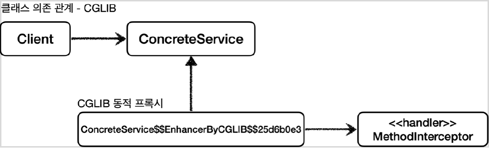

# <a href = "../README.md" target="_blank">스프링 핵심 원리 - 고급편</a>
## Chapter 05. 동적 프록시 기술
### 5.7 CGLIB - 예제 코드
1) CGLIB 동적 기술 - `MethodInterceptor` 인터페이스
2) 실습 코드 : `TimeMethodInterceptor`
3) CGLIB 동적 프록시 기술 사용법 : `CglibTest`
4) CGLIB 기술 적용 후 의존관계
5) CGLIB 기술 제약사항 : 기본생성자 필수, 클래스/메서드 final 키워드 금지
6) 남은 문제 : 인터페이스/구체클래스 동적 프록시 공통화, 필터링 기능
---

# 5.7 CGLIB - 예제 코드

---

## 1) CGLIB 동적 기술 - `MethodInterceptor` 인터페이스
```java
package org.springframework.cglib.proxy;

public interface MethodInterceptor extends Callback {
    Object intercept(Object obj, Method method, Object[] args, MethodProxy proxy) throws Throwable;
}
```
- `obj` : CGLIB가 적용된 객체
- `method` : 호출된 메서드
- `args` : 메서드를 호출하면서 전달된 인수
- `proxy` : 메서드 호출에 사용

---

## 2) 실습 코드 : `TimeMethodInterceptor`
```java
@Slf4j
public class TimeMethodInterceptor implements MethodInterceptor {

    private final Object target;

    public TimeMethodInterceptor(Object target) {
        this.target = target;
    }

    @Override
    public Object intercept(Object obj, Method method, Object[] args, MethodProxy methodProxy) throws Throwable {
        log.info("TimeProxy 실행");
        long startTime = System.currentTimeMillis();

        Object result = methodProxy.invoke(target, args); // 실행

        long endTime = System.currentTimeMillis();
        long resultTime = endTime - startTime;
        log.info("TimeProxy 종료 resultTime = {}", resultTime);
        return result;
    }
}
```
- `TimeMethodInterceptor` 는 `MethodInterceptor` 인터페이스를 구현해서 CGLIB 프록시의 실행
로직을 정의한다.
- JDK 동적 프록시를 설명할 때 예제와 거의 같은 코드이다.
- `Object target` : 프록시가 호출할 실제 대상
- `proxy.invoke(target, args)` : 실제 대상을 동적으로 호출한다.
  - `method` 를 사용해도 되지만, `CGLIB`는 성능상 `MethodProxy methodProxy`를 사용하는 것을
  권장한다.

---

## 3) CGLIB 동적 프록시 기술 사용법 : `CglibTest`
```java
@Slf4j
public class CglibTest {

    @Test
    void cglib() {
        ConcreteService target = new ConcreteService();

        Enhancer enhancer = new Enhancer();
        enhancer.setSuperclass(ConcreteService.class);
        enhancer.setCallback(new TimeMethodInterceptor(target)); // Enhancer에 클래스 정보, methodInterceptor를 전달
        ConcreteService proxy = (ConcreteService) enhancer.create(); // 동적 프록시 생성
        log.info("targetClass={}", target.getClass());
        log.info("proxyClass={}", proxy.getClass());
        proxy.call();
    }
}
```
`ConcreteService` 는 인터페이스가 없는 구체 클래스이다. 여기에 CGLIB를 사용해서 프록시를
생성해보자.

### 3.1 Enhancer를 통해 프록시 생성
- `Enhancer` : CGLIB는 Enhancer 를 사용해서 프록시를 생성한다.
- `enhancer.setSuperclass(ConcreteService.class)` : CGLIB는 구체 클래스를 상속 받아서 프록시를
생성할 수 있다. 어떤 구체 클래스를 상속 받을지 지정한다.
- `enhancer.setCallback(new TimeMethodInterceptor(target))`
  - 프록시에 적용할 실행 로직을 할당한다.
- `enhancer.create()` : 프록시를 생성한다. 앞서 설정한
`enhancer.setSuperclass(ConcreteService.class)` 에서 지정한 클래스를 상속 받아서 프록시가
만들어진다.

### 3.2 JDK 동적 프록시 vs CGLIB 동적 프록시
- JDK 동적 프록시는 인터페이스를 구현(implement)해서 프록시를 만든다.
- CGLIB는 구체 클래스를 상속(extends)해서 프록시를 만든다.

### 3.3 실행 결과
```shell
CglibTest - targetClass=class hello.proxy.common.service.ConcreteService
CglibTest - proxyClass=class hello.proxy.common.service.ConcreteService$$EnhancerByCGLIB$$25d6b0e3
TimeMethodInterceptor - TimeProxy 실행
ConcreteService - ConcreteService 호출
TimeMethodInterceptor - TimeProxy 종료 resultTime=9
```
실행 결과를 보면 프록시가 정상 적용된 것을 확인할 수 있다.

### 3.4 CGLIB가 생성한 프록시 이름
- CGLIB를 통해서 생성된 클래스의 이름을 확인해보자.
  - `ConcreteService$$EnhancerByCGLIB$$25d6b0e3`
- CGLIB가 동적으로 생성하는 클래스 이름은 다음과 같은 규칙으로 생성된다.
  - `대상클래스$$EnhancerByCGLIB$$임의코드`
- 참고로 JDK Proxy가 생성하는 클래스 이름은 다음과 같이 생성된다.
  - `proxyClass=class com.sun.proxy.$Proxy1`

---

## 4) CGLIB 기술 적용 후 의존관계
### 4.1 클래스 의존관계



### 4.2 런타임 객체 의존관계


---

## 5) CGLIB 기술 제약사항 : 기본생성자 필수, 클래스/메서드 final 키워드 금지
- 클래스 기반 프록시는 상속을 사용하기 때문에 몇가지 제약이 있다.
- 부모 클래스의 생성자를 체크해야 한다. CGLIB는 자식 클래스를 동적으로 생성하기 때문에 기본
생성자가 필요하다.
- 클래스에 final 키워드가 붙으면 상속이 불가능하다. CGLIB에서는 예외가 발생한다.
- 메서드에 final 키워드가 붙으면 해당 메서드를 오버라이딩 할 수 없다. CGLIB에서는 프록시
로직이 동작하지 않는다.
- 참고
  - CGLIB를 사용하면 인터페이스가 없는 V2 애플리케이션에 동적 프록시를 적용할 수 있다.
  - 그런데 지금 당장 적용하기에는 몇가지 제약이 있다. V2 애플리케이션에 기본 생성자를 추가하고, 의존관계를 setter
  를 사용해서 주입하면 CGLIB를 적용할 수 있다.
  - 하지만 다음에 학습하는 ProxyFactory 를 통해서 CGLIB를 적용하면 이런 단점을 해결하고
  더 편리하게 프록시 기능을 애플리케이션에 적용할 수 있으므로, 이 부분은 뒤에서 다룬다.

---

## 6) 남은 문제 : 인터페이스/구체클래스 동적 프록시 공통화, 필터링 기능
- 인터페이스가 있는 경우에는 JDK 동적 프록시를 적용하고, 그렇지 않은 경우에는 CGLIB를 적용하려면
어떻게 해야할까?
- 두 기술을 함께 사용할 때 부가 기능을 제공하기 위해서 JDK 동적 프록시가 제공하는
InvocationHandler 와 CGLIB가 제공하는 MethodInterceptor 를 각각 중복으로 만들어서 관리해야
할까?
- 특정 조건에 맞을 때 프록시 로직을 적용하는 기능도 공통으로 제공되었으면?

---
