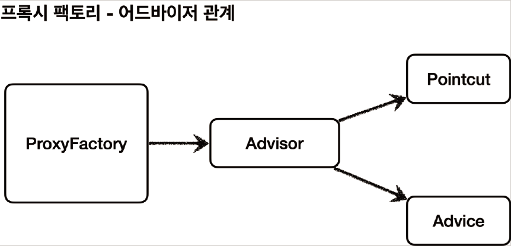

# <a href = "../README.md" target="_blank">스프링 핵심 원리 - 고급편</a>
## Chapter 06. 스프링이 지원하는 프록시
### 6.05 예제 코드1 - 어드바이저
1) 프록시 팩토리 - 어드바이저 관계
2) 어드바이저를 지정하는 방법 - `AdvisorTest`
3) `addAdivce()`는 항상 통과되는 어드바이저를 내부적으로 지정하는 편의 메서드다.
---

# 6.05 예제 코드1 - 어드바이저

---

## 1) 프록시 팩토리 - 어드바이저 관계


---

## 2) 어드바이저를 지정하는 방법 - `AdvisorTest`
```java
public class AdvisorTest {

    @Test
    void advisorTest1() {
        ServiceInterface target = new ServiceImpl();
        ProxyFactory proxyFactory = new ProxyFactory(target);
        DefaultPointcutAdvisor advisor = new DefaultPointcutAdvisor(Pointcut.TRUE, new TimeAdvice());
        proxyFactory.addAdvisor(advisor);

        ServiceInterface proxy = (ServiceInterface) proxyFactory.getProxy();
        proxy.save();
        proxy.find();
    }
}
```

### 2.1 어드바이저 생성
```java
DefaultPointcutAdvisor advisor = new DefaultPointcutAdvisor(Pointcut.TRUE, new TimeAdvice());
```
- `new DefaultPointcutAdvisor(Pointcut.TRUE, new TimeAdvice())`
  - Advisor 인터페이스의 가장 일반적인 구현체이다. 생성자를 통해 하나의 포인트컷과 하나의 어드바이스를 넣어주면 된다.
  - 어드바이저는 하나의 포인트컷과 하나의 어드바이스로 구성된다.
- `Pointcut.TRUE` : 항상 true 를 반환하는 포인트컷이다. 이후에 직접 포인트컷을 구현해볼 것이다.
- `new TimeAdvice()` : 앞서 개발한 TimeAdvice 어드바이스를 제공한다.

### 2.2 어드바이저 추가
```java
proxyFactory.addAdvisor(advisor);
```
- 프록시 팩토리에 적용할 어드바이저를 지정한다.
- 어드바이저는 내부에 포인트컷과 어드바이스를 모두 가지고 있다. 따라서 어디에 어떤 부가 기능을 적용해야 할지
어드바이스 하나로 알 수 있다.
- 프록시 팩토리를 사용할 때 어드바이저는 필수이다.

---

## 3) `addAdivce()`는 항상 통과되는 어드바이저를 내부적으로 지정하는 편의 메서드다.
- 생각해보면 이전에 분명히 `proxyFactory.addAdvice(new TimeAdvice())` 이렇게
어드바이저가 아니라 어드바이스를 바로 적용했다.
- 이것은 단순히 편의 메서드이고 결과적으로 해당 메서드 내부에서 지금 코드와 똑같은 다음 어드바이저가 생성된다.
- `DefaultPointcutAdvisor(Pointcut.TRUE, new TimeAdvice())`

---
