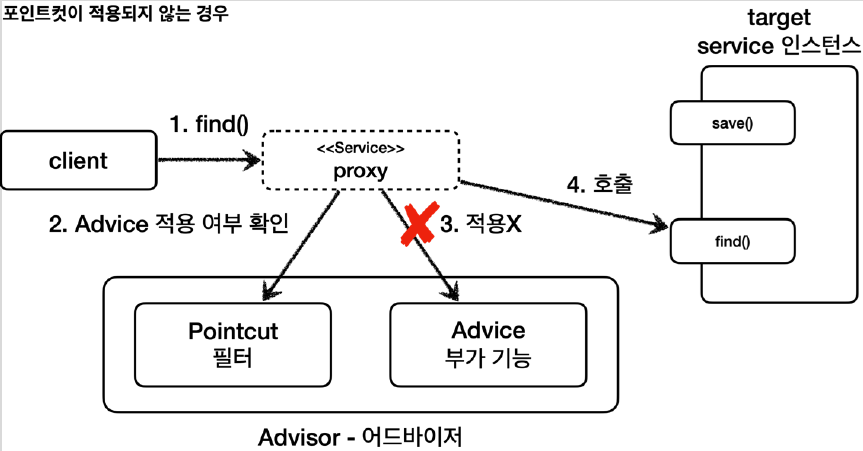

# <a href = "../README.md" target="_blank">스프링 핵심 원리 - 고급편</a>
## Chapter 06. 스프링이 지원하는 프록시
### 6.06 예제 코드2 - 직접 만든 포인트컷
1) 포인트컷 관련 인터페이스
2) 직접 포인트컷 만들기
3) 포인트컷 적용 시 프록시 로직 흐름
---

# 6.06 예제 코드2 - 직접 만든 포인트컷

---

## 1) 포인트컷 관련 인터페이스

### 1.1 Pointcut 인터페이스
```java
public interface Pointcut {
    ClassFilter getClassFilter();
    MethodMatcher getMethodMatcher();
}
```
- 포인트컷은 크게 ClassFilter 와 MethodMatcher 둘로 이루어진다.
- 일반적으로 스프링이 이미 만들어둔 구현체를 사용하지만 개념 학습 차원에서 간단히 직접 구현해보자.

### 1.2 ClassFilter 인터페이스
```java
public interface ClassFilter {
    boolean matches(Class<?> clazz);
}
```
클래스가 맞는지 확인할 때 사용한다.

### 1.3 MethodMatcher 인터페이스
```java
public interface MethodMatcher {
    boolean matches(Method method, Class<?> targetClass);
    
    boolean isRuntime();
    boolean matches(Method method, Class<?> targetClass, Object... args)
}
```
- 메서드가 맞는지 확인할 때 사용한다.
- `matches()`
    - 이 메서드에 `method` , `targetClass` 정보가 넘어온다.
    - 이 정보로 어드바이스를 적용할지 적용하지 않을지 판단할 수 있다.
    - `true`를 반환할 경우 어드바이스를 적용하고, `false`를 반환하면 어드바이스를 적용하지 않고 `target`을 바로 호출한다.
- `isRuntime() , matches(... args)` : 잘 안 쓰는 기능
    - `isRuntime()` 이 값이 true이면 `matches(... args)` 메서드가 대신 호출된다. 동적으로 넘어오는 매개변수를 판단 로직으로 사용할 수 있다.
    - `isRuntime()` 이 값이 false이면 클래스의 정적 정보만 사용하기 때문에 스프링이 내부에서 캐싱을
      통해 성능 향상이 가능하지만, `isRuntime()` 이 true 인 경우 매개변수가 동적으로 변경된다고
      가정하기 때문에 캐싱을 하지 않는다.
    - 크게 중요한 부분은 아니니 참고만 하고 넘어가자.

---

## 2) 직접 포인트컷 만들기

### 2.1 ClassFilter
- 클래스 필터 조건은 지정하지 않을 것이다.
- `ClassFilter.TRUE`를 지정하면 모든 클래스에 대해 통과된다.

### 2.2 MyMethodMatcher
```java
@Slf4j
static class MyMethodMatcher implements MethodMatcher {

    private String matchName = "save";

    @Override
    public boolean matches(Method method, Class<?> targetClass) {
        boolean result = (method.getName().equals(matchName));
        log.info("포인트컷 호출! method = {}, targetClass = {}", method.getName(), targetClass);
        log.info("포인트컷 결과 result = {}", result);
        return result;
    }

    @Override
    public boolean isRuntime() {
        return false;
    }

    @Override
    public boolean matches(Method method, Class<?> targetClass, Object... args) {
        throw new UnsupportedOperationException();
    }
}
```
- 직접 구현한 MethodMatcher 이다. MethodMatcher 인터페이스를 구현한다.
  - `isRuntime()`을 `false`만 반환하게 함으로서 클래스의 정적 정보만 사용하게 한다. 따라서 `matches(... args)`는 호출되지 않는다.
- 여기서는 메서드 이름이 "save" 인 경우에 true 를 반환하도록 판단 로직을 적용했다.
- 이름이 "save"이면 어드바이스를 적용하고, "save"가 아니면 바로 target이 호출될 것이다.  

### 2.3 MyPointcut
```java
    static class MyPointcut implements Pointcut {

        @Override
        public ClassFilter getClassFilter() {
            return ClassFilter.TRUE;
        }

        @Override
        public MethodMatcher getMethodMatcher() {
            return new MyMethodMatcher();
        }
    }
```
- 직접 구현한 포인트컷이다. `Pointcut` 인터페이스를 구현한다.
- 현재 메서드 기준으로 로직을 적용하면 된다. 클래스 필터는 항상 `true` 를 반환하도록 했고, 메서드 비교
기능은 `MyMethodMatcher` 를 사용한다.

### 2.4 직접 만든 포인트컷 적용
```java
    @Test
    @DisplayName("직접 만든 포인트컷")
    void advisorTest2() {
        ServiceInterface target = new ServiceImpl();
        ProxyFactory proxyFactory = new ProxyFactory(target);
        DefaultPointcutAdvisor advisor = new DefaultPointcutAdvisor(new MyPointcut(), new TimeAdvice());
        proxyFactory.addAdvisor(advisor);

        ServiceInterface proxy = (ServiceInterface) proxyFactory.getProxy();
        proxy.save();
        proxy.find();
    }
```
- `new DefaultPointcutAdvisor(new MyPointcut(), new TimeAdvice())` : 어드바이저에 직접 구현한 포인트컷을 사용한다.

### 2.5 실행 결과
```java
#save() 호출
AdvisorTest - 포인트컷 호출 method=save targetClass=class hello.proxy.common.service.ServiceImpl
AdvisorTest - 포인트컷 결과 result=true
TimeAdvice - TimeProxy 실행
ServiceImpl - save 호출
TimeAdvice - TimeProxy 종료 resultTime=1ms
        
#find() 호출
AdvisorTest - 포인트컷 호출 method=find targetClass=class hello.proxy.common.service.ServiceImpl
AdvisorTest - 포인트컷 결과 result=false
ServiceImpl - find 호출
```
- 실행 결과를 보면 기대한 것과 같이 `save()` 를 호출할 때는 어드바이스가 적용되지만, `find()` 를 호출할
때는 어드바이스가 적용되지 않는다.


---

## 3) 포인트컷 적용 시 프록시 로직 흐름

### 3.1 save() 호출시 : 포인트컷 true

1. 클라이언트가 프록시의 `save()` 를 호출한다.
2. 포인트컷에 Service 클래스의 `save()` 메서드에 어드바이스를 적용해도 될지 물어본다.
3. 포인트컷이 `true` 를 반환한다. 따라서 어드바이스를 호출해서 부가 기능을 적용한다.
4. 이후 실제 인스턴스의 save() 를 호출한다.

### 3.2 find() 호출시 : 포인트컷 false

1. 클라이언트가 프록시의 `find()` 를 호출한다.
2. 포인트컷에 Service 클래스의 `find()` 메서드에 어드바이스를 적용해도 될지 물어본다.
3. 포인트컷이 `false` 를 반환한다. 따라서 어드바이스를 호출하지 않고, 부가 기능도 적용되지 않는다.
4. 실제 인스턴스를 호출한다.

---
