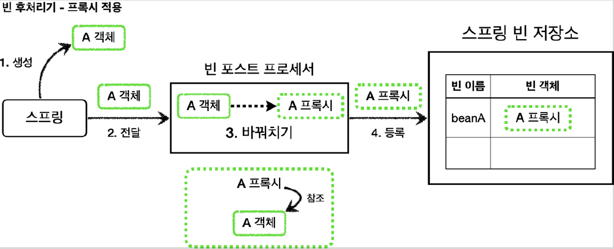
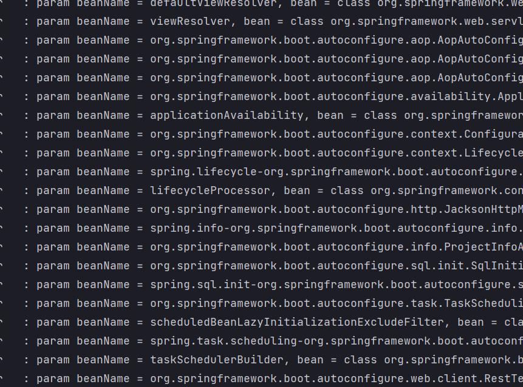

# <a href = "../README.md" target="_blank">스프링 핵심 원리 - 고급편</a>
## Chapter 07. 빈 후처리기
### 7.4 빈 후처리기 - 적용
1) 애플리케이션에 빈 후처리기 적용
2) 애플리케이션 로딩 로그 - 컴포넌트 스캔에도 프록시가 적용됐다.
3) 모든 빈들에 프록시가 적용 되지 않도록 필터링 로직이 필요하다.
4) 실행 확인

---

# 7.4 빈 후처리기 - 적용

---

## 1) 애플리케이션에 빈 후처리기 적용

### 1.1 개요

- 빈 후처리기를 사용해서 실제 객체 대신 프록시를 스프링 빈으로 등록해보자.
- 이렇게 하면 수동으로 등록하는 빈은 물론이고, 컴포넌트 스캔을 사용하는 빈까지 모두 프록시를 적용할 수
있다.
- 더 나아가서 설정 파일에 있는 수 많은 프록시 생성 코드도 한번에 제거할 수 있다.

### 1.2 PackageLogTracePostProcessor
```java
@Slf4j
public class PackageLogTracePostProcessor implements BeanPostProcessor {

    private final String basePackage;
    private final Advisor advisor;

    public PackageLogTracePostProcessor(String basePackage, Advisor advisor) {
        this.basePackage = basePackage;
        this.advisor = advisor;
    }

    @Override
    public Object postProcessAfterInitialization(Object bean, String beanName) throws BeansException {
        log.info("param beanName = {}, bean = {}", beanName, bean.getClass());

        // 프록시 적용 대상 여부 체크
        // 프록시 적용 대상이 아니면 원본을 그대로 진행
        String packageName = bean.getClass().getPackageName();

        if (!packageName.startsWith(basePackage)) {
            return bean;
        }

        // 프록시 대상이면 프록시 만들어서 반환
        ProxyFactory proxyFactory = new ProxyFactory(bean);
        proxyFactory.addAdvisor(advisor);

        Object proxy = proxyFactory.getProxy();
        log.info("create proxy: target = {}, proxy = {}", bean.getClass(), proxy.getClass());
        return proxy;
    }
}
```
- `PackageLogTraceProxyPostProcessor` 는 원본 객체를 프록시 객체로 변환하는 역할을 한다. 이때
프록시 팩토리를 사용하는데, 프록시 팩토리는 advisor 가 필요하기 때문에 이 부분은 외부에서 주입
받도록 했다.
- 모든 스프링 빈들에 프록시를 적용할 필요는 없다. 여기서는 특정 패키지와 그 하위에 위치한 스프링 빈들만
프록시를 적용한다. 여기서는 `hello.proxy.app` 과 관련된 부분에만 적용하면 된다. 다른 패키지의
객체들은 원본 객체를 그대로 반환한다.
- 프록시 적용 대상의 반환 값을 보면 원본 객체 대신에 프록시 객체를 반환한다. 따라서 스프링 컨테이너에
원본 객체 대신에 프록시 객체가 스프링 빈으로 등록된다. 원본 객체는 스프링 빈으로 등록되지 않는다.

### 1.2 BeanPostProcessorConfig
```java
@Slf4j
@Configuration
@Import({AppV1Config.class, AppV2Config.class})
public class BeanPostProcessorConfig {

    @Bean
    public PackageLogTracePostProcessor logTracePostProcessor(LogTrace logTrace) {
        return new PackageLogTracePostProcessor("hello.proxy.app", getAdvisor(logTrace));
    }

    private Advisor getAdvisor(LogTrace logTrace) {
        //pointcut
        NameMatchMethodPointcut pointcut = new NameMatchMethodPointcut();
        pointcut.setMappedNames("request*", "order*", "save*");

        //advice
        Advice advice = new LogTraceAdvice(logTrace);
        return new DefaultPointcutAdvisor(pointcut, advice);
    }
}
```
- `@Import({AppV1Config.class, AppV2Config.class})`
  - V3는 컴포넌트 스캔으로 자동으로 스프링 빈으로 등록되지만, V1, V2 애플리케이션은 수동으로 스프링 빈으로 등록해야
  동작한다.
  - `ProxyApplication` 에서 등록해도 되지만 편의상 여기에 등록하자.
- `@Bean logTraceProxyPostProcessor()`
  - 특정 패키지를 기준으로 프록시를 생성하는 빈 후처리기를 스프링 빈으로 등록한다.
  - 빈 후처리기는 스프링 빈으로만 등록하면 자동으로 동작한다. 여기에 프록시를 적용할 패키지 정보( hello.proxy.app )와 어드바이저( getAdvisor(logTrace) )를 넘겨준다.
- 이제 **프록시를 생성하는 코드가 설정 파일에는 필요 없다.** 순수한 빈 등록만 고민하면 된다. 프록시를 생성하고 프록시를 스프링 빈으로 등록하는 것은 빈 후처리기가 모두 처리해준다.

### 1.3 ProxyApplication
```java
//@Import(ProxyFactoryConfigV2.class)
@Import(BeanPostProcessorConfig.class)
@SpringBootApplication(scanBasePackages = "hello.proxy.app")
public class ProxyApplication {
```
- `BeanPostProcessorConfig.class` 를 등록하자.

---

## 2) 애플리케이션 로딩 로그 - 컴포넌트 스캔에도 프록시가 적용됐다.

### 2.1 등록된 프록시들
```shell
#v1 애플리케이션 프록시 생성 - JDK 동적 프록시
create proxy: target=v1.OrderRepositoryV1Impl proxy=class com.sun.proxy.$Proxy50
create proxy: target=v1.OrderServiceV1Impl proxy=class com.sun.proxy.$Proxy51
create proxy: target=v1.OrderControllerV1Impl proxy=class com.sun.proxy.$Proxy52

#v2 애플리케이션 프록시 생성 - CGLIB
create proxy: target=v2.OrderRepositoryV2 proxy=v2.OrderRepositoryV2$$EnhancerBySpringCGLIB$$x4
create proxy: target=v2.OrderServiceV2 proxy=v2.OrderServiceV2$$EnhancerBySpringCGLIB$$x5
create proxy: target=v2.OrderControllerV2 proxy=v2.OrderControllerV2$$EnhancerBySpringCGLIB$$x6

#v3 애플리케이션 프록시 생성 - CGLIB
create proxy: target=v3.OrderRepositoryV3 proxy=3.OrderRepositoryV3$$EnhancerBySpringCGLIB$$x1
create proxy: target=v3.orderServiceV3 proxy=3.OrderServiceV3$$EnhancerBySpringCGLIB$$x2
create proxy: target=v3.orderControllerV3 proxy=3.orderControllerV3$$EnhancerBySpringCGLIB$$x3
```
- 애플리케이션을 실행해서 로그를 확인해보면, 우리가 직접 등록한 스프링 빈들 뿐만 아니라
스프링 부트가 기본으로 등록하는 수 많은 빈들이 빈 후처리기에 넘어온다.
- 여기서는 `basePackage` 를 사용해서 v1~v3 애플리케이션 관련 빈들만 프록시
적용 대상이 되도록 했다.
- v1: 인터페이스가 있으므로 JDK 동적 프록시가 적용된다.
- v2: 구체 클래스만 있으므로 CGLIB 프록시가 적용된다.
- v3: 구체 클래스만 있으므로 CGLIB 프록시가 적용된다.

### 2.2 컴포넌트 스캔에도 프록시가 적용됐다.
- 여기서 중요한 포인트는 v1, v2와 같이 수동으로 등록한 빈 뿐만 아니라 컴포넌트 스캔을 통해 등록한 v3 빈들도 프록시를 적용할 수 있다는 점이다.
- 이것은 모두 빈 후처리기 덕분이다.

---

## 3) 모든 빈들에 프록시가 적용 되지 않도록 필터링 로직이 필요하다.

- 우리가 등록한 스프링 빈 외에, 스프링 부트가 등록한 빈들도 넘어온다.
- 스프링 부트가 기본으로 제공하는 빈 중에는 프록시 객체를 만들 수 없는 빈들도 있다. 따라서 모든 객체를 프록시로 만들 경우 오류가 발생한다.
- 모든 스프링 빈들에 프록시를 적용하는 것은 바람직하지 않다. 그래서 여기서는 간단히 basePackage 를 사용해서 특정 패키지를 기준으로
해당 패키지와 그 하위 패키지의 빈들을 프록시로 만든다.

---

### 4) 실행 확인
실행해보면 모두 동일한 결과가 나오는 것을 확인할 수 있다.
- http://localhost:8080/v1/request?itemId=hello
- http://localhost:8080/v2/request?itemId=hello
- http://localhost:8080/v3/request?itemId=hello

---
