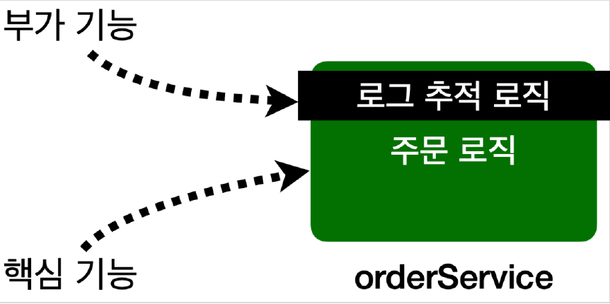

# <a href = "../README.md" target="_blank">스프링 핵심 원리 - 고급편</a>
## Chapter 09. 스프링 AOP 개념
### 9.1 AOP 소개 - 핵심 기능과 부가 기능
1) 핵심 기능, 부가 기능
2) 횡단 관심사 : 같은 부가기능이 여러 곳에서 동일하게 요구되고, 사용됨
3) 부가 기능 적용 문제 : 중복 코드가 발생하고, 유지보수가 힘들다.

---

# 9.1 AOP 소개 - 핵심 기능과 부가 기능

---

## 1) 핵심 기능, 부가 기능
애플리케이션 로직은 크게 핵심 기능과 부가 기능으로 나눌 수 있다.

### 1.1 핵심 기능

- 핵심 기능은 해당 객체가 제공하는 고유의 기능이다.
- 예를 들어서 `OrderService` 의 핵심 기능은 주문 로직이다.

### 1.2 부가 기능

- 부가 기능은 핵심 기능을 보조하기 위해 제공되는 기능이다.
  - 예) 로그 추적 로직, 트랜잭션 기능이 있다.
- 이러한 부가 기능은 단독으로 사용되지 않고, 핵심 기능과 함께 사용된다. 이름 그대로 핵심 기능을 보조하기 위해 존재하는 것이다.
  - 예) 로그 추적 기능은 어떤 핵심 기능이 호출되었는지 로그를 남기기 위해 사용한다. 적용 대상 없이 혼자 존재하지 않는다.

### 1.3 한 메서드에서 핵심 기능, 부가 기능을 모두 적용 시
- 주문 로직을 실행하기 직전에 로그 추적 기능을 사용해야 하면, 핵심 기능인 주문 로직과 부가 기능인 로그
추적 로직이 하나의 객체 안에 섞여 들어가게 된다.
- 부가 기능이 필요한 경우 이렇게 둘을 합해서 하나의 로직을 완성한다.
- 이제 주문 서비스를 실행하면 핵심 기능인 주문 로직과 부가 기능인 로그 추적 로직이 함께
실행된다.

---

## 2) 횡단 관심사 : 같은 부가기능이 여러 곳에서 동일하게 요구되고, 사용됨

- 보통 부가 기능은 여러 클래스에 걸쳐서 동일하게 사용된다. 이러한 부가 기능은 횡단 관심사(cross-cutting concerns)가 된다.
  - 예) 모든 애플리케이션 호출을 로깅 해야 하는 요구사항

---

## 3) 부가 기능 적용 문제 : 중복 코드가 발생하고, 유지보수가 힘들다.

### 3.1 같은 부가 기능 코드를 여러 군데에 매번 중복으로 작성해야함.
- 이런 부가 기능을 여러 곳에 적용하려면 너무 번거롭다. 예를 들어서 부가 기능을 적용해야 하는
클래스가 100개면 100개 모두에 동일한 코드를 추가해야 한다.
- 부가 기능을 별도의 유틸리티 클래스로 만든다고 해도, 해당 유틸리티 클래스를 호출하는 코드가 결국
필요하다. 그리고 부가 기능이 구조적으로 단순 호출이 아니라 try~catch~finally 같은 구조가
필요하다면 더욱 복잡해진다. (예: 실행 시간 측정)

### 3.2 부가기능이 한 곳에서 집중적으로 관리되지 않아서, 유지보수에 매우 취약하다.
- 더 큰 문제는 수정이다. 만약 부가 기능에 수정이 발생하면, 100개의 클래스 모두를 하나씩 찾아가면서
수정해야 한다. 여기에 추가로 부가 기능이 적용되는 위치를 변경한다면 어떻게 될까?
- 예를 들어서 부가 기능을 모든 컨트롤러, 서비스, 리포지토리에 적용했다가, 로그가 너무 많이 남아서 서비스 계층에만
적용한다고 수정해야하면 어떻게 될까? 또 수 많은 코드를 고쳐야 할 것이다.

### 3.3 부가기능 적용 문제점 - 정리
- 부가 기능을 적용할 때 아주 많은 반복이 필요하다.
- 부가 기능이 여러 곳에 퍼져서 중복 코드를 만들어낸다.
- 부가 기능을 변경할 때 중복 때문에 많은 수정이 필요하다.
- 부가 기능의 적용 대상을 변경할 때 많은 수정이 필요하다.

소프트웨어 개발에서 변경 지점은 하나가 될 수 있도록 잘 모듈화 되어야 한다.  
그런데 부가 기능처럼 특정 로직을 애플리케이션 전반에 적용하는 문제는 일반적인 OOP 방식으로는 해결이 어렵다.

---

