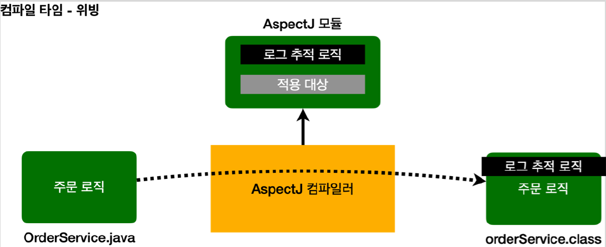
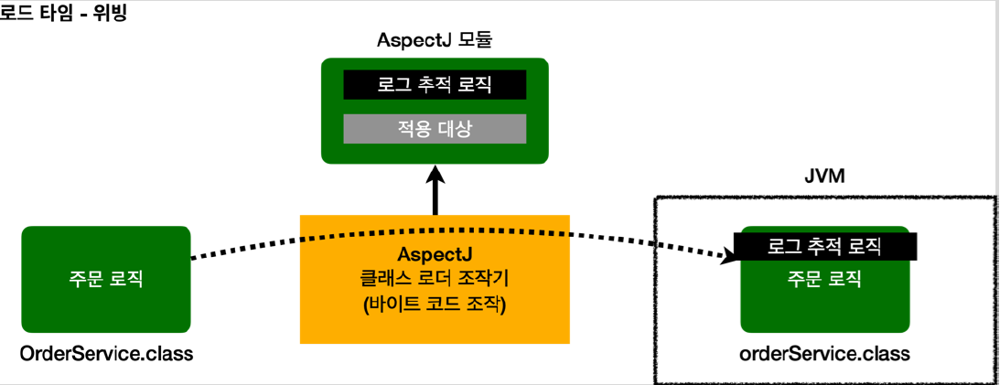

# <a href = "../README.md" target="_blank">스프링 핵심 원리 - 고급편</a>
## Chapter 09. 스프링 AOP 개념
### 9.3 AOP 적용 방식
1) AOP 적용 방식1 - 컴파일 시점
2) AOP 적용 방식2 - 클래스 로딩 시점 (로드 타임 위빙)
3) AOP 적용 방식3 - 런타임 시점(프록시)
4) AOP 적용 방식 비교
5) 조인 포인트 : AOP 적용 위치
6) 선택 : AspectJ vs Spring AOP

---

# 9.3 AOP 적용 방식

---

## 1) AOP 적용 방식1 - 컴파일 시점

### 1.1 특수한 컴파일러를 통해, 컴파일 시점에 부가 기능을 코드에 덧붙임
- `.java` 소스 코드를 컴파일러를 사용해서 `.class`를 만드는 시점에 부가 기능 로직을 추가할 수 있다.
- 이때는 AspectJ가 제공하는 **특별한 컴파일러를 사용해야 한다.**
- 컴파일 된 `.class` 를 디컴파일 해보면 애스펙트 관련 호출 코드가 들어간다.
- 이해하기 쉽게 풀어서 이야기하면 부가 기능 코드가 핵심 기능이 있는 컴파일된 코드 주변에 실제로 붙어 버린다고 생각하면 된다.
AspectJ 컴파일러는 Aspect를 확인해서 해당 클래스가 적용 대상인지 먼저 확인하고, 적용 대상인 경우에 부가 기능 로직을 적용한다.
- 이렇게 원본 로직에 부가 기능 로직이 추가되는 것을 위빙(Weaving)이라 한다.
  - 위빙(Weaving): 옷감을 짜다. 직조하다. 애스펙트와 실제 코드를 연결해서 붙이는 것

### 1.2 단점
- 컴파일 시점에 부가 기능을 적용하려면 특별한 컴파일러도 필요하고 복잡하다.

---

## 2) AOP 적용 방식2 - 클래스 로딩 시점 (로드 타임 위빙)

### 2.1 클래스 로더가 JVM에 올리기 직전에 .class 파일 조작
- 자바를 실행하면 자바 언어는 `.class` 파일을 JVM 내부의 클래스 로더에 보관한다.
- 이때 중간에서 `.class` 파일을 조작한 다음 JVM에 올릴 수 있다.
- 자바 언어는 `.class` 를 JVM에 저장하기 전에 조작할 수 있는 기능을 제공한다.
  - 참고 : java Instrumentation를 검색해보자.
- 수 많은 모니터링 툴들이 이 방식을 사용한다.
- 이 시점에 애스펙트를 적용하는 것을 로드 타임 위빙이라 한다.

### 2.2 단점
- 로드 타임 위빙은 자바를 실행할 때 특별한 옵션(`java -javaagent`)을 통해 클래스 로더 조작기를
지정해야 하는데, 이 부분이 번거롭고 운영하기 어렵다.

---

## 3) AOP 적용 방식3 - 런타임 시점(프록시)

### 3.1 런타임에 프록시로 부가기능을 추가하는 방식
- 런타임 시점은 컴파일도 다 끝나고, 클래스 로더에 클래스도 다 올라가서 이미 자바가 실행되고 난 다음을
말한다. 자바의 메인(main) 메서드가 이미 실행된 다음이다.
- 따라서 자바 언어가 제공하는 범위 안에서 부가 기능을 적용해야 한다.
- 스프링과 같은 컨테이너의 도움을 받고 프록시와 DI, 빈 포스트 프로세서 같은
개념들을 총 동원해야 한다. 이렇게 하면 최종적으로 프록시를 통해 스프링 빈에 부가 기능을 적용할 수
있다. 그렇다. **지금까지 우리가 학습한 것이 바로 프록시 방식의 AOP이다.**

### 3.2 단점 : AOP 기능에 제약이 있음.
- 프록시를 사용하기 때문에 AOP 기능에 일부 제약이 있다.
- 앞의 AspectJ에서 가능했던 높은 자유도의 위빙을 모두 사용할 수 없다.

### 3.3 하지만... 간단하다...!!!
- 하지만 특별한 컴파일러나, 자바를 실행할 때 복잡한 옵션과 클래스 로더 조작기를 설정하지 않아도 된다.
- 스프링만 있으면 얼마든지 AOP를 적용할 수 있다.

---

## 4) AOP 적용 방식 비교
- 컴파일 시점: 실제 대상 코드에 애스팩트를 통한 부가 기능 호출 코드가 포함된다. AspectJ를 직접
사용해야 한다.
- 클래스 로딩 시점: 실제 대상 코드에 애스팩트를 통한 부가 기능 호출 코드가 포함된다. AspectJ를 직접
사용해야 한다.
- 런타임 시점: 실제 대상 코드는 그대로 유지된다. 대신에 프록시를 통해 부가 기능이 적용된다. 따라서 항상
프록시를 통해야 부가 기능을 사용할 수 있다. 스프링 AOP는 이 방식을 사용한다.

---

## 5) 조인 포인트 : AOP 적용 위치

### 5.1 조인 포인트(Join Point)
AOP는 지금까지 학습한 메서드 실행 위치 뿐만 아니라 다음과 같은 다양한 위치에 적용할 수 있다.
- 적용 가능 지점(조인 포인트): 생성자, 필드 값 접근, static 메서드 접근, 메서드 실행 지점
- 이렇게 AOP를 적용할 수 있는 지점을 조인 포인트(Join point)라 한다.

### 5.2 AspectJ 방식의 조인 포인트 : 모든 지점
- AspectJ를 사용해서 컴파일 시점과 클래스 로딩 시점에 적용하는 AOP는 바이트코드를 실제 조작하기
때문에 해당 기능을 모든 지점에 다 적용할 수 있다.

### 5.3 Spring AOP의 조인 포인트 : 메서드 실행 지점
- 프록시 방식을 사용하는 스프링 AOP는 메서드 실행 지점에만 AOP를 적용할 수 있다.
  - 프록시는 메서드 오버라이딩 개념으로 동작한다. 따라서 생성자나 static 메서드, 필드 값 접근에는
  프록시 개념이 적용될 수 없다.
  - 프록시를 사용하는 **스프링 AOP의 조인 포인트는 메서드 실행 지점으로 제한된다.**
- 프록시 방식을 사용하는 스프링 AOP는 스프링 컨테이너가 관리할 수 있는 스프링 빈에만 AOP를 적용할
수 있다.

---

## 6) 선택 : AspectJ vs Spring AOP

### 6.1 AspectJ : 기능이 많으나 복잡하다
- Spring AOP에 비해 더 복잡하고 더 다양한 기능을 사용할 수 있다.
- AspectJ를 사용하려면 공부할 내용도 많고, 자바 관련 설정(특별한 컴파일러, AspectJ 전용 문법, 자바
실행 옵션)도 복잡하다.

### 6.2 Spring AOP : 추가 설정 없이, 대부분의 부가기능 문제를 해결할 수 있다.
- Spring AOP는 런타임 프록시 방식을 통해서만 AOP를 적용할 수 있다.
- 하지만 AspectJ의 복잡한 설정법과 비교했을 때, 별도의 추가 자바 설정 없이 스프링만 있으면 편리하게 AOP
를 사용할 수 있다.
- 실무에서는 스프링이 제공하는 AOP 기능만 사용해도 대부문의 문제를 해결할 수 있다.

### (cf) 스프링은 AspectJ 문법을 차용할 뿐 직접 사용하는 것이 아니다.
- 스프링은 AspectJ의 문법을 차용하고 프록시 방식의 AOP를 적용한다.
- AspectJ를 직접 사용하는 것이 아니다.

---
