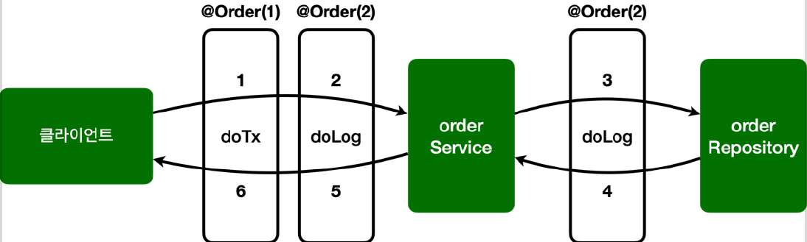

# <a href = "../README.md" target="_blank">스프링 핵심 원리 - 고급편</a>
## Chapter 10. 스프링 AOP 구현
### 10.7 스프링 AOP 구현5 - 어드바이스 순서
1) `@Order(...)` : 클래스 단위 어드바이스 순서 지정
2) (실습) 애플리케이션의 어드바이스들에 순서 지정

---

# 10.7 스프링 AOP 구현5 - 어드바이스 순서

---

## 1) `@Order(...)` : 클래스 단위 어드바이스 순서 지정
- 어드바이스는 기본적으로 순서를 보장하지 않는다.
- 순서를 지정하고 싶으면 `@Aspect` 적용 단위로 `org.springframework.core.annotation.@Order` 어노테이션을 적용해야 한다.
- 문제는 이것을 **어드바이스 단위가 아니라 클래스 단위로 적용할 수 있다**는 점이다.
- 그래서 지금처럼 하나의 애스펙트에 여러 어드바이스가 있으면 순서를 보장 받을 수 없다.
- 따라서 애스펙트를 별도의 클래스로 분리하고, 분리된 애스펙트 각각을 빈으로 등록해야한다.

---

## 2) (실습) 애플리케이션의 어드바이스들에 순서 지정

### 2.1 AspectV5Order
```java
@Slf4j
public class AspectV5Order {

    @Aspect
    @Order(2)
    public static class LogAspect {
        @Around("com.ttasjwi.aop.order.aop.Pointcuts.allOrder()")
        public Object doLog(ProceedingJoinPoint joinPoint) throws Throwable {
            log.info("[log] {}", joinPoint.getSignature()); // join poin 시그니처
            return joinPoint.proceed();
        }
    }

    @Aspect
    @Order(1)
    public static class TxAspect {
        // com.ttasjwi.aop.order 패키지와 하위 패키지 이면서 클래스 이름이 *Service
        @Around("com.ttasjwi.aop.order.aop.Pointcuts.orderAndService()")
        public Object doTransaction(ProceedingJoinPoint joinPoint) throws Throwable {
            try {
                log.info("[트랜잭션 시작] {}", joinPoint.getSignature());

                Object result = joinPoint.proceed();

                log.info("[트랜잭션 커밋] {}", joinPoint.getSignature());
                return result;
            } catch (Exception e) {
                log.error("[트랜잭션 롤백] {}", joinPoint.getSignature());
                throw e;
            } finally {
                log.info("[리소스 릴리즈] {}", joinPoint.getSignature());
            }
        }
    }

}
```
- 하나의 애스펙트 안에 있던 어드바이스를 `LogAspect` , `TxAspect` 애스펙트로 각각 분리했다.
- 그리고 각 애스펙트에 `@Order` 애노테이션을 통해 실행 순서를 적용했다. 참고로 숫자가 작을 수록 먼저 실행된다.
- 따라서 트랜잭션(`TxAspect`, order: 1) → 로깅(`LogAspect`, order:2) 순으로 실행된다.

### 2.2 AopTest 변경
```java
//@Import(AspectV4Pointcut.class)
//@Import({AspectV5Order.LogAspect.class, AspectV5Order.TxAspect.class})
@Import(AspectV6Advice.class)
public class AopTest {
```
AspectV5Order 를 실행하기 위해서 다음 처리를 하자.
- `@Import(AspectV4Pointcut.class)` 주석 처리
- `@Import({AspectV5Order.LogAspect.class, AspectV5Order.TxAspect.class})` 추가

### 2.3 실행

```shell
[트랜잭션 시작] void hello.aop.order.OrderService.orderItem(String)
[log] void hello.aop.order.OrderService.orderItem(String)
[orderService] 실행
[log] String hello.aop.order.OrderRepository.save(String)
[orderRepository] 실행
[트랜잭션 커밋] void hello.aop.order.OrderService.orderItem(String)
[리소스 릴리즈] void hello.aop.order.OrderService.orderItem(String)
```
실행 결과를 보면 트랜잭션 어드바이스가 먼저 실행되는 것을 확인할 수 있다.

---
