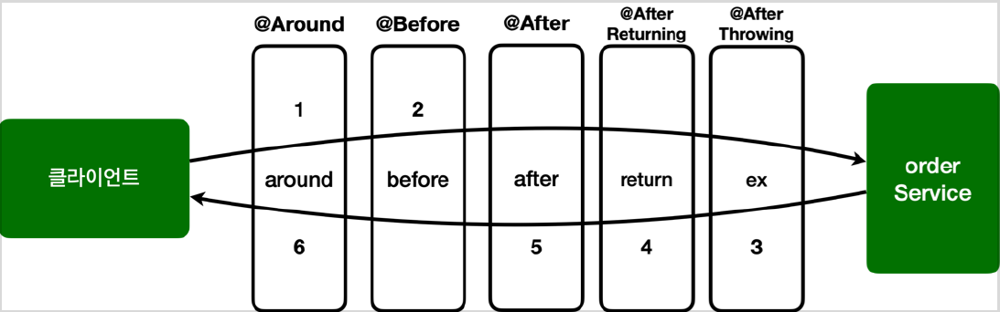

# <a href = "../README.md" target="_blank">스프링 핵심 원리 - 고급편</a>
## Chapter 10. 스프링 AOP 구현
### 10.8 스프링 AOP 구현6 - 어드바이스 종류
1) 여러가지 어드바이스 종류
2) (실습) 여러가지 어드바이스 종류를 애플리케이션에 적용
3) JoinPoint, ProceedingJoinPoint : 조인 포인트에 관한 참고정보 획득
4) `@Around` : 메서드의 실행의 주변! 가장 강력한 어드바이스.
5) `@Before` : 조인 포인트 실행 전
6) `@AfterReturning` : 메서드 실행이 정상적으로 반환될 때 실행
7) `@AfterThrowing` : 메서드 실행이 예외를 던져서 종료될 때 실행
8) `@After` : 메서드 실행이 종료될 때 무조건 실행 (≒ finally)
9) 어드바이스 실행 순서 : `@Around`, `@Before`, `@After`, `@AfterReturning`, `@AfterThrowing`
10) 제약을 둘수록, 애플리케이션 설계가 명확해진다.

---

# 10.8 스프링 AOP 구현6 - 어드바이스 종류

---

## 1) 여러가지 어드바이스 종류
- `@Around`
  - 메서드 호출 전후에 수행
  - 가장 강력한 어드바이스
  - 조인 포인트 실행 여부 선택, 반환 값 변환, 예외 변환 등이 가능
- `@Before` : 조인 포인트 실행 이전에 실행
- `@AfterReturning` : 조인 포인트가 정상 완료후 실행
- `@AfterThrowing` : 메서드가 예외를 던지는 경우 실행
- `@After` : 조인 포인트가 정상 또는 예외에 관계없이 실행(finally)

---

## 2) (실습) 여러가지 어드바이스 종류를 애플리케이션에 적용

### 2.1 AspectV6Advice
```java
@Slf4j
@Aspect
public class AspectV6Advice {

    @Around("com.ttasjwi.aop.order.aop.Pointcuts.orderAndService()")
    public Object doTransaction(ProceedingJoinPoint joinPoint) throws Throwable {
        try {
            log.info("[around] [트랜잭션 시작] {}", joinPoint.getSignature());
            // @Before
            Object result = joinPoint.proceed();
            // @AfterReturning
            log.info("[around] [트랜잭션 커밋] {}", joinPoint.getSignature());
            return result;
        } catch (Exception e) {
            // @AfterThrowing
            log.error("[around] [트랜잭션 롤백] {}", joinPoint.getSignature());
            throw e;
        } finally {
            // @After
            log.info("[around] [리소스 릴리즈] {}", joinPoint.getSignature());
        }
    }

    @Before("com.ttasjwi.aop.order.aop.Pointcuts.orderAndService()")
    public void doBefore(JoinPoint joinPoint) {
        log.info("[before] {}", joinPoint.getSignature());
    }

    @AfterReturning(value = "com.ttasjwi.aop.order.aop.Pointcuts.orderAndService()", returning = "result")
    public void doReturn(JoinPoint joinPoint, Object result) {
        log.info("[return] {} return = {}", joinPoint.getSignature(), result);
    }

    @AfterThrowing(value = "com.ttasjwi.aop.order.aop.Pointcuts.orderAndService()", throwing = "ex")
    public void doThrowing(JoinPoint joinPoint, Exception ex) {
        log.info("[ex] {} message=", joinPoint.getSignature(), ex);
    }

    @After(value = "com.ttasjwi.aop.order.aop.Pointcuts.orderAndService()")
    public void doAfter(JoinPoint joinPoint) {
        log.info("[after] {}", joinPoint.getSignature());
    }
}
```
- `doTransaction()` 메서드에 남겨둔 주석을 보자.
- 복잡해 보이지만 사실 `@Around` 를 제외한 나머지 어드바이스들은 `@Around` 가 할 수 있는 일의 일부만
제공할 뿐이다. 따라서 `@Around` 어드바이스만 사용해도 필요한 기능을 모두 수행할 수 있다.

### 2.2 AopTest - 변경
```java
//@Import({AspectV5Order.LogAspect.class, AspectV5Order.TxAspect.class})
@Import(AspectV6Advice.class)
public class AopTest {
```
AspectV6Order 를 실행하기 위해서 다음 처리를 하자.
- `@Import({AspectV5Order.LogAspect.class, AspectV5Order.TxAspect.class})` 주석 처리
- `@Import(AspectV6Advice.class)` 주석 처리

### 2.3 실행
아래에서 다룰 것이다.

---

## 3) JoinPoint, ProceedingJoinPoint : 조인 포인트에 관한 참고정보 획득
### 3.1 소개
- JoinPoint, ProceedingJoinPoint를 통해 조인 포인트에 관한 여러가지 정보를 획득할 수 있다.
- 모든 어드바이스는 `org.aspectj.lang.JoinPoint` 를 첫번째 파라미터에 사용할 수 있다. (생략해도
된다.)
- 단 `@Around` 는 `ProceedingJoinPoint` 을 사용해야 한다.
참고로 `ProceedingJoinPoint` 는 `org.aspectj.lang.JoinPoint` 의 하위 타입이다.

### 3.2 JoinPoint의 주요 기능
- `getArgs()` : 메서드 인수를 반환
- `getThis()` : 프록시 객체를 반환
- `getTarget()` : 대상 객체를 반환
- `getSignature()` : 조언되는 메서드에 대한 설명을 반환
- `toString()` : 조언되는 방법에 대한 유용한 설명을 문자열로 반환

### 3.3 ProceedingJoinPoint 인터페이스의 주요 기능
- `proceed()` : 다음 어드바이스나 타켓을 호출한다.

### 3.4 그 외
- 추가로 호출시 전달한 매개변수를 파라미터를 통해서도 전달 받을 수도 있는데, 이 부분은 뒤에서 설명한다.

---

## 4) `@Around` : 메서드의 실행의 주변! 가장 강력한 어드바이스.
- 메서드의 실행의 주변에서 실행된다. 메서드 실행 전후에 작업을 수행한다.
- 가장 강력한 어드바이스. 대부분의 기능을 수행할 수 있다.
  - 조인 포인트 실행 여부 선택 : `joinPoint.proceed()` 호출 여부 선택
  - 전달 값 변환: `joinPoint.proceed(args[])`
  - 반환 값 변환
  - 예외 변환
  - 트랜잭션 처럼 `try` ~ `catch` ~ `finally` 모두 들어가는 구문 처리 가능
- 어드바이스의 첫 번째 파라미터는 `ProceedingJoinPoint` 를 사용해야 한다.
- 실제 `target`의 메서드를 실행하기 위해서는 중간에 **반드시 `target.proceed()`을 호출해야한다.**
  - `proceed()` 를 통해 대상을 실행한다.
  - `proceed()` 를 여러번 실행할 수도 있음(재시도)

---

## 5) `@Before` : 조인 포인트 실행 전
```java
    @Before("com.ttasjwi.aop.order.aop.Pointcuts.orderAndService()")
    public void doBefore(JoinPoint joinPoint) {
        log.info("[Before] {}", joinPoint.getSignature());
    }
```
- `@Around` 와 다르게 작업 흐름을 변경할 수는 없다.
- `@Around` 는 `ProceedingJoinPoint.proceed()` 를 호출해야 다음 대상이 호출된다. 만약 호출하지
않으면 다음 대상이 호출되지 않는다.
- 반면에 `@Before` 는 `ProceedingJoinPoint.proceed()` 자체를 사용하지 않는다.
메서드 종료시 자동으로 다음 타켓이 호출된다. 물론 예외가 발생하면 다음 코드가 호출되지는 않는다.

---

## 6) `@AfterReturning` : 메서드 실행이 정상적으로 반환될 때 실행
```java
    @AfterReturning(value = "com.ttasjwi.aop.order.aop.Pointcuts.orderAndService()", returning = "result")
    public void doReturn(JoinPoint joinPoint, Object result) {
        log.info("[return] {} return = {}", joinPoint.getSignature(), result);
    }
```
- `returning` 속성에 사용된 이름은 어드바이스 메서드의 매개변수 이름과 일치해야 한다.
- `returning` 절에 지정된 타입의 값을 반환하는 메서드만 대상으로 실행한다. (부모 타입을 지정하면 모든
자식 타입은 인정된다.)
- `@Around` 와 다르게 반환되는 객체를 변경할 수는 없다. 반환 객체를 변경하려면 `@Around` 를 사용해야
한다. 참고로 반환 객체를 조작할 수는 있다.

---

## 7) `@AfterThrowing` : 메서드 실행이 예외를 던져서 종료될 때 실행
```java
    @AfterThrowing(value = "com.ttasjwi.aop.order.aop.Pointcuts.orderAndService()", throwing = "ex")
    public void doThrowing(JoinPoint joinPoint, Exception ex) {
        log.info("[ex] {} message=", joinPoint.getSignature(), ex);
    }
```
- `throwing` 속성에 사용된 이름은 어드바이스 메서드의 매개변수 이름과 일치해야 한다.
- `throwing` 절에 지정된 타입과 맞은 예외를 대상으로 실행한다. (부모 타입을 지정하면 모든 자식 타입은
인정된다.)
- 종료 직후 알아서 예외를 바깥으로 throw 해준다.

---

## 8) `@After` : 메서드 실행이 종료될 때 무조건 실행 (≒ finally)
- 메서드 실행이 종료되면 실행된다. (finally를 생각하면 된다.)
- 정상 및 예외 반환 조건을 모두 처리한다.
- 일반적으로 리소스를 해제하는 데 사용한다.

---

## 9) 어드바이스 실행 순서 : `@Around`, `@Before`, `@After`, `@AfterReturning`, `@AfterThrowing`

```shell
[around][트랜잭션 시작] void hello.aop.order.OrderService.orderItem(String)
[before] void hello.aop.order.OrderService.orderItem(String)
[orderService] 실행
[orderRepository] 실행
[return] void hello.aop.order.OrderService.orderItem(String) return=null
[after] void hello.aop.order.OrderService.orderItem(String)
[around][트랜잭션 커밋] void hello.aop.order.OrderService.orderItem(String)
[around][리소스 릴리즈] void hello.aop.order.OrderService.orderItem(String)
```
- 스프링은 5.2.7 버전부터 동일한 `@Aspect` 안에서 동일한 조인포인트의 우선순위를 정했다.
- 실행 순서: `@Around` , `@Before` , `@After` , `@AfterReturning` , `@AfterThrowing`
- 어드바이스가 적용되는 순서는 이렇게 적용되지만, 호출 순서와 리턴 순서는 반대라는 점을 알아두자.
- 물론 `@Aspect` 안에 동일한 종류의 어드바이스가 2개 있으면 순서가 보장되지 않는다. 이 경우 앞서 배운 것
처럼 `@Aspect` 를 분리하고 `@Order` 를 적용하자.

---

## 10) 제약을 둘수록, 애플리케이션 설계가 명확해진다.
`@Around` 하나만 있어도 모든 기능을 수행할 수 있다.  
그런데 다른 어드바이스들이 존재하는 이유는 무엇일까?  

### 10.1 `@Around` 호출 도중 `proceed()`를 호출하지 않을 경우
```java
@Around("hello.aop.order.aop.Pointcuts.orderAndService()")
public void doBefore(ProceedingJoinPoint joinPoint) {
    log.info("[before] {}", joinPoint.getSignature());
}
```
- 이 코드의 문제점을 찾을 수 있겠는가? 이 코드는 타켓을 호출하지 않는 문제가 있다.
- 이 코드를 개발한 의도는 타켓 실행 전에 로그를 출력하는 것이다.
- 그런데 `@Around` 는 항상 `joinPoint.proceed()` 를 호출해야 한다. 만약 실수로 호출하지 않으면 타켓이 호출되지 않는 치명적인
버그가 발생한다.

### 10.2 `@Before`는 도중에 메서드를 호출하지 않아도 된다.
```java
@Before("hello.aop.order.aop.Pointcuts.orderAndService()")
public void doBefore(JoinPoint joinPoint) {
    log.info("[before] {}", joinPoint.getSignature());
}
```
- `@Before` 는 `joinPoint.proceed()` 를 호출하는 고민을 하지 않아도 된다.

### 10.3 `@Before`, `@After`, ... : 실수를 방지할 수 있고, 의도가 더 명확해진다.
- `@Around` 가 가장 넓은 기능을 제공하는 것은 맞지만, 실수할 가능성이 있다.
- 반면에 `@Before` , `@After` 같은 어드바이스는 기능은 적지만 실수할 가능성이 낮고, 코드도 단순하다.
- 그리고 가장 중요한 점이 있는데, 바로 이 코드를 **작성한 의도가 명확하게 드러난다는 점이다.**
- `@Before` 라는 어노테이션을 보는 순간 아~ 이 코드는 타켓 실행 전에 한정해서 어떤 일을 하는 코드구나 라는 것이 들어난다.

### 10.4 제약이 있을 수록 더 명확한 코드가 되고, 좋은 설계다.
- 좋은 설계는 제약이 있는 것이다. `@Around` 만 있으면 되는데 왜? 이렇게 제약을 두는가?
- 제약은 실수를 미연에 방지한다. 일종의 가이드 역할을 한다.
- 만약 `@Around` 를 사용했는데, 중간에 다른 개발자가 해당 코드를 수정해서 호출하지 않았다면? 큰 장애가 발생했을 것이다.
- 처음부터 `@Before` 를 사용했다면 이런 문제 자체가 발생하지 않는다.
- 제약 덕분에 역할이 명확해진다. 다른 개발자도 이 코드를 보고 고민해야 하는 범위가 줄어들고 코드의
의도도 파악하기 쉽다.

---
