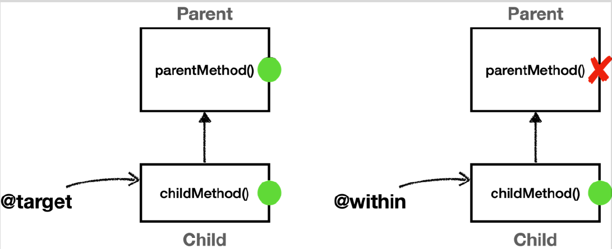

# <a href = "../README.md" target="_blank">스프링 핵심 원리 - 고급편</a>
## Chapter 11. 스프링 AOP - 포인트컷
### 11.07 @target, @within
1) `@target(...)` : 지정 어노테이션이 타입에 걸려있으면, 상위 타입 메서드까지 전부 어드바이스 적용
2) `@within` : 지정 어노테이션이 타입에 걸려있으면, 해당 타입 메서드만 어드바이스 적용
3) (실습) `@within`, `@target` 비교
4) `args`, `@args`, `@target` 포인트컷 지시자는 절대 단독으로 사용해선 안 된다.

---

# 11.07 @target, @within

---



## 1) `@target(...)` : 지정 어노테이션이 타입에 걸려있으면, 상위 타입 메서드까지 전부 어드바이스 적용  
```java
@Around('... && @target(hello.aop.member.annotation.ClassAop)') //인스턴스의 타입에 이 어노테이션이 있니? 있으면 상위 메서드까지 어드바이스 적용이야.
```
```java
@ClassAop // 있어!
class Target{}
```
### 1.1 정의
실행 객체의 클래스에 주어진 타입의 어노테이션이 있는 조인 포인트

### 1.2 풀어서 설명
- 언제 : `@target(...)`에 지정한 어노테이션이 타입에 걸려있을 때
- 인스턴스의 모든 메서드(상위 메서드, 자신의 메서드)를 조인 포인트로 적용한다.
- 상위 클래스의 메서드까지 어드바이스를 다 적용함

---

## 2) `@within` : 지정 어노테이션이 타입에 걸려있으면, 해당 타입 메서드만 어드바이스 적용
```java
@Around('... && @within(hello.aop.member.annotation.ClassAop)') //인스턴스의 타입에 이 어노테이션이 있니? 있으면 해당 타입의 메서드만 어드바이스 적용이야.
```
```java
@ClassAop // 있어!
class Target{}
```
### 2.1 정의
주어진 애노테이션이 있는 타입 내 조인 포인트

### 2.2 풀어서 설명
- 언제 : `@within(...)`에 지정한 어노테이션이 타입에 걸려있을 때
- 해당 타입(부모 포함 x) 내에 있는 메서드만 조인 포인트로 적용한다.
- 자기 자신의 클래스에 정의된 메서드에만 어드바이스를 적용한다.

---

## 3) (실습) `@within`, `@target` 비교


### 3.1 Parent, Child
```java

    static class Parent {
        public void parentMethod() {}
    }

    @ClassAop
    static class Child extends Parent {
        public void childMethod() {}
    }
```
- `parentMethod()` 는 Parent 클래스에는 명시적으로 정의되어 있고, Child 클래스에 정의되어 있지 않다.
- Child에 `@ClassAop` 어노테이션을 걸었다.

### 3.2 `AtTargetAtWithinAspect` 
```java
    @Slf4j
    @Aspect
    static class AtTargetAtWithinAspect {
        //@Target: 인스턴스 기준으로 모든 메서드의 조인 포인트를 선정, 부모 타입의 메서드도 적용
        @Around("execution(* com.ttasjwi.aop..*(..)) && @target(com.ttasjwi.aop.member.annotation.ClassAop)")
        public Object atTarget(ProceedingJoinPoint joinPoint) throws Throwable {
            log.info("[@target] {}", joinPoint.getSignature());
            return joinPoint.proceed();
        }

        //@within : 선택된 클래스 내부에 있는 메서드만 조인 포인트로 선정, 부모 타입의 메서드는 적용되지 않음
        @Around("execution(* com.ttasjwi.aop..*(..)) && @within(com.ttasjwi.aop.member.annotation.ClassAop)")
        public Object atWithin(ProceedingJoinPoint joinPoint) throws Throwable {
            log.info("[@within] {}", joinPoint.getSignature());
            return joinPoint.proceed();
        }

        // target, within은 런타임 시점, 빈 초기화 직후 클래스에 존재하는 어노테이션을 기반으로 적용여부를 동적으로 판단한다
    }
```
- `@target`과 `@within`을 적용한 어드바이스를 각각 정의했다.
- 위에서 `Child`에 `@ClassAop` 어노테이션이 걸려있는데, 런타임에 이를 확인하여 프록시를 적용할지 말지 판단할 것이다.
- `@target`은 `Child`에 `@ClassAop`가 걸려있는 것을 확인하고, 인스턴스의 모든 메서드에 어드바이스를 적용한다.
- `@within`은 `Child`에 `@ClassAop`가 걸려있는 것을 확인하고, 해당 타입의 메서드에 어드바이스를 적용한다.


### 3.3 Config
```java
    static class Config {

        @Bean
        public Parent parent() {
            return new Parent();
        }

        @Bean
        public Child child() {
            return new Child();
        }

        @Bean
        public AtTargetAtWithinAspect atTargetAtWithinAspect() {
            return new AtTargetAtWithinAspect();
        }

    }
```
- Parent, Child, AtTargetAtWithinAspect 을 빈으로 등록했다.

### 3.4 실행 코드
```java
@Slf4j
@Import(AtTargetWithinTest.Config.class)
@SpringBootTest
public class AtTargetWithinTest {

    @Autowired
    Child child;

    @Test
    void success() {
        log.info("child Proxy={}", child.getClass());
        child.childMethod(); //부모, 자식 모두 있는 메서드
        child.parentMethod(); //부모 클래스만 있는 메서드
    }
}
```
- child의 childMethod, parentMethod를 순서대로 호출한다.

### 3.5 실행 및 로그 분석


```shell
[@target] void hello.aop.pointcut.AtTargetAtWithinTest$Child.childMethod()
[@within] void hello.aop.pointcut.AtTargetAtWithinTest$Child.childMethod()

[@target] void hello.aop.pointcut.AtTargetAtWithinTest$Parent.parentMethod()
```
- 실행결과를 보면 `child.parentMethod()` 를 호출 했을 때 `[@within]` 이 호출되지 않은 것을 확인할 수
있다.

---

## 4) `args`, `@args`, `@target` 포인트컷 지시자는 절대 단독으로 사용해선 안 된다.
```java
@Around("execution(* com.ttasjwi.aop..*(..)) && @target(com.ttasjwi.aop.member.annotation.ClassAop)")
public Object atTarget(ProceedingJoinPoint joinPoint) throws Throwable {
    log.info("[@target] {}", joinPoint.getSignature());
    return joinPoint.proceed();
}
```
이번 예제를 보면 `execution(* hello.aop..*(..))` 를 통해 적용 대상을 줄여준 것을 확인할 수 있다.

### 4.1 단독 사용하면 안 되는 어노테이션
- `args`, `@args`, `@target`

### 4.2 적용대상을 최대한 줄이고 사용해야한다.
- `args` , `@args` , `@target` 은 실제 객체 인스턴스가 생성되고 실행될 때 어드바이스 적용 여부를 확인할 수
있다.
- 실행 시점에 일어나는 포인트컷 적용 여부도 결국 프록시가 있어야 실행 시점에 판단할 수 있다. 프록시가
없다면 판단 자체가 불가능하다. 그런데 스프링 컨테이너가 프록시를 생성하는 시점은 스프링 컨테이너가
만들어지는 애플리케이션 로딩 시점에 적용할 수 있다. 따라서 `args` , `@args`, `@target` 같은 포인트컷
지시자가 있으면 스프링은 모든 스프링 빈에 AOP를 적용하려고 시도한다. 앞서 설명한 것 처럼 프록시가
없으면 실행 시점에 판단 자체가 불가능하다.
- 문제는 이렇게 모든 스프링 빈에 AOP 프록시를 적용하려고 하면 스프링이 내부에서 사용하는 빈 중에는
final 로 지정된 빈들도 있기 때문에 오류가 발생할 수 있다.
- 따라서 이러한 표현식은 최대한 프록시 적용 대상을 축소하는 표현식과 함께 사용해야 한다.

---
