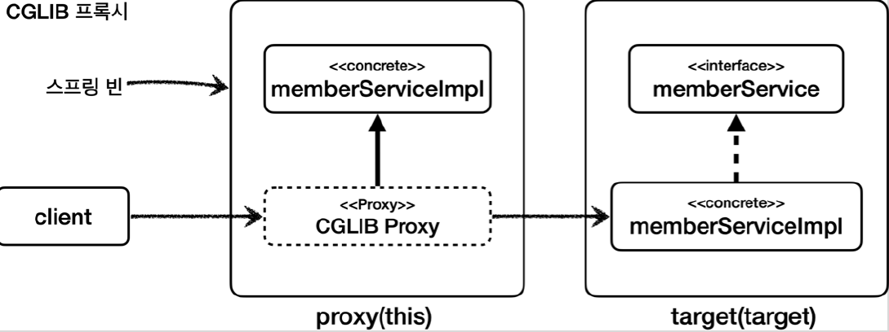

# <a href = "../README.md" target="_blank">스프링 핵심 원리 - 고급편</a>
## Chapter 11. 스프링 AOP - 포인트컷
### 11.11 this, target
1) `this`, `target` : proxy, target을 대상으로 하는 조인 포인트
2) JDK 동적 프록시와 `this`, `target`
3) CGLIB 동적 프록시와 `this`, `target`
4) (실습) 예제 코드를 통해 확인하기

---

# 11.11 this, target

---

## 1) `this`, `target` : proxy, target을 대상으로 하는 조인 포인트

### 1.1 정의
- `this` : 스프링 빈 객체(스프링 AOP 프록시)를 대상으로 하는 조인 포인트
- `target` : Target 객체(스프링 AOP 프록시가 가르키는 실제 대상)를 대상으로 하는 조인 포인트

### 1.2 설명
```shell
this(hello.aop.member.MemberService)
target(hello.aop.member.MemberService)
```
- `this` , `target` 은 위와 같이 적용 타입 하나를 정확하게 지정해야 한다.
- `*` 같은 패턴을 사용할 수 없다.
- 부모 타입을 허용한다.
- `this` , `target` 지시자는 단독으로 사용되기 보다는 파라미터 바인딩에서 주로 사용된다.

### 1.3 `this` vs `target`
스프링에서 AOP를 적용하면 실제 target 객체 대신에 프록시 객체가 스프링 빈으로 등록된다.
- `this` 는 스프링 빈으로 등록되어 있는 프록시 객체를 대상으로 포인트컷을 매칭한다.
- `target` 은 실제 target 객체를 대상으로 포인트컷을 매칭한다.

### 1.4 JDK 프록시, CGLIB 프록시 상황에서 다르게 동작한다.
스프링은 프록시를 생성할 때 JDK 동적 프록시와 CGLIB를 선택할 수 있다.  
둘의 프록시를 생성하는 방식이 다르기 때문에 차이가 발생한다.  
- JDK 동적 프록시 : 인터페이스가 필수이고, 인터페이스를 구현한 프록시 객체를 생성한다.
- CGLIB 동적 프록시 : 인터페이스가 있어도 구체 클래스를 상속 받아서 프록시 객체를 생성한다.

이 때, 프록시를 대상으로 하는 `this` 의 경우 구체 클래스를 지정하면 프록시 생성 전략에 따라서 다른 결과가
나올 수 있다. 아래에서 다룰 것이다.

---

## 2) JDK 동적 프록시와 `this`, `target`


JDK 동적 프록시: 인터페이스가 필수이고, 인터페이스를 구현한 프록시 객체를 생성한다.

### 2.1 MemberService 인터페이스 지정
- `this(hello.aop.member.MemberService)`
  - proxy 객체를 보고 판단한다. `this` 는 부모 타입을 허용하기 때문에 AOP가 적용된다.
- `target(hello.aop.member.MemberService)`
  - target 객체를 보고 판단한다. `target` 은 부모 타입을 허용하기 때문에 AOP가 적용된다.

### 2.2 MemberServiceImpl 구체 클래스 지정
- `this(hello.aop.member.MemberServiceImpl)`
  - proxy 객체를 보고 판단한다. JDK 동적 프록시로 만들어진 proxy 객체는 `MemberService` 인터페이스를 기반으로 구현된 새로운 클래스다.
  따라서 `MemberServiceImpl` 를 전혀 알지 못하므로 **AOP 적용 대상이 아니다.**
- `target(hello.aop.member.MemberServiceImpl)`
  - target 객체를 보고 판단한다. target 객체가 `MemberServiceImpl` 타입이므로 AOP 적용 대상이다.

---

## 3) CGLIB 동적 프록시와 `this`, `target`


CGLIB 동적 프록시 : 인터페이스가 있어도 구체 클래스를 상속 받아서 프록시 객체를 생성한다.

### 3.1 MemberService 인터페이스 지정
- `this(hello.aop.member.MemberService)`
  - proxy 객체를 보고 판단한다. this 는 부모 타입을 허용하기 때문에 AOP가 적용된다.
- `target(hello.aop.member.MemberService)`
  - target 객체를 보고 판단한다. target 은 부모 타입을 허용하기 때문에 AOP가 적용된다.

### 3.2 MemberServiceImpl 클래스 지정
- `this(hello.aop.member.MemberServiceImpl)`
  - proxy 객체를 보고 판단한다. JDK 동적 프록시로 만들어진 proxy 객체는 `MemberService` 인터페이스를 기반으로 구현된 새로운 클래스다.
  따라서 `MemberServiceImpl` 를 전혀 알지 못하므로 AOP 적용 대상이 아니다.
- `target(hello.aop.member.MemberServiceImpl)`
  - target 객체를 보고 판단한다. target 객체가 `MemberServiceImpl` 타입이므로 AOP 적용 대상이다.

---

## 4) (실습) 예제 코드를 통해 확인하기

### 4.1 예제 코드
```java
/**
 * application.properties
 * spring.aop.proxy-target-class=true : CGLIB 동적 프록시 우선 생성
 * spring.aop.proxy-target-class=false : JDK 동적 프록시 우선 생성
 */
@Slf4j
//@SpringBootTest(properties = "spring.aop.proxy-target-class=true") // CGLIB 동적 프록시 우선 생성
@SpringBootTest(properties = "spring.aop.proxy-target-class=false") // JDK 동적 프록시 우선 생성
@Import(ThisTargetTest.ThisTargetAspect.class)
public class ThisTargetTest {

    @Autowired
    MemberService memberService;

    @Test
    void success() {
        log.info("memberService Proxy = {}", memberService.getClass());
        memberService.hello("helloA");
    }
    
    @Aspect
    static class ThisTargetAspect {

        // this - 부모 타입 허용
        @Around("this(com.ttasjwi.aop.member.MemberService)")
        public Object doThisInterface(ProceedingJoinPoint joinPoint) throws Throwable {
            log.info("[this-interface] {}", joinPoint.getSignature());
            return joinPoint.proceed();
        }

        // this - 부모 타입 허용
        @Around("target(com.ttasjwi.aop.member.MemberService)")
        public Object doTargetInterface(ProceedingJoinPoint joinPoint) throws Throwable {
            log.info("[target-interface] {}", joinPoint.getSignature());
            return joinPoint.proceed();
        }

        //this: 스프링 AOP 프록시 객체 대상
        //JDK 동적 프록시는 인터페이스를 기반으로 생성되므로 구현 클래스를 알 수 없음
        //CGLIB 프록시는 구현 클래스를 기반으로 생성되므로 구현 클래스를 알 수 있음
        @Around("this(com.ttasjwi.aop.member.MemberServiceImpl)")
        public Object doThisImpl(ProceedingJoinPoint joinPoint) throws Throwable {
            log.info("[this-impl] {}", joinPoint.getSignature());
            return joinPoint.proceed();
        }

        //target: 실제 target 객체 대상
        @Around("target(com.ttasjwi.aop.member.MemberServiceImpl)")
        public Object doTargetImpl(ProceedingJoinPoint joinPoint) throws Throwable {
            log.info("[target-impl] {}", joinPoint.getSignature());
            return joinPoint.proceed();
        }
    }

}
```
`this` , `target` 은 실제 객체를 만들어야 테스트 할 수 있다. 테스트에서 스프링 컨테이너를 사용해서
target , proxy 객체를 모두 만들어서 테스트한다.
- `properties = {"spring.aop.proxy-target-class=false"}`
  - `application.properties` 에 설정하는 대신에 해당 테스트에서만 설정을 임시로 적용한다.
  - 이렇게 하면 각 테스트마다 다른 설정을 손쉽게 적용할 수 있다.
- `spring.aop.proxy-target-class=false`
  - 스프링이 AOP 프록시를 생성할 때 인터페이스가 있다면 JDK 동적 프록시를 우선 생성한다. 물론 인터페이스가 없다면 CGLIB를 사용한다.
- `spring.aop.proxy-target-class=true`
  - 스프링이 AOP 프록시를 생성할 때 CGLIB 프록시를 생성한다.
  - 참고로 이 설정을 생략하면 스프링 부트에서 기본으로 CGLIB를 사용한다. 즉, 명시적으로 이 속성을 선언하지 않아도 된다. 이 부분은 뒤에서
  자세히 설명한다.

### 4.2 JDK 동적 프록시 우선 생성 방식 실행
```java
//@SpringBootTest(properties = "spring.aop.proxy-target-class=true") // CGLIB 동적 프록시 우선 생성
@SpringBootTest(properties = "spring.aop.proxy-target-class=false") // JDK 동적 프록시 우선 생성
```
```shell
memberService Proxy = class com.sun.proxy.$Proxy50
[target-impl] String com.ttasjwi.aop.member.MemberService.hello(String)
[target-interface] String com.ttasjwi.aop.member.MemberService.hello(String)
[this-interface] String com.ttasjwi.aop.member.MemberService.hello(String)
```
JDK 동적 프록시를 사용하면 `this(hello.aop.member.MemberServiceImpl)` 로 지정한 `[thisimpl]`
부분이 출력되지 않는 것을 확인할 수 있다.

### 4.3 CGLIB 동적 프록시 우선 생성 방식 실행
```java
@SpringBootTest(properties = "spring.aop.proxy-target-class=true") // CGLIB 동적 프록시 우선 생성
//@SpringBootTest(properties = "spring.aop.proxy-target-class=false") // JDK 동적 프록시 우선 생성
```
```shell
memberService Proxy = class com.ttasjwi.aop.member.MemberServiceImpl$$EnhancerBySpringCGLIB$$9105b4d2
[target-impl] String com.ttasjwi.aop.member.MemberServiceImpl.hello(String)
[target-interface] String com.ttasjwi.aop.member.MemberServiceImpl.hello(String)
[this-impl] String com.ttasjwi.aop.member.MemberServiceImpl.hello(String)
[this-interface] String com.ttasjwi.aop.member.MemberServiceImpl.hello(String)
```
CGLIB 동적 프록시를 사용하면 JDK 동적 프록시 방식과 달리 구체 클래스를 상속하여 프록시를 생성하기 때문에,
`this(hello.aop.member.MemberServiceImpl)` 로 지정한 `[thisimpl]` 부분이 출력되는 것을 확인할 수 있다.

---
