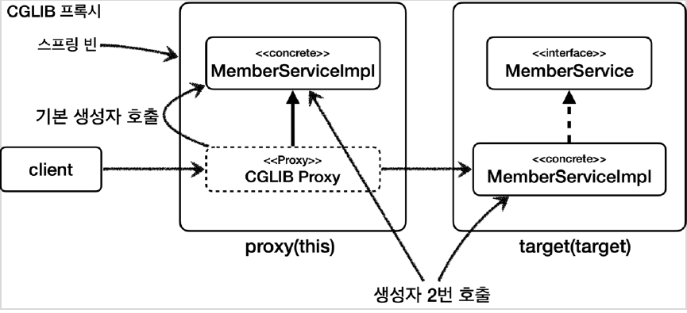

# <a href = "../README.md" target="_blank">스프링 핵심 원리 - 고급편</a>
## Chapter 13. 스프링 AOP - 실무 주의사항
### 13.7 프록시 기술과 한계 - CGLIB
1) CGLIB 구체 클래스 기반 프록시 문제점
2) 문제점1: 대상 클래스에 기본 생성자 필수
3) 문제점2: 생성자 2번 호출 문제
4) 문제점3: final 키워드 클래스, 메서드 사용 불가

---

# 13.7 프록시 기술과 한계 - CGLIB

---

## 1) CGLIB 구체 클래스 기반 프록시 문제점
스프링에서 CGLIB는 구체 클래스를 상속 받아서 AOP 프록시를 생성할 때 사용한다.
CGLIB는 구체 클래스를 상속 받기 때문에 다음과 같은 문제가 있다.
- 대상 클래스에 기본 생성자 필수
- 생성자 2번 호출 문제
- final 키워드 클래스, 메서드 사용 불가

---

## 2) 문제점1: 대상 클래스에 기본 생성자 필수

### 2.1 자바 문법 : 하위 클래스에서는 상위 클래스의 생성자를 호출해야한다.
- 자바 언어에서 상속을 받으면 자식 클래스의 생성자를 호출할 때 자식 클래스의 생성자에서 부모 클래스의 생성자도 호출해야 한다.
- 이 부분이 생략되어 있다면 자식 클래스의 생성자 첫줄에 부모 클래스의 기본 생성자를 호출하는 `super()` 가 자동으로 들어간다.
- 이 부분은 자바 문법 규약이다.

### 2.2 CGLIB 기술은 상속 기반이고, 프록시 측에서 target의 기본 생성자를 호출한다.
- CGLIB는 구체 클래스를 상속 받는다. 
- CGLIB를 사용할 때 CGLIB가 만드는 프록시의 생성자는 우리가 호출하는 것이 아니다. CGLIB 프록시는
대상 클래스를 상속 받고, 생성자에서 대상 클래스의 기본 생성자를 호출한다.
- 따라서 대상 클래스에 기본 생성자를 만들어야 한다. (기본 생성자는 파라미터가 하나도 없는 생성자를 뜻한다. 생성자가 하나도 없으면
자동으로 만들어진다.)

---

## 3) 문제점2: 생성자 2번 호출 문제

CGLIB는 구체 클래스를 상속 받는다. 자바 언어에서 상속을 받으면 자식 클래스의 생성자를 호출할 때
부모 클래스의 생성자도 호출해야 한다. 그런데 왜 2번일까?

1. 실제 target의 객체를 생성할 때
2. 프록시 객체를 생성할 때 부모 클래스의 생성자 호출

---

## 4) 문제점3: final 키워드 클래스, 메서드 사용 불가
- `final` 키워드가 클래스에 있으면 상속이 불가능하고, 메서드에 있으면 오버라이딩이 불가능하다.
- CGLIB는 상속을 기반으로 하기 때문에 두 경우 프록시가 생성되지 않거나 정상 동작하지 않는다.
프레임워크 같은 개발이 아니라 일반적인 웹 애플리케이션을 개발할 때는 final 키워드를 잘 사용하지
않는다. 따라서 이 부분이 특별히 문제가 되지는 않는다.

---
