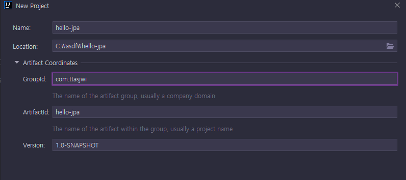
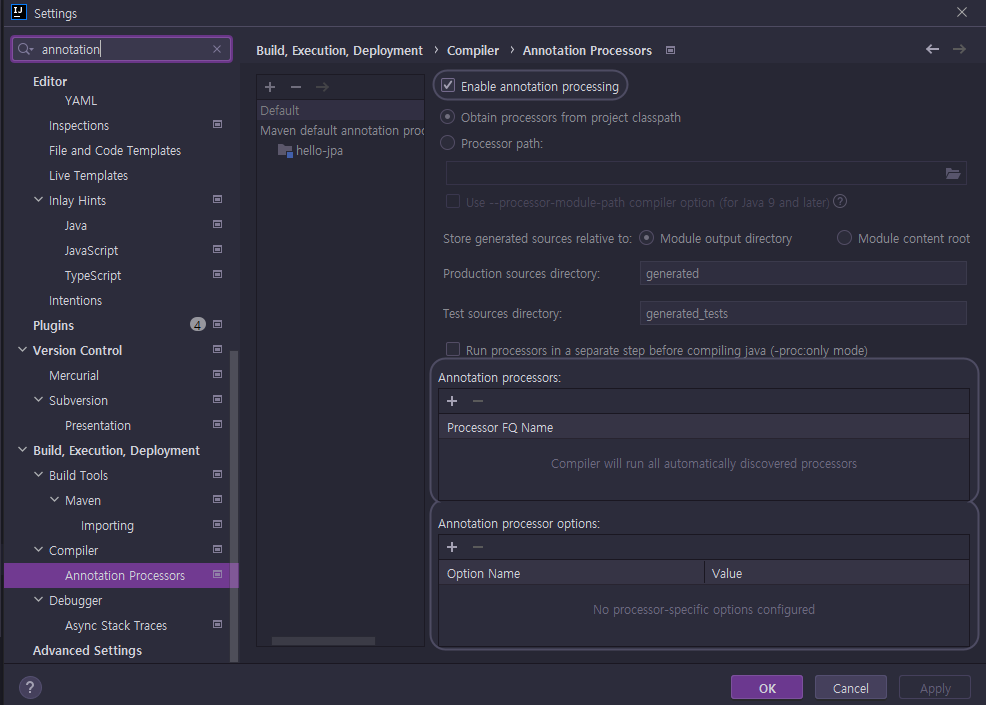
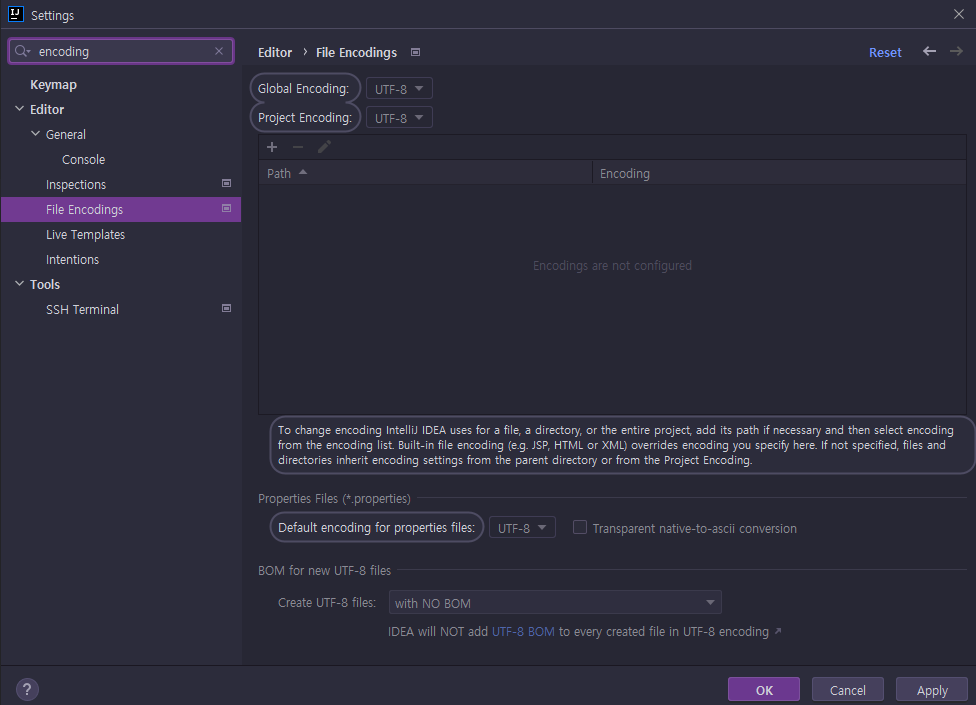
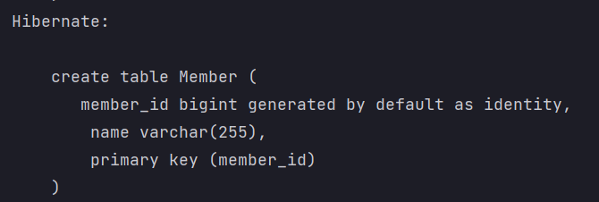
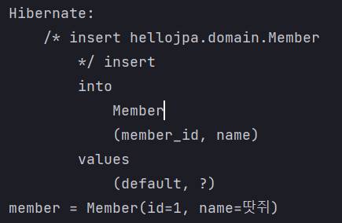

# <a href = "../README.md" target="_blank">자바 ORM 표준 JPA 프로그래밍 - 기본편</a>
## Chapter 02. JPA 시작하기
### 2.1 Hello JPA - 프로젝트 생성
1) H2 데이터베이스 설치
2) maven 프로젝트 생성
3) pom.xml의 dependencies에 의존 라이브러리 추가
4) persistence.xml
5) IntelliJ Setting
6) 실행 확인
---

# 2.1 Hello JPA - 프로젝트 생성

---

## 2.1.1 H2 데이터베이스 설치
### H2 데이터베이스는?

- 개발이나 테스트 용도로 가볍고 편리한 DB
- 웹 화면으로 제공됨(8082 포트)

### 설치
- h2 데이터베이스 버전은 스프링 부트 버전에 맞춘다. (현재 1.4.200이 기준 버전)
  - 1.4.200 버전을 압축파일로 다운 [링크](https://www.h2database.com/html/download-archive.html)
- 편의를 위해 home 경로(terminal 기준 home 경로는 `'~'`)에 압축파일 해제

### 실행
- h2 설치 폴더의 bin 경로로 이동 (cd `~/h2/bin`)
- (mac 기준) 실행 권한 설정: `chmod 755 h2.sh`
- 실행
  - windows : `.\h2.bat`
  - mac : `.\h2.sh`

### DB 파일 생성
- `jdbc:h2:~/datajpa` (최소 한번)
- `~/datajpa.mv.db` 파일 생성 확인
- 이후 부터는 jdbc:h2:tcp://localhost/~/datajpa 이렇게 접속

---

## 2.1.2 maven 프로젝트 생성

- 해당 강의, 서적 기준으로 maven으로 설정되어 있음.
- 서적 발행 년도가 2015년이고 당시에는 maven이 주류였음
- 현재 주류인 gradle로 설정할 경우 여러가지 설정 차이가 있어서, 실습에 매우 지장이 생기므로 maven으로 빌드하는 것이 좋다.
- 서적에서는 8버전 기준으로 되어 있는데, 현재 내 자바 개발환경은 11이므로 java 11 기준오로 서술함

---

## 2.1.3 pom.xml의 dependencies에 의존 라이브러리 추가
```xml
    <dependencies>
        <!-- JPA 하이버네이트 -->
        <dependency>
            <groupId>org.hibernate</groupId>
            <artifactId>hibernate-entitymanager</artifactId>
            <version>5.6.9.Final</version>
        </dependency>
        <!-- H2 데이터베이스 -->
        <dependency>
            <groupId>com.h2database</groupId>
            <artifactId>h2</artifactId>
            <version>1.4.200</version>
        </dependency>

        <dependency>
            <!-- java 11 -->
            <groupId>javax.xml.bind</groupId>
            <artifactId>jaxb-api</artifactId>
            <version>2.3.0</version>
        </dependency>

        <!-- 롬복 -->
        <dependency>
            <groupId>org.projectlombok</groupId>
            <artifactId>lombok</artifactId>
            <version>1.18.24</version>
            <scope>provided</scope>
        </dependency>

    </dependencies>
```
현재 Spring Boot에서 기본적으로 지원하는 안정 dependency-versions 기준으로 설정함. ([참고 링크](https://docs.spring.io/spring-boot/docs/current/reference/html/dependency-versions.html#appendix.dependency-versions))
- `com.h2database:1.4.200`
- `org.hibernate:hibernate-entitymanager` : 하이버네이트 엔티티 매니저
  - 하이버네이트 엔티티 매니저의 버전이 낮을 때 h2 데이터베이스의 create 설정에서 drop이 제대로 작동 안 되는 문제가 있음.
- `javax.xml.bind:javaxb-api` : java 11 이상 의존성 추가 해야함.
- lombok : getter, setter 등 편의 메서드 생성은 어노테이션으로 간편하게 할 수 있음

---

## 2.1.4 persistence.xml
```xml
<?xml version="1.0" encoding="UTF-8"?>
<persistence version="2.2"
             xmlns="http://xmlns.jcp.org/xml/ns/persistence" xmlns:xsi="http://www.w3.org/2001/XMLSchema-instance"
             xsi:schemaLocation="http://xmlns.jcp.org/xml/ns/persistence http://xmlns.jcp.org/xml/ns/persistence/persistence_2_2.xsd">
    <persistence-unit name="hello">
        <properties>
            <!-- 필수 속성 -->
            <property name="javax.persistence.jdbc.driver" value="org.h2.Driver"/>
            <property name="javax.persistence.jdbc.user" value="sa"/>
            <property name="javax.persistence.jdbc.password" value=""/>
            <property name="javax.persistence.jdbc.url" value="jdbc:h2:tcp://localhost/~/hello-jpa"/>
            <property name="hibernate.dialect" value="org.hibernate.dialect.H2Dialect"/>
            <!-- 옵션 -->
            <property name="hibernate.show_sql" value="true"/>
            <property name="hibernate.format_sql" value="true"/>
            <property name="hibernate.use_sql_comments" value="true"/>
            <property name="hibernate.hbm2ddl.auto" value="create" />

            <!-- 배치 사이즈를 조절할 수 있음 -->
            <!--<property name="hibernate.default_batch_fetch_size" value="10"/>-->

        </properties>
    </persistence-unit>
</persistence>

```
- `src/main/resources/META-INF/persistence.xml`
- db 연결설정 (드라이버, user, password, url)
- hibernate.dialect : 데이터베이스 방언 지원
- show_sql : `System.out`에 하이버네이트 실행 SQL을 남김
- format_sql : 예쁘게 보여줌
- use_sql_comment : 추가적인 주석 표기
- ddl_auto : ddl 자동 정의 기능
  - create : 테이블들을 drop 시키고 다시 생성

---

## 2.1.5 IntelliJ Setting

### Annotation Processing

- 롬복과 같은 외부 어노테이션 라이브러리를 원활하게 사용하기 위해서 활성화 
- `Settings -> Build, Exception, Deployment -> Compiler -> Annotation Processing`
  - [x] Enable annotation processing

### File Encoding

- 인텔리제이 파일 인코딩 설정. UTF-8로 변경

---

## 2.1.6 실행 확인
```java
@Entity
@Getter @Setter
@NoArgsConstructor(access = AccessLevel.PROTECTED)
@ToString(of = {"id", "name"})
public class Member {

  @Id @GeneratedValue(strategy = GenerationType.IDENTITY)
  @Column(name = "member_id")
  private Long id;
  private String name;

  public Member(String name) {
    this.name = name;
  }
}
```
```java
public class JpaMain {
  public static void main(String[] args) {
    EntityManagerFactory emf = Persistence.createEntityManagerFactory("hello");
    EntityManager em = emf.createEntityManager();

    EntityTransaction tx = em.getTransaction();
    tx.begin();

    try {
      Member member = new Member("땃쥐");
      em.persist(member);
      
      System.out.println("member = "+member);
      tx.commit();
    } catch (Exception e) {
      e.printStackTrace();
      tx.rollback();
    } finally {
      em.close();
    }
    emf.close();
  }
}
```


- DDL, insert, sout이 제대로 작동되면 정상임
  - ddl : create table ...
  - insert : insert 쿼리
  - sout : system.out문을 통해 엔티티 출력(롬복의 toString 테스트) 
- 매번 실행될 때마다 테이블이 지워지고 다시 생성되야 정상

---
