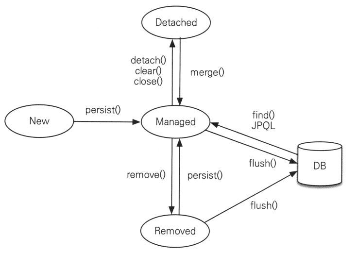
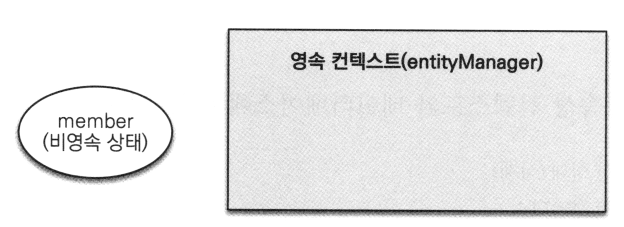

# <a href = "../README.md" target="_blank">자바 ORM 표준 JPA 프로그래밍 - 기본편</a>
## Chapter 03. 영속성 관리 - 내부 동작 방식
### 3.1 영속성 컨텍스트 1
1) 엔티티 매니저 팩토리, 엔티티 매니저, 커넥션
2) 영속성 컨텍스트(Persistence Context)
3) 엔티티의 생명 주기

---

# 3.1 영속성 컨텍스트 1

---

## 1) 엔티티 매니저 팩토리, 엔티티 매니저, 커넥션


### 1.1 엔티티 매니저 팩토리(EntityManagerFactory)
```java
EntityManagerFactory emf = Persistence.createEntityManagerFactory("hello");
```
```xml
    <persistence-unit name="hello"> <!-- persistence.xml-->
        <properties>
```
- Persistence 클래스를 통해서, EntityManagerFactory를 생성한다.
    - `resources/META-INF/persistence.xml`의 설정 정보를 사용한다.
- 위와 같이 지정하면, 이름이 'hello'인 persistence-unit을 찾아서 엔티티 매니저 팩토리를 생성한다.
- 여러 스레드에서 동시에 접근해도 안전하다.
- 엔티티 매니저 팩토리는 **애플리케이션 전체에서 단 한번 생성하고 공유해서 사용**해야한다.
  - JPA를 동작시키기 위한 기반 객체 생성, 구현체에 따라서는 데이터베이스 커넥션 풀도 생성하기 때문에 매우 생성 비용이 비싸다.

### 1.2 엔티티 매니저(Entity Manager)
```java
EntityManager em = emf.createEntityManager();
```
- 엔티티 매니저를 통해서, 엔티티 매니저를 생성한다. 생성 비용이 그렇게 비싸지 않다.
- JPA의 대부분의 기능은 EntityManager가 제공한다.
- 엔티티 매니저는 내부적으로 DataSource를 유지하면서 데이터베이스와 통신할 수 있다.
- 엔티티 매니저를 통해서, 엔티티를 데이터베이스에 등록/수정/삭제/조회 할 수 있다.
- 데이터베이스 커넥션과 밀접한 관련이 있으므로, 스레드 간에 공유하거나 재사용하면 안 된다.
    - 요청이 들어올 때마다 하나씩 사용한다.

### 1.3 커넥션 풀
- 하이버네이트를 포함한 대부분의 JPA 구현체들은 EnitityManagerFactory 생성 시점에 커넥션 풀을 생성한다.
  - (이 때, `persistence.xml`에 등록된 정보를 사용한다.)
- Spring은 스프링 컨테이너가 제공하는 Datasource를 사용한다.
  - Spring Boot 기준으로는 HikariCP가 기본 커넥션 풀로 제공된다.

---

## 2) 영속성 컨텍스트(Persistence Context)

### 2.1 영속성 컨텍스트란?
- 엔티티를 영구 저장하는 환경
- 논리적인 개념이다. 눈에 보이지 않는다.
- JPA를 이해하는데 가장 중요한 용어.

### 2.2 영속성 컨텍스트와 EntityManager의 관계
- EntityManager를 하나 생성하면, 영속성 컨텍스트가 하나 생성된다.
- EntityManager를 통해 영속성 컨텍스트에 접근하여 데이터를 저장, 접근, 조회, ... 할 수 있다.
- 보통 하나의 EntityManager를 통해 하나의 영속성 컨텍스트가 만들어지는데, 여러 엔티티 매니저가 같은 영속성 컨텍스트에 접근하는 경우도 있다.
이런 복잡한 상황은 책 11장에서 다룬다고 서술되어 있다.

### 2.3 예시
```java
em.persist(member);
```
- '엔티티 매니저'에 저장하는 것이 아니라, 엔티티 매니저를 통해 member 엔티티를 영속성 컨텍스트에 저장한다.

---

## 3) 엔티티의 생명 주기

### 3.1 엔티티의 생명 주기

엔티티에는 4가지 상태가 존재한다.
- 비영속(new/transient) : 영속성 컨텍스트와 전혀 관계가 없는 상태
- 영속(managed) : 영속성 컨텍스트에 저장된 상태
- 준영속(detached) : 영속성 컨텍스트에 저장되었다가 분리된 상태
- 삭제(removed) : 삭제된 상태

### 3.2 비영속(new/transient)

```java
Book book = new Book("땃쥐의 Spring", 30000); // 비영속 상태
```
- 순수한 객체 상태이며, 아직 저장되지 않은 상태
- 영속성 컨텍스트, 데이터베이스와 관련이 없는 상태

### 3.3 영속(managed)


영속성 컨텍스트에 의해 관리되는 상태
- `em.persist(...)` : 엔티티를 영속성 컨텍스트에 저장하여 영속상태로 만든다.
- `em.find(...)` 또는 JPQL을 통해 조회된 엔티티 : 영속성 컨텍스트에 의해 관리된다.

### 3.4 준영속(detached)
영속성 컨텍스트가 관리하던 영속 상태의 엔티티가 관리하지 않는 상태.
- `em.detach(...)` : 영속성 컨텍스트가 관리하던 엔티티를 준영속 상태로 분리한다.
- `em.close()` : 엔티티 매니저를 통해 영속성 컨텍스트를 종료한다.
- `em.clear()` : 영속성 컨텍스트를 초기화한다.

### 3.5 삭제(removed)
```java
em.remove(member);
```
- 엔티티를 영속성 컨텍스트 뿐만 아니라, 데이터베이스에서 삭제한다.

---
