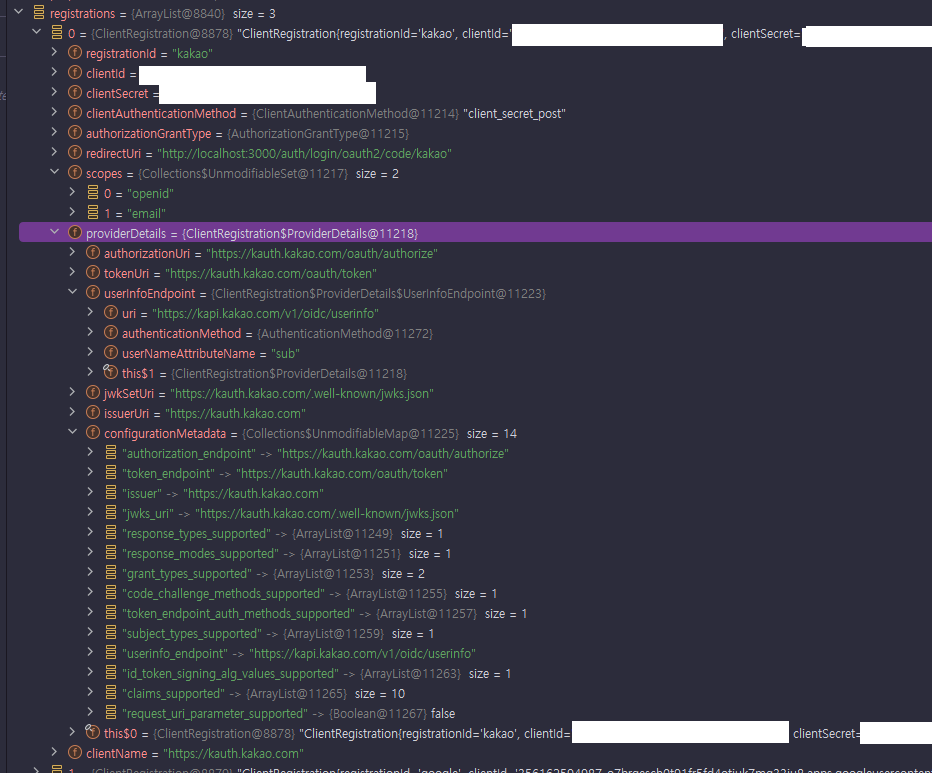

# Spring Security OAuth2 Client - ClientRegistration, ClientRegistrationRepository

---

## Index
1. [ClientRegistration](#1-clientregistration)
2. [ClientRegistration 의 필드들](#2-clientregistration-의-필드들)
3. [CommonOAuth2Provider](#3-commonoauth2provider)
4. [ClientRegistration 자동 구성 흐름](#4-clientregistration-자동-구성-흐름)
5. [ClientRegistration 설정 정리](#5-clientregistration-설정-정리)
6. [ClientRegistrationRepository](#6-clientregistrationrepository)

---

## 1. ClientRegistration
- OAuth 2.0(또는 OpenID Connect 1.0 Provider) 에서 클라이언트(Client)의 등록 정보, 서비스 제공자(Provider) 정보를 나타낸다.
  - 클라이언트 정보: client_id, client_secret, ...
  - 서비스 제공자 정보: authorization_uri, token_uri, ...
- 스프링은 기본적으로 우리가 등록한 설정값(`application.yml -> OAuth2ClientProperties`)을 기반으로 ClientRegistration 을 구성한다.

---

## 2. ClientRegistration 의 필드들


### 2.1 ClientRegistration 식별자
- registrationId: 애플리케이션 내에서 ClientRegistration 을 식별할 수 있는 유니크한 id

### 2.2 클라이언트 등록정보
- clientId(필수): 클라이언트 식별자
- clientSecret(필수): 클라이언트 secret
- clientAuthenticationMethod : provider(인가서버)에서 클라이언트를 인증할 때 사용할 방법
    - `client_secret_basic` : `id:secret`을 base64 인코딩한 뒤 Authorization Header에 담아 보냄(basic 방식)
    - `client_secret_post` : id, secret 을 html form을 통해 보냄
    - `none`: 공개 클라이언트라서 secret이 필요 없는 경우
- authorizationGrantType: OAuth 2.0 인가 프레임워크의 권한 부여 유형 중 어떤 것을 선택할 것인가?
    - authorization_code
    - implicit
    - client_credentials
    - password
- redirectUri: 클라이언트에 등록한 리다이렉트 URL로, 사용자의 인증으로 클라이언트에 접근 권한을 부여하고 나면, 인가 서버가 이 최종사용자를
이 URL로 리다이렉트시킨다.
- Scopes : 인가 요청 플로우에서 클라이언트가 요청한 openid, email, 프로필 등의 scope
- clientName: 클라이언트를 나타내는 이름으로 자동 생성되는 로그인 페이지에서 노출하는 등에 사용한다.

### 2.3 서비스 제공자 정보(ProviderDetails)
- **issuerUri**: 인가 서비스 제공자의 메타데이터 정보를 얻을 때 사용하는 baseUri
  - 이 값을 설정하면 서비스 제공자가 제공하는 메타데이터 엔드포인트에 접근하여 `configurationMetadata` 를 구성하고, 사용할 수 있다
- configurationMetadata : OpenID Provider 설정 정보 관련 메타데이터 Map. issuerUri 를 설정하면, 해당 인증서버와의 http 통신을 거쳐서
이 정보를 획득하고 사용할 수 있다.
- authorizationUri : 인가 서버의 인가 엔드포인트 URI.
- tokenUri: 인가 서버의 토큰 엔드포인트 URI
- jwkSetUri : 인가 서버에서 JWKSet(JSON Web Key Set)을 가져올 때 사용할 URI. 이 JWKSet 에는 Open ID Connect에서 사용하는 ID 토큰의
JSON Web Signature (JWS) 를 검증할 때 사용할 암호키(공개키)가 있으며, UserInfo 응답을 검증할 때도 사용할 수 있다.
- userInfoEndpoint
    - uri: 인증된 최종 사용자의 클레임/속성에 접근할 때 사용하는 UserInfo 엔드포인트 URI.
    - authenticationMethod: UserInfo 엔드포인트로 액세스 토큰을 전송할 때 사용할 인증 메소드. header, form, query 를 지원한다.
- userNameAttributeName : UserInfo 응답에 있는 속성 이름으로, 최종 사용자의 이름이나 식별자에 접근할 때 사용한다

---

## 3. CommonOAuth2Provider
```java
package org.springframework.security.config.oauth2.client;

public enum CommonOAuth2Provider {
	GOOGLE {
		@Override
		public Builder getBuilder(String registrationId) {
			ClientRegistration.Builder builder = getBuilder(registrationId,
					ClientAuthenticationMethod.CLIENT_SECRET_BASIC, DEFAULT_REDIRECT_URL);
			builder.scope("openid", "profile", "email");
			builder.authorizationUri("https://accounts.google.com/o/oauth2/v2/auth");
			builder.tokenUri("https://www.googleapis.com/oauth2/v4/token");
			builder.jwkSetUri("https://www.googleapis.com/oauth2/v3/certs");
			builder.issuerUri("https://accounts.google.com");
			builder.userInfoUri("https://www.googleapis.com/oauth2/v3/userinfo");
			builder.userNameAttributeName(IdTokenClaimNames.SUB);
			builder.clientName("Google");
			return builder;
		}
	},
```
- 널리 잘 알려진 OAuth2 Provider 정보는 스프링이 따로 CommonOAuth2Provider enum 으로 관리하고 있다.
  - 2024년 기준 **Google**, **GitHub**, FaceBook, Okta 4개가 이에 해당된다.
- 이 enum 클래스는 ClientRegistration 객체를 생성할 수 있는 빌더 클래스를 반환하는데 여기에 기본적인 인가서버 정보가 준비되어 있다.
- 이들 Provider에 대해서 별도의 Provider 설정은 안 해도 되지만 client_id(필수)와 client_secret(필수), redirect_uri 와 같이
클라이언트 환경마다 달라지는 값들은 별도로 `application.properties` 에 작성해야 해야한다. (CommonOAuth2Provider 이 제공한 빌더에
해당 설정이 추가된다.)
- Naver 나 Kakao 와 같은 국내 Provider 정보는 Provider 정보를 어느 정도 수동으로 작성해서 사용해야 한다.

---

## 4. ClientRegistration 자동 구성 흐름
스프링이 어떻게 ClientRegistration 을 자동 설정하는 지 상세한 흐름을 보자.

### 4.1 OAuth2ClientRegistrationRepositoryConfiguration
```java
@Configuration(proxyBeanMethods = false)
@EnableConfigurationProperties(OAuth2ClientProperties.class)
@Conditional(ClientsConfiguredCondition.class)
class OAuth2ClientRegistrationRepositoryConfiguration {
    @Bean
    @ConditionalOnMissingBean(ClientRegistrationRepository.class)
    InMemoryClientRegistrationRepository clientRegistrationRepository(OAuth2ClientProperties properties) {
        List<ClientRegistration> registrations = new ArrayList<>(
                new OAuth2ClientPropertiesMapper(properties).asClientRegistrations().values());
        return new InMemoryClientRegistrationRepository(registrations);
    }
}
```
- ClientRegistrationRepository 빈이 등록되어있지 않을 때 스프링은 자동으로 `clientRegistrationRepository` 를 빈으로 등록한다.
- 이 설정 클래스에서는 `OAuth2ClientProperties` 설정을 가져와서 사용하는데, 앞서 우리가 설정파일을 통해 설정한 값들이
여기에 바인딩되어 있다.
- 그리고 이 정보를 기반으로 `ClientRegistration` 리스트를 구성하고 이를 통해 `ClientRegistrationRepository` 를 만들어
빈으로 등록한다.
- `asClientRegistrations()` 부분으로 파고들어가 보겠다.

### 4.2 OAuth2ClientPropertiesMapper.asClientRegistrations.values
```java
	public Map<String, ClientRegistration> asClientRegistrations() {
		Map<String, ClientRegistration> clientRegistrations = new HashMap<>();
		this.properties.getRegistration()
			.forEach((key, value) -> clientRegistrations.put(key,
					getClientRegistration(key, value, this.properties.getProvider())));
		return clientRegistrations;
	}
```
- 앞서 설정된 OAuth2Properties 를 기반으로 ClientRegistration 목록을 만든다.
- getClientRegistration 부분을 파고들어가 보겠다.

### 4.3 OAuth2ClientPropertiesMapper.getClientRegistration
```java
	private static ClientRegistration getClientRegistration(String registrationId,
			OAuth2ClientProperties.Registration properties, Map<String, Provider> providers) {
		Builder builder = getBuilderFromIssuerIfPossible(registrationId, properties.getProvider(), providers);
		if (builder == null) {
			builder = getBuilder(registrationId, properties.getProvider(), providers);
		}
		PropertyMapper map = PropertyMapper.get().alwaysApplyingWhenNonNull();
		map.from(properties::getClientId).to(builder::clientId);
		map.from(properties::getClientSecret).to(builder::clientSecret);
		map.from(properties::getClientAuthenticationMethod)
			.as(ClientAuthenticationMethod::new)
			.to(builder::clientAuthenticationMethod);
		map.from(properties::getAuthorizationGrantType)
			.as(AuthorizationGrantType::new)
			.to(builder::authorizationGrantType);
		map.from(properties::getRedirectUri).to(builder::redirectUri);
		map.from(properties::getScope).as(StringUtils::toStringArray).to(builder::scope);
		map.from(properties::getClientName).to(builder::clientName);
		return builder.build();
	}
```
- 스프링은 ClientRegistration 을 구성할 때 클라이언트 기준인 `Registration` 항목과 서비스 제공자 기준인 `Provider` 항목으로 구분하여 설정한다
- Provider 설정 구성 : Provider 설정을 기반으로 builder 를 준비
    - getBuilderFromIssuerIfPossible : provider 설정의 issuerUri 를 기반으로 메타데이터를 조회해서 provider 설정 구성
    - 앞에서 얻어오지 못 했다면 우리가 설정한 provider 설정으로 설정을 구성
- 클라이언트 설정 추가 : Registration으로부터 클라이언트 설정을 가져와 builder에 추가
- `빌더.build()` => ClientRegistration 구성

### 4.4 issuerUri 설정을 했을 경우
```java
	private static Builder getBuilderFromIssuerIfPossible(String registrationId, String configuredProviderId,
			Map<String, Provider> providers) {
		String providerId = (configuredProviderId != null) ? configuredProviderId : registrationId;
		if (providers.containsKey(providerId)) {
			Provider provider = providers.get(providerId);
			String issuer = provider.getIssuerUri();
			if (issuer != null) {
				Builder builder = ClientRegistrations.fromIssuerLocation(issuer).registrationId(registrationId);
				return getBuilder(builder, provider);
			}
		}
		return null;
	}
```
- issuerUri 설정이 있다면 issuerUri 설정을 기반으로 다음 순으로 Http 통신을 시도하고
  가장 먼저 성공한 통신을 기반으로 Builder를 구성한다.
    - oidc : `/.well-known/openid-configuration`
    - oidcRfc8414 : `/.well-known/oauth-authorization-server`
- 그 후 우리가 수동 등록한 Provider 설정값이 있으면 해당 값으로 덮어 씌운다.


### 4.5 issuerUri 설정을 하지 않았을 경우
```java
	private static Builder getBuilder(String registrationId, String configuredProviderId,
			Map<String, Provider> providers) {
		String providerId = (configuredProviderId != null) ? configuredProviderId : registrationId;
		CommonOAuth2Provider provider = getCommonProvider(providerId);
		if (provider == null && !providers.containsKey(providerId)) {
			throw new IllegalStateException(getErrorMessage(configuredProviderId, registrationId));
		}
		Builder builder = (provider != null) ? provider.getBuilder(registrationId)
				: ClientRegistration.withRegistrationId(registrationId);
		if (providers.containsKey(providerId)) {
			return getBuilder(builder, providers.get(providerId));
		}
		return builder;
	}
```
- 우선 provider가 잘 알려진 provider인지 확인하고 잘 알려진 provider이면 CommonOAuth2Provider 를 통해 builder를 얻어온다.
    - google, github, facebook, okta, ...
- 잘 알려진 provider가 아닐 경우 빈 builder를 만든다.
- 그 후 우리가 수동등록한 provider 설정값이 있으면 해당 값으로 설정을 덮어 씌운다.

---

## 5. ClientRegistration 설정 정리
- 클라이언트 설정
    - clientId, clientSecret 설정은 필수다. (google, github, facebook, okta는 이것만 지정해도 된다.)
    - scope: 인가서버 정책에 따라 따로 지정하지 않아도 기본으로 지정되는 scope들이 있어서 인가서버 정책에 따라 선택적으로 설정하면 된다.
        - keycloak 의 경우 userInfo api 호출 시 "openid" 스코프가 필수인데 디폴트 scope 설정을 하지 않았을 경우 여기서 지정해야한다.
    - redirectUri: issuerUri 설정 시 기본값으로 `{baseUrl}/{action}/oauth2/code/{registrationId}` 템플릿으로 지정된다.
    - client_authentication_method: issuerUri 설정 시 메타데이터 정보를 기반으로 구성된다.
- 인가서버 설정(Provider)
    - 잘 알려진 서비스 제공자 (Google, GitHub, Facebook, Okta) 는 서비스 제공자 설정을 할 필요가 없다.
    - 그 외 서비스 제공자들 중 Open Id Connect 를 지원할 경우(Kakao, ...), issuerUri 를 등록하면 나머지 설정을 제공할 필요가 없다.
        - userNameAttribute는 기본값으로 "sub"을 사용한다.
        - authorizationGrantType 은 "authorization_code"를 사용한다.
        - clientName은 issuerUri 를 기본값으로 지정한다.
        - registrationId는 issuer의 Host를 기본값으로 지정한다.
        - 나머지 정보는 메타데이터를 기반으로 구성한다.
    - 필요에 따라 커스터마이징 설정으로 덮어씌워도 된다.

```yaml
spring.application.name: spring-security-test-application
server:
  port: 8080

spring:
  security:
    oauth2:
      client:
        registration:
          keycloak:
            clientId: oauth2-client-app
            clientSecret: 1tIeERcVJnWNmVZIEFA7Ao5YkTIbx83w
            scope: openid,profile,email
        provider:
          keycloak:
            issuerUri: http://localhost:8080/realms/oauth2
```
- 위의 규칙에 따른 예시 설정이다.
- clientId, clientSecret 은 모든 서비스 제공자에 대해서 필수
- Keycloak 과 같이 open id connect 사양을 준수하고 메타데이터 엔드포인트를 제공하면 issuerUri 설정을 등록함으로서
그 외 provider 설정은 안 해도 된다. 
  - 스프링이 인가서버에 요청하여 메타데이터를 찾아주고 그 외 값들을 기본설정 해주기 때문이다.
- scope 의 경우 keycloak 에서 userinfo api 호출 시 openid scope가 필수인 정책이 있어서 따로 지정해줘야한다.
  - keycloak 의 내부 디폴트 스코프 설정에서 openid 설정을 해주면 이 설정도 안 해도 될 것으로 추정된다.
- 여기서 더 나아가, google/github/facebook/okta 는 clientId, clientSecret 만 설정해줘도 된다.

---

## 6. ClientRegistrationRepository

### 6.1 ClientRegistrationRepository
```java
package org.springframework.security.oauth2.client.registration;

public interface ClientRegistrationRepository {
	ClientRegistration findByRegistrationId(String registrationId);
}
```
- `ClientRegistrationRepository` 는 우리 서비스에서 관리하는 `ClientRegistration` 저장소 역할을 한다.
- `registrationId` 를 통해 `ClientRegistration` 를 검색하고 반환할 책임을 가진다.
- 빈 등록
  - 자동구성: 스프링부트 자동 구성은 기본적으로 `spring.security.oauth2.client.registration.{registrationId}` 하위 프로퍼티를
  `ClientRegistration` 인스턴스에 바인딩하며, 각 `ClientRegistration`를 `ClientRegistrationRepository` 에 모은다. 그리고 이
  리포지토리를 빈으로 등록한다. 이때 디폴트 구현체는 메모리 저장 방식인 `InMemoryClientRegistrationRepository` 이다.
    - 아래의 커스텀 빈 등록 방식은 굳이 쓸 이유가 거의 없는 것 같다.
  - 커스텀 빈 등록: 우리가 `ClientRegistrationRepository` 를 빈으로 만들어 등록하면 스프링 부트의 자동구성이 무시된다.

### 6.2 커스텀 빈 등록 - issuerUri 없이
```kotlin
@Configuration
class OAuth2ClientConfig {

    @Bean
    fun clientRegistrationRepository(): ClientRegistrationRepository {
        return InMemoryClientRegistrationRepository(keycloakClientRegistration())
    }

    private fun keycloakClientRegistration(): ClientRegistration {
        return ClientRegistration
            .withRegistrationId("keycloak")

            // 클라이언트 설정
            .clientId("oauth2-client-app")
            .clientSecret("1tIeERcVJnWNmVZIEFA7Ao5YkTIbx83w")
            .clientName("oauth2-client-app")
            .authorizationGrantType(AuthorizationGrantType.AUTHORIZATION_CODE)
            .clientAuthenticationMethod(ClientAuthenticationMethod.CLIENT_SECRET_BASIC)
            .scope("openid", "profile", "email")
            .redirectUri("{baseUrl}/{action}/oauth2/code/{registrationId}")

            // 공급자 설정
            .authorizationUri("http://localhost:8080/realms/oauth2/protocol/openid-connect/auth")
            .tokenUri("http://localhost:8080/realms/oauth2/protocol/openid-connect/token")
            .jwkSetUri("http://localhost:8080/realms/oauth2/protocol/openid-connect/certs")
            .userInfoUri("http://localhost:8080/realms/oauth2/protocol/openid-connect/userinfo")
            .userNameAttributeName("preferred_username")
            .build()
    }
}
```
- ClientRegistration.withRegistrationId(...) 를 사용해 빌더를 얻어오고 여기에 추가 설정을 하나하나 지정해서 등록하는 방식이다.
- 인가서버와 통신을 통해 메타데이터를 얻어와 사용하지 않기 때문에 대부분의 설정을 개발자가 지정해야한다.

### 6.3 커스텀 빈 등록 - issuerUri 기반 설정
```kotlin
@Configuration
class OAuth2ClientConfig {

    @Bean
    fun clientRegistrationRepository(): ClientRegistrationRepository {
        return InMemoryClientRegistrationRepository(keycloakClientRegistration())
    }

    private fun keycloakClientRegistration(): ClientRegistration {
        return ClientRegistrations.fromIssuerLocation("http://localhost:8080/realms/oauth2")
            .registrationId("keycloak")
            .clientId("oauth2-client-app")
            .clientSecret("1tIeERcVJnWNmVZIEFA7Ao5YkTIbx83w")
            .scope("openid", "profile", "email")
            .build()
    }
}
```
- ClientRegistrations.fromIssuerLocation(...) 에서 issuerUri를 지정하면 스프링은 내부적으로 해당 인가서버의
Metadata 를 http 통신을 통해 가져오고 이를 기반으로 ClientRegistration 구성에 필요한 대부분의 정보를 설정한다.
- 물론 registrationId, clientId, clientSecret은 반드시 지정해야한다.
- scope는 예시로 든 keycloak 인가서버 정책 상 "openid" 스코프가 필수라서 수동으로 지정해줬다.
인가서버 정책에 맞게 선택적으로 설정하면 된다.

### 6.4 ClientRegistrationRepository 사용해보기
```kotlin
@RestController
class IndexController(
    private val clientRegistrationRepository: ClientRegistrationRepository
) {

    companion object {
        private val log = getLogger(IndexController::class.java)
    }

    @GetMapping("/")
    fun index(): String {
        val clientRegistration = clientRegistrationRepository.findByRegistrationId("keycloak")

        val clientId = clientRegistration.clientId
        log.info { "clientId = $clientId" }

        val redirectUri = clientRegistration.redirectUri
        log.info { "redirectUri = $redirectUri" }

        return "index"
    }
}
```
- 컨트롤러에서 ClientRegistrationRepository를 의존성으로 주입받아 사용한다
- findByRegistrationId 를 통해 keycloak ClientRegistration 을 가져올 수 있다.

```bash
clientId = oauth2-client-app
redirectUri = {baseUrl}/{action}/oauth2/code/{registrationId}
```
- 루트페이지로 접근에 대해 permitAll 을 걸어 실행해보면 ClientRegistration 정보를 잘 출력해주는 것을 볼 수 있다.

---
