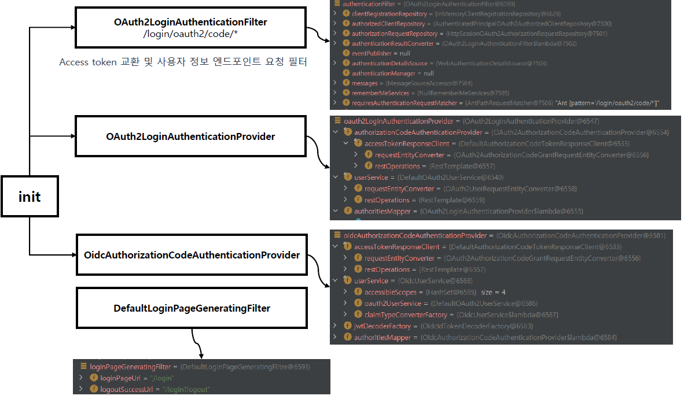
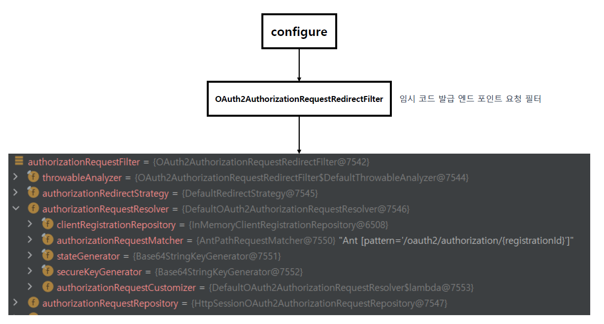
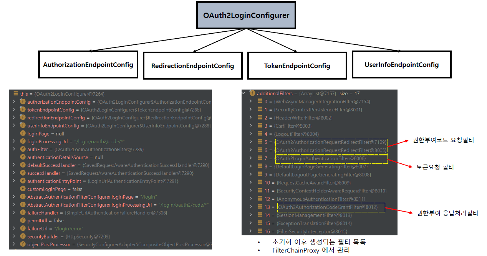

# Spring Security OAuth2 Client - OAuth2LoginConfigurer 초기화 이해

---

## 1. `oauth2Login(...)` 설정
```kotlin
@Configuration
class OAuth2ClientConfig {

    @Bean
    fun securityFilterChain(http: HttpSecurity): SecurityFilterChain {
        http {
            authorizeHttpRequests {
                authorize(anyRequest, authenticated)
            }
            oauth2Login {  }
        }
        return http.build()
    }
}
```
```java
	public HttpSecurity oauth2Login(Customizer<OAuth2LoginConfigurer<HttpSecurity>> oauth2LoginCustomizer)
			throws Exception {
		oauth2LoginCustomizer.customize(getOrApply(new OAuth2LoginConfigurer<>()));
		return HttpSecurity.this;
	}
```
- `oauth2Login(...)` api 를 통해 OAuth2LoginConfigurer 설정이 동작함
- 이후 HttpSecurity build 호출 시, `OAuth2LoginConfigurer` 의 내부 메서드 init, configure 에서
실질적인 보안 설정이 구성됨

---

## 2. OAuth2LoginConfigurer.init


이 메서드에서는 다음 요소들이 기본값 또는 커스텀 설정에 기반하여 구성된다.
- OAuth2LoginAuthenticationFilter : 인가서버를 통해 사용자 신원 정보를 가져와 사용자 인증 (로그인 처리)
    - 기본 Url: "/login/oauth2/code/*"
- OAuth2LoginAuthenticationProvider : code 를 기반으로 access token을 가져오고 이것으로 리소스 서버를 통해 사용자 정보를 가져옴
- OidcAuthorizationCodeAuthenticationProvider : code 를 기반으로 id token을 가져오고 이것으로 사용자 정보를 가져옴
- DefaultLoginPageGeneratingFilter : 기본 로그인 페이지를 만들어 반환

---

## 3. OAuth2LoginConfigurer.configure


이 메서드에서는 다음 요소들이 기본값 또는 커스텀 설정에 기반하여 구성된다.
- OAuth2AuthorizationRequestRedirectFilter
    - 임시 code 발급을 위한 필터
    - 클라이언트에게서 이 엔드포인트로 요청이 들어오면, code 발급을 위한 서비스 제공자 페이지로 리다이렉트 시킴
    - 동작 조건 : '/oauth2/authorization/{registrationId}'
- OAuth2LoginAuthenticationFilter
    - RedirectionEndPointConfig 설정에서 baseUri 설정이 되어있을 경우 로그인 처리 Uri를 이 값으로 지정한다.
    - 즉 `oauth2Login()` 설정에서 loginProcessingUri 설정을 하더라도 RedirectionEndPointConfig.baseUri 를 설정하면
      RedirectionEndPointConfig.baseUri 설정이 우선시되어 로그인 처리 Uri 설정이 지정된다.

---

## 4. OAuth2LoginConfigurer 내부에서 참조하는 설정


```java
public final class OAuth2LoginConfigurer<B extends HttpSecurityBuilder<B>>
		extends AbstractAuthenticationFilterConfigurer<B, OAuth2LoginConfigurer<B>, OAuth2LoginAuthenticationFilter> {

	private final AuthorizationEndpointConfig authorizationEndpointConfig = new AuthorizationEndpointConfig();
	private final TokenEndpointConfig tokenEndpointConfig = new TokenEndpointConfig();
	private final RedirectionEndpointConfig redirectionEndpointConfig = new RedirectionEndpointConfig();
	private final UserInfoEndpointConfig userInfoEndpointConfig = new UserInfoEndpointConfig();

	private String loginPage;
	private String loginProcessingUrl = OAuth2LoginAuthenticationFilter.DEFAULT_FILTER_PROCESSES_URI;

```
- `oauthLogin()` 에서 수행한 설정 내용들은 위의 6개 설정 값에 반영된다. 이 설정들을 기반으로 OAuth2 Login 아키텍처의 구성요소들이 설정된다.
- 즉 위의 init, configure 과정은 이 설정값을 기반으로 동작한다.
- 설정
    - AuthorizationEndpointConfig : 인가 서버의 권한 부여 엔드포인트 관련 설정
    - TokenEndpointConfig : 인가 서버의 토큰발급 엔드포인트 관련 설정
    - RedirectionEndpointConfig
        - baseUri: 로그인 처리 엔드포인트 (우선설정). loginProcessingUrl 보다 우선시된다.
    - UserInfoEndpointConfig : 인가 서버의 사용자 정보 엔드포인트
    - loginPage : 우리 서버의 로그인페이지
    - loginProcessingUrl: 우리 서버의 로그인 처리 엔드포인트

---
