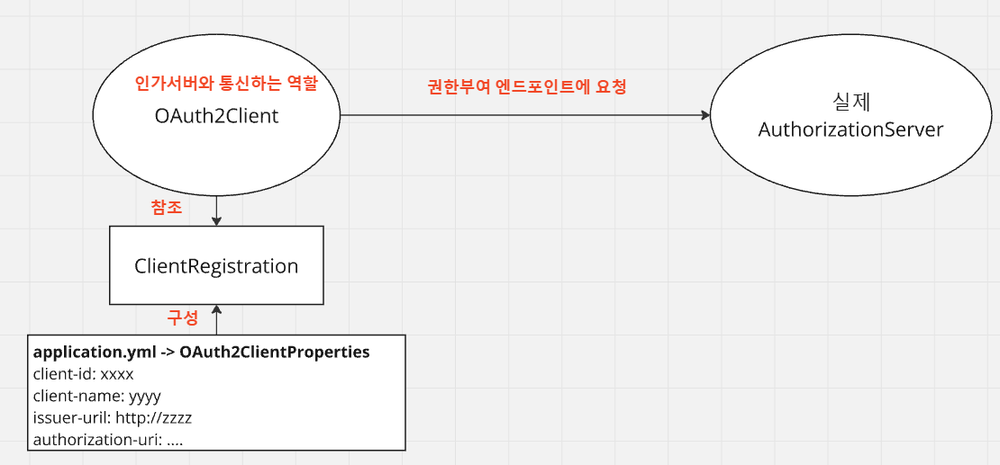

# Spring Security OAuth2 Client - application.yml 설정 및 OAuth2ClientProperties

---

### 개요


- 클라이언트가 인가서버로 권한 부여 요청을 하거나 토큰 요청을 할 경우 클라이언트 정보 및 엔드포인트 정보를 참조해서 전달해야한다.
- 정해진 규칙에 따라 설정을 작성해두면, 스프링은 설정값을 기반으로 OAuth2 인가서버와 통신하기 위해 사용할 클래스를 구성해준다.
- 설정 순서
  - application.yml 환경설정 파일에 클라이언트 설정과 인가서버 엔드포인트 등을 설정한다.
  - 스프링 컨테이너 초기화가 진행되면 `application.yml` 에 있는 클라이언트 및 엔드포인트 정보가 `OAuth2ClientProperties` 의 각 속성에 바인딩 된다.
  - `OAuth2ClientProperties` 에 바인딩 되어 있는 속성의 값은 인가서버로 권한부여 요청을 하기 위한 `ClientRegistration` 클래스의 필드에 저장된다
  - 실제 인가서버와 통신하기 위해 사용되는 역할 `OAuth2Client` 는 `ClientRegistration` 를 참조해서 권한부여 요청을 위한 매개변수를 구성하고 인가서버와 통신한다

---

### `application.yml`
```yaml
spring.application.name: spring-security-oauth2
spring:
  security:
    oauth2:
      client:
        # 클라이언트 설정
        registration:
          # OAuth2ClientProperties 의 내부 registration Map 의 key로 삽입된다.
          keycloak:
            # 서비스 공급자에 등록된 클라이언트 id
            clientId: oauth2-client-app
            # 서비스 공급자에 등록된 클라이언트 비밀번호
            clientSecret: 1tIeERcVJnWNmVZIEFA7Ao5YkTIbx83w
            # 클라이언트 이름
            clientName: oauth2-client-app
            # OAuth 2.0 권한부여 타입
            authorizationGrantType: authorization_code
            # 인가 서버에서 권한 코드 부여 후 클라이언트로 다시 리다이렉트 하는 위치
            redirectUri: http://localhost:3000/auth/login/oauth2/code
            # 인가 서버 token 발급 시 Client를 입증할 수단
            # client_secret_basic -> client_id:client_secret 값을 base64 인코딩한 값을 Authorization 헤더에 삽입하여 전달하는 방식
            # client_secret_post : 파라미터 방식
            # 그 외 none ...
            clientAuthenticationMethod: client_secret_basic
            # 토큰이 허가하는 유효범위
            scope: openid,profile,email
        # 서비스 제공자 설정
        provider:
          # OAuth2ClientProperties 의 내부 provider Map 의 key로 삽입된다.
          keycloak:
            # OpenID Connect 검색 엔드포인트 또는 RFC 8414에 정의된 OAuth 2.0 인증 서버 메타데이터 엔드포인트일 수 있는 URI 의 BaseUri
            # 공급자의 baseUri
            # 해당 Uri에 /.well-known/openid-configuration 를 붙여 검색 엔드포인트를 탐색하게 된다.
            issuerUri: http://localhost:8080/realms/oauth2
            # code를 발급받을 엔드포인트
            authorizationUri: http://localhost:8080/realms/oauth2/protocol/openid-connect/auth
            # token을 발급받을 엔드포인트
            tokenUri: http://localhost:8080/realms/oauth2/protocol/openid-connect/token
            # 클라이언트가 resource server에게 데이터를 요청할 때 access token 을 전달해야 하는데
            # 이 access token을 검증하기 위한 공개키를 얻기 위한 엔드포인트
            jwkSetUri: http://localhost:8080/realms/oauth2/protocol/openid-connect/certs
            # 사용자 정보를 발급받을 엔드포인트 uri
            userInfoUri: http://localhost:8080/realms/oauth2/protocol/openid-connect/userinfo
            # OAuth2 사용자명을 추출할 key (클레임명. keycloak 기준으로는 preferred_username)
            # profile 스코프가 있어야 이 key로 사용자 이름을 가져올 수 있음
            userNameAttribute: preferred_username
```
- 여기서 설정한 값들(`spring.security.oauth2.client.*`)은 OAuth2ClientProperties 객체에 바인딩된다.

---

### OAuth2ClientProperties
```java
@ConfigurationProperties(prefix = "spring.security.oauth2.client")
public class OAuth2ClientProperties implements InitializingBean {

	private final Map<String, Provider> provider = new HashMap<>();
	private final Map<String, Registration> registration = new HashMap<>();
```
- provider
  - 공급자 정보 Map
  - 공급자에서 제공되는 엔드포인트 등의 정보를 나타낸다.
  - 우리가 위에서 `spring.security.oauth2.client.provider.keyCloak` 이름으로 설정을 해뒀는데 이 keyCloak이 key가 되고 그 내부 프로퍼티는 Provider 객체에 바인딩된다.
- registration
  - 클라이언트 정보 Map
  - 인가서버에 등록된 클라이언트 및 요청 파라미터 정보들을 모아둔다.
  - 위에서 우리가 `spring.security.oauth2.client.registration.keyCloak` 이름으로 설정을 해뒀는데 이 keyCloak이 key가 되고 그 내부 프로퍼티는 Registration 객체에 바인딩된다.

---
