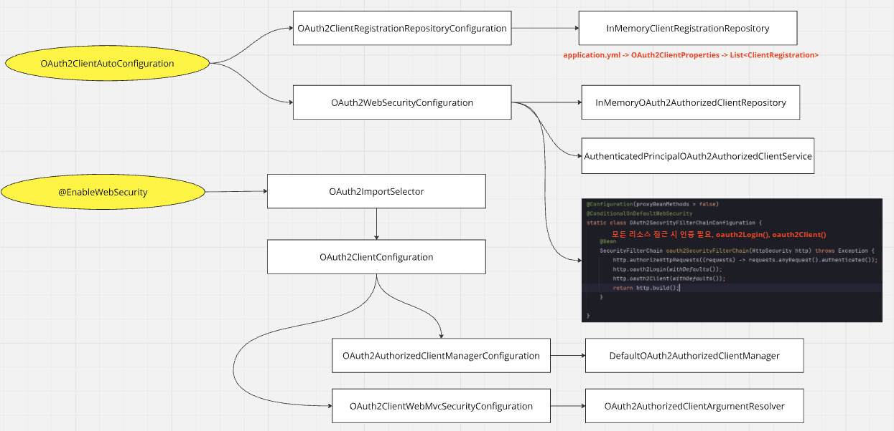

# Spring Security OAuth2 Client - 자동구성

---

## 결론부터


`spring-boot-starter-oauth2-client`가 등록되면 다음 설정이 기본 활성화된다.

- `ClientRegistrationRepository` : 클라이언트/서비스 제공자 정보가 모인 `ClientRegistration` 목록을 저장해둔 리포지토리
- `OAuth2AuthorizedClientService` : OAuth2AuthorizedClient 를 조회, 저장, 삭제하는 역할
- `OAuth2AuthorizedClientRepository` : OAuth2AuthorizedClientService 에게 위임
- 디폴트 `SecurityFilterChain`
  - 기본 OAuth2Login, OAuth2Client 설정이 포함됐고 모든 엔드포인트에 인증이 필요한 시큐리티 필터체인
  - 물론 개발자가 시큐리티 필터체인을 커스텀 등록하면 활성하되지 않는다.
- `OAuth2AuthorizedClientArgumentResolver` 가 만들어져 `ArgumentResolver` 목록에 추가

아래에서 서술할 내용들은 이것들이 어디서 등록됐는 지를 설명하는 내용들이다.

---

## 1. OAuth2ClientAutoConfiguration 에 의한 자동설정

### 1.1 `org.springframework.boot.autoconfigure.AutoConfiguration.imports`
```text
org.springframework.boot.autoconfigure.security.oauth2.client.servlet.OAuth2ClientAutoConfiguration
```
- 모든 스프링 부트 프로젝트는 spring-boot-autoconfigure 모듈 의존성을 가지는데 이곳에 가보면 여러가지 자동구성 클래스 등록이 되어있다.
- 여기서 OAuth2ClientAutoConfiguration 이 등록되어지는 것을 확인해볼 수 있다.

### 1.2 `OAuth2ClientAutoConfiguration`
```java
@AutoConfiguration(before = SecurityAutoConfiguration.class)
@ConditionalOnClass({ EnableWebSecurity.class, ClientRegistration.class })
@ConditionalOnWebApplication(type = ConditionalOnWebApplication.Type.SERVLET)
@Import({ OAuth2ClientRegistrationRepositoryConfiguration.class, OAuth2WebSecurityConfiguration.class })
public class OAuth2ClientAutoConfiguration {
}
```
- Spring OAuth2 Client 모듈이 의존성에 포함될 경우 클래스패스에 `ClientRegistration` 이 포함되어지게 되고
`OAuth2ClientAutoConfiguration` 자동구성이 활성화된다.
- 이 구성에는 다음 설정이 포함된다.
  - OAuth2ClientRegistrationRepositoryConfiguration
  - OAuth2WebSecurityConfiguration

### 1.3 `OAuth2ClientRegistrationRepositoryConfiguration`
```java
@Configuration(proxyBeanMethods = false)
@EnableConfigurationProperties(OAuth2ClientProperties.class)
@Conditional(ClientsConfiguredCondition.class)
class OAuth2ClientRegistrationRepositoryConfiguration {

	@Bean
	@ConditionalOnMissingBean(ClientRegistrationRepository.class)
	InMemoryClientRegistrationRepository clientRegistrationRepository(OAuth2ClientProperties properties) {
		List<ClientRegistration> registrations = new ArrayList<>(
				new OAuth2ClientPropertiesMapper(properties).asClientRegistrations().values());
		return new InMemoryClientRegistrationRepository(registrations);
	}

}
```
- 별도로 `ClientRegistrationRepository` 빈을 등록하지 않았다면 설정파일(application.yml)을 기반으로
OAuth2ClientProperties 설정값 클래스를 구성하고 이를 사용하여 `ClientRegistrationRepository` 를 빈으로 등록한다.

### 1.4 `OAuth2WebSecurityConfiguration`
```java
@Configuration(proxyBeanMethods = false)
@ConditionalOnBean(ClientRegistrationRepository.class)
class OAuth2WebSecurityConfiguration {

	@Bean
	@ConditionalOnMissingBean
	OAuth2AuthorizedClientService authorizedClientService(ClientRegistrationRepository clientRegistrationRepository) {
		return new InMemoryOAuth2AuthorizedClientService(clientRegistrationRepository);
	}

	@Bean
	@ConditionalOnMissingBean
	OAuth2AuthorizedClientRepository authorizedClientRepository(OAuth2AuthorizedClientService authorizedClientService) {
		return new AuthenticatedPrincipalOAuth2AuthorizedClientRepository(authorizedClientService);
	}

	@Configuration(proxyBeanMethods = false)
	@ConditionalOnDefaultWebSecurity
	static class OAuth2SecurityFilterChainConfiguration {

		@Bean
		SecurityFilterChain oauth2SecurityFilterChain(HttpSecurity http) throws Exception {
			http.authorizeHttpRequests((requests) -> requests.anyRequest().authenticated());
			http.oauth2Login(withDefaults());
			http.oauth2Client(withDefaults());
			return http.build();
		}

	}

}
```
- 다음 빈들을 등록하지 않았다면 각각 자동으로 빈이 등록된다.
  - `OAuth2AuthorizedClientService` : `OAuth2AuthorizedClient` 를 조회, 저장, 삭제하는 역할
      - InMemoryOAuth2AuthorizedClientService 구현체가 지정된다.
  - `OAuth2AuthorizedClientRepository` : `OAuth2AuthorizedClientService`에게 위임
      - AuthenticatedPrincipalOAuth2AuthorizedClientRepository 구현체가 지정된다
  - **SecurityFilterChain**
      - 모든 엔드포인트에 인증이 필요
      - `oAuth2Login` api 기본 설정, `oAuth2Client` api 기본 설정이 포함

---

## 2. OAuth2ImportSelector 에 의한 설정

### 2.1 EnableWebSecurity
```java
@Retention(RetentionPolicy.RUNTIME)
@Target(ElementType.TYPE)
@Documented
@Import({ WebSecurityConfiguration.class, SpringWebMvcImportSelector.class, OAuth2ImportSelector.class,
		HttpSecurityConfiguration.class })
@EnableGlobalAuthentication
public @interface EnableWebSecurity {
```
- 또 spring-boot-starter-security 등록 시 기본으로 활성화되는 `@EnableWebSecurity` 에는 `OAuth2ImportSelector` 가 포함되어 있다.

### 2.2 OAuth2ImportSelector
```java
final class OAuth2ImportSelector implements ImportSelector {

	@Override
	public String[] selectImports(AnnotationMetadata importingClassMetadata) {
		Set<String> imports = new LinkedHashSet<>();
		ClassLoader classLoader = getClass().getClassLoader();
        
        // 생략
        
		boolean oauth2ClientPresent = ClassUtils
			.isPresent("org.springframework.security.oauth2.client.registration.ClientRegistration", classLoader);

		if (oauth2ClientPresent) {
			imports.add("org.springframework.security.config.annotation.web.configuration.OAuth2ClientConfiguration");
		}
        
        // 생략
		return StringUtils.toStringArray(imports);
	}
}
```
- ClientRegistration 가 클래스패스에 포함되어 있을 경우, OAuth2ClientConfiguration 설정이 import 된다.

### 2.3 `OAuth2ClientConfiguration`
```java
@Import({ OAuth2ClientConfiguration.OAuth2ClientWebMvcImportSelector.class,
		OAuth2ClientConfiguration.OAuth2AuthorizedClientManagerConfiguration.class })
final class OAuth2ClientConfiguration {
```
- 이 설정에서는 내부 클래스 `OAuth2AuthorizedClientManagerConfiguration.class` 설정과
`OAuth2ClientWebMvcImportSelector.class` 설정과 설정이 포함된다.

### 2.4 `OAuth2AuthorizedClientManagerConfiguration`에 의한 설정
```java
@Configuration(proxyBeanMethods = false)
static class OAuth2AuthorizedClientManagerConfiguration {
    @Bean(name = OAuth2AuthorizedClientManagerRegistrar.BEAN_NAME)
    OAuth2AuthorizedClientManagerRegistrar authorizedClientManagerRegistrar() {
        return new OAuth2AuthorizedClientManagerRegistrar();
    }
}
```
- OAuth2AuthorizedClientManagerRegistrar 를 빈으로 등록한다.
- 이 클래스는 아래 설정에서 OAuth2AuthorizedClientManager 빈이 존재하지 않을 경우 기본 OAuth2AuthorizedClientManager 를 만들어 반환하는 것을 목적으로 
만들어졌다.

### 2.5 `OAuth2ClientWebMvcImportSelector`에 의한 설정
```java
	static class OAuth2ClientWebMvcImportSelector implements ImportSelector {

		@Override
		public String[] selectImports(AnnotationMetadata importingClassMetadata) {
			if (!webMvcPresent) {
				return new String[0];
			}
			return new String[] {
					OAuth2ClientConfiguration.class.getName() + ".OAuth2ClientWebMvcSecurityConfiguration" };
		}

	}
```
- spring web mvc가 포함되어 있을 경우 내부 클래스 `OAuth2ClientConfiguration.OAuth2ClientWebMvcSecurityConfiguration` 설정이
활성화된다.

```java

	@Configuration(proxyBeanMethods = false)
	static class OAuth2ClientWebMvcSecurityConfiguration implements WebMvcConfigurer {

		private OAuth2AuthorizedClientManager authorizedClientManager;

		private SecurityContextHolderStrategy securityContextHolderStrategy;

		private OAuth2AuthorizedClientManagerRegistrar authorizedClientManagerRegistrar;

		@Override
		public void addArgumentResolvers(List<HandlerMethodArgumentResolver> argumentResolvers) {
			OAuth2AuthorizedClientManager authorizedClientManager = getAuthorizedClientManager();
			if (authorizedClientManager != null) {
				OAuth2AuthorizedClientArgumentResolver resolver = new OAuth2AuthorizedClientArgumentResolver(
						authorizedClientManager);
				if (this.securityContextHolderStrategy != null) {
					resolver.setSecurityContextHolderStrategy(this.securityContextHolderStrategy);
				}
				argumentResolvers.add(resolver);
			}
		}

		@Autowired(required = false)
		void setAuthorizedClientManager(List<OAuth2AuthorizedClientManager> authorizedClientManagers) {
			if (authorizedClientManagers.size() == 1) {
				this.authorizedClientManager = authorizedClientManagers.get(0);
			}
		}

		@Autowired(required = false)
		void setSecurityContextHolderStrategy(SecurityContextHolderStrategy strategy) {
			this.securityContextHolderStrategy = strategy;
		}

		@Autowired
		void setAuthorizedClientManagerRegistrar(
				OAuth2AuthorizedClientManagerRegistrar authorizedClientManagerRegistrar) {
			this.authorizedClientManagerRegistrar = authorizedClientManagerRegistrar;
		}

		private OAuth2AuthorizedClientManager getAuthorizedClientManager() {
			if (this.authorizedClientManager != null) {
				return this.authorizedClientManager;
			}
			return this.authorizedClientManagerRegistrar.getAuthorizedClientManagerIfAvailable();
		}

	}
```
- WebMvcConfigurer 설정 클래스인데, `OAuth2AuthorizedClientArgumentResolver`를 MVC의 ArgumentResolver 목록에 등록하기 위해 존재한다.
- 설정 과정
  - `OAuth2AuthorizedClientManager` 를 준비한다.
    - `OAuth2AuthorizedClientManager` 빈을 목록으로 주입받고 그들중 0번째 매니저를 설정한다.
    - `OAuth2AuthorizedClientManager` 빈이 없으면 위에서 설정한 `authorizedClientManagerRegistrar` 를 이용해 `AuthorizedClientManager`를
      생성하여 디폴트 설정한다.
  - `SecurityContextHolderStrategy` 빈이 존재하면 이것을 사용하도록 한다. (SecurityContextHolderStrategy 를 빈으로 등록하지 않았으면 내부적으로 ThreadLocalSecurityContextHolderStrategy 를 사용할 것이다)
  - `OAuth2AuthorizedClientArgumentResolver`를 구성하여 ArgumentResolver 목록에 등록한다.

---
