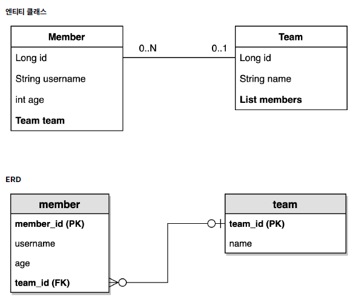

# Querydsl 예제 도메인 모델

---

### 예제 도메인 모델 관계도


- 하나의 팀에는 0개 또는 1개 이상의 회원이 소속된다.
- 하나의 회원은 0개 또는 하나의 Team 에 속해진다.

---

### Member
```kotlin
@Entity
class Member
internal constructor(
    @Id
    @GeneratedValue(strategy = GenerationType.IDENTITY)
    @Column(name = "member_id")
    var id: Long? = null,

    var username: String,

    var age: Int,

    @ManyToOne(fetch = FetchType.LAZY)
    @JoinColumn(name = "team_id")
    var team: Team?
) {

    companion object {

        fun create(
            username: String,
            age: Int = 0,
            team: Team? = null
        ): Member {
            val member = Member(username = username, age = age, team = null)
            if (team != null) {
                member.changeTeam(team)
            }
            return member
        }
    }

    fun changeTeam(team: Team) {
        this.team = team
        team.members.add(this)
    }

    override fun toString(): String {
        return "Member(id=$id, username='$username', age=$age)"
    }
}
```
- 생성: create 메서드
- 메서드
  - changeTeam : Team 을 변경하면서, 반대쪽 팀에 자기 자신을 추가한다.

---

### Team
```kotlin

@Entity
class Team(
    @Id
    @GeneratedValue(strategy = GenerationType.IDENTITY)
    @Column(name = "team_id")
    val id: Long? = null,
    val name: String,

    @OneToMany(mappedBy = "team")
    val members: MutableList<Member> = mutableListOf()
) {

    companion object {

        fun create(name: String): Team {
            return Team(name = name)
        }
    }

    override fun toString(): String = "Team(id=$id, name='$name')"
}
```
- 생성 : create 메서드

---

### 실행 테스트
```kotlin
@SpringBootTest
@Transactional
class MemberTest @Autowired constructor(
    private val em: EntityManager
) {

    @Test
    fun testEntity() {
        val teamA = Team.create("teamA")
        val teamB = Team.create("teamB")
        em.persist(teamA)
        em.persist(teamB)

        val memberA = Member.create("memberA", 10, teamA)
        val memberB = Member.create("memberB", 20, teamA)
        val memberC = Member.create("memberC", 30, teamB)
        val memberD = Member.create("memberD", 40, teamB)

        em.persist(memberA)
        em.persist(memberB)
        em.persist(memberC)
        em.persist(memberD)

        // 초기화
        em.flush()
        em.clear()

        val members = em.createQuery("SELECT m FROM Member m", Member::class.java)
            .resultList

        for (member in members) {
            println("member = $member")
            println("-> member.team=${member.team}") // 지연로딩 동작 확인
        }
    }
}
```

---
