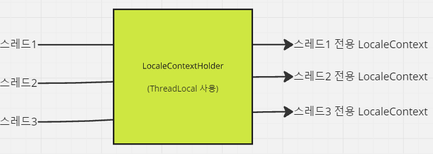
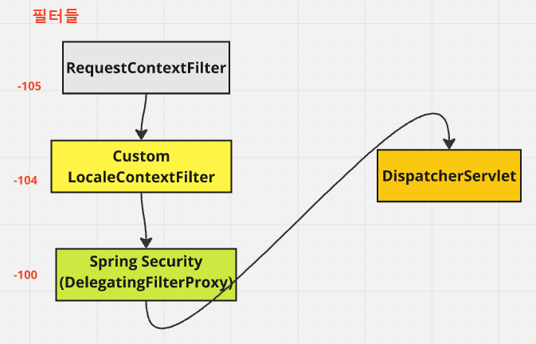

# 로케일 - LocaleContext, LocaleResolver

---

### 로케일을 고려해야하는 이유
서비스가 한국 내에서만 서비스되는 것을 넘어서 일본,미국,중국 등 여러 국가에서 서비스 된다면 다국어에 대해  
확장성 있는 애플리케이션을 개발해야한다.

---

### Locale
- `java.util.Locale`
- 자바에서는 표준 클래스로 Locale 클래스를 제공한다.
- 로케일에 대한 표준 클래스로 Locale 이 사용되는구나, 정도만 이해하면 된다.
- 스프링에서도 `java.util.Locale` 을 사용하여 로케일 기능을 지원한다.

---

### 로케일 컨텍스트(LocaleContext)
```java
package org.springframework.context.i18n;
import java.util.Locale;

public interface LocaleContext {
	Locale getLocale();
}
```
- 스프링에서는 사용자의 로케일을 획득하고, 저장하여 관리하기 위해 LocaleContext 라는 개념을 통해 로케일을 감싸서 관리한다.
- 결국 LocaleContext 는 Locale 을 래핑하기 위한 보관함이라고 생각하면 된다.

---

### 로케일 컨텍스트 홀더(LocaleContextHolder)


```java
package org.springframework.context.i18n;

public final class LocaleContextHolder {

	private static final ThreadLocal<LocaleContext> localeContextHolder =
			new NamedThreadLocal<>("LocaleContext");

	private static final ThreadLocal<LocaleContext> inheritableLocaleContextHolder =
			new NamedInheritableThreadLocal<>("LocaleContext");
```
- LocaleContextHolder 는 스프링에서 제공하는 LocaleContext 저장소이다.
- 현재 요청 사용자의 로케일을 요청 내에서 전역적으로 LocaleContextHolder 를 통해 저장/수정/삭제/변경할 수 있다.
- 작동 원리: ThreadLocal 저장소에 로케일을 저장한다.
  - ThreadLocal 은 스레드마다 할당된 고유한 저장공간이다. 같은 스레드 내에서라면, ThreadLocal 을 통해 원하는 데이터를 저장/수정/삭제/조회 할 수 있다.
  - 서블릿 요청은 스레드 하나마다 할당되므로 요청 하나에 대해 유효한 저장 공간이라 생각하면 된다.
- 데이터 저장 시 inheritable 속성을 true로 할 경우, 파생된 스레드에서도 공유할 수 있게 할 수 있다.(InheritableLocaleContextHolder)
  - inheritable 속성을 주지 않을 경우 부모 스레드에서 파생된 스레드에서 해당 속성을 사용할 수 없다.

----

### LocaleResolver
```java
package org.springframework.web.servlet;

public interface LocaleResolver {
	Locale resolveLocale(HttpServletRequest request);
	void setLocale(HttpServletRequest request, @Nullable HttpServletResponse response, @Nullable Locale locale);
}
```
스프링에서 제공하는 웹 기반 로케일 정보 획득 전략 인터페이스
- 웹 요청을 통해 사용자의 로케일을 획득(resolveLocale)
- 웹 요청, 응답을 통해 로케일을 변경(setLocale)

```java
@Override
@Bean
@ConditionalOnMissingBean(name = DispatcherServlet.LOCALE_RESOLVER_BEAN_NAME)
public LocaleResolver localeResolver() {
    if (this.webProperties.getLocaleResolver() == WebProperties.LocaleResolver.FIXED) {
        return new FixedLocaleResolver(this.webProperties.getLocale());
    }
    AcceptHeaderLocaleResolver localeResolver = new AcceptHeaderLocaleResolver();
    localeResolver.setDefaultLocale(this.webProperties.getLocale());
    return localeResolver;
}
```
```java
@ConfigurationProperties("spring.web")
public class WebProperties {
    private Locale locale;
```
LocaleResolver 의 기본 구현체(별도로 빈을 등록하지 않을 때)는 AcceptHeaderLocaleResolver 이다. (`WebMvcAutoConfiguration` 참고) 
- Accept-Lanaguage 헤더를 통해 가장 우선도가 높은 로케일을 획득한다.
- 디폴트 로케일 값을 설정할 수 있는데 'WebProperties' 라는 프로퍼티 클래스의 locale 을 사용한다.
- WebProperties 클래스는 스프링의 웹 설정 프로퍼티 클래스인데 여기에 `spring.web.locale`값이 기본 로케일이 바인딩된다.
  - `spring.web.locale=ko` 로 설정하면 한국어를 기본 로케일로 설정할 수 있다.
```java
	@Override
	public Locale resolveLocale(HttpServletRequest request) {
		Locale defaultLocale = getDefaultLocale();
		if (defaultLocale != null && request.getHeader("Accept-Language") == null) {
			return defaultLocale;
		}
		Locale requestLocale = request.getLocale();
		List<Locale> supportedLocales = getSupportedLocales();
		if (supportedLocales.isEmpty() || supportedLocales.contains(requestLocale)) {
			return requestLocale;
		}
		Locale supportedLocale = findSupportedLocale(request, supportedLocales);
		if (supportedLocale != null) {
			return supportedLocale;
		}
		return (defaultLocale != null ? defaultLocale : requestLocale);
	}
```
실제 resolveLocale 메서드 구현을 보자.
- Accept-Language 헤더가 없으면 디폴트 로케일 설정값을 획득한다.
- Accept-Language 헤더가 있으면 Accept-Language 헤더값을 가져와서 이를 토대로 로케일을 반환한다.

---

### 로케일이 설정되는 지점
스프링은 사용자의 요청이 들어왔을 때 로케일을 획득하고 LocaleContextHolder 에 저장한다. 이 작업은 두 군데에서 이루어지는데 하나는
`RequestContextFilter` 이고 또 하나는 `DispatcherServlet` 이다.

```java
    protected void doFilterInternal(HttpServletRequest request, HttpServletResponse response, FilterChain filterChain) throws ServletException, IOException {
        ServletRequestAttributes attributes = new ServletRequestAttributes(request, response);
        this.initContextHolders(request, attributes);
        try {
            filterChain.doFilter(request, response);
        } finally {
            this.resetContextHolders();
            if (this.logger.isTraceEnabled()) {
                this.logger.trace("Cleared thread-bound request context: " + request);
            }
            attributes.requestCompleted();
        }
    }
    private void initContextHolders(HttpServletRequest request, ServletRequestAttributes requestAttributes) {
        LocaleContextHolder.setLocale(request.getLocale(), this.threadContextInheritable);
        RequestContextHolder.setRequestAttributes(requestAttributes, this.threadContextInheritable);
        if (this.logger.isTraceEnabled()) {
            this.logger.trace("Bound request context to thread: " + request);
        }
    }
```
- RequestContextFilter 에서는 요청객체를 통해 getLocale 을 호출하고 이를 LocaleContextHolder 에 저장한다.
- 문제는 HttpServletRequest 를 통해 로케일을 획득한다는 점인데, 실제 구현체에서 어떤 식으로 코드가 구현되어 있는지 따지기 어렵다.
실제로 요청 객체의 구현체는 여러 래핑 클래스들로 래핑-래핑되어 있는데 이걸 따라서 실제로 어떤 방식으로 로케일을 획득하는 지 불분명하다.
- 결국 RequestContextFilter 에서 설정된 로케일은 어떤 로케일이 설정되는 지 확실하지 않다.

```java
	protected final void processRequest(HttpServletRequest request, HttpServletResponse response)
        throws ServletException, IOException {

    LocaleContext previousLocaleContext = LocaleContextHolder.getLocaleContext();
    LocaleContext localeContext = buildLocaleContext(request);

    initContextHolders(request, localeContext, requestAttributes);

    try {
        doService(request, response);
    }
    // 생략
}
```
- DispatcherServlet 의 부모 클래스인 FrameworkServlet 의 코드를 보면 doService 실행 직전 LocaleContext 설정이 일어난다.
- 기존 LocaleContext 를 획득하고, buildLocaleContext 를 통해 다시 로케일 정보를 획득할 기회를 얻는다.

```java
	@Override
	protected LocaleContext buildLocaleContext(final HttpServletRequest request) {
		LocaleResolver lr = this.localeResolver;
		if (lr instanceof LocaleContextResolver localeContextResolver) {
			return localeContextResolver.resolveLocaleContext(request);
		}
		else {
			return () -> (lr != null ? lr.resolveLocale(request) : request.getLocale());
		}
	}
```
- buildLocaleContext 는 자식인 DispatcherServlet 에서 오버라이드되어 있는데 여기서 LocaleResolver 를 통해 로케일을 얻어온다.

```java
	private void initContextHolders(HttpServletRequest request,
			@Nullable LocaleContext localeContext, @Nullable RequestAttributes requestAttributes) {

		if (localeContext != null) {
			LocaleContextHolder.setLocaleContext(localeContext, this.threadContextInheritable);
		}
		if (requestAttributes != null) {
			RequestContextHolder.setRequestAttributes(requestAttributes, this.threadContextInheritable);
		}
	}
```
- initContextHolders 에서 위를 통해 얻어진 새로운 로케일 값을 LocaleContextHolder 에 저장한다.

---

### 스프링 시큐리티쪽에서 발생할 여지가 있는 문제
- DispatcherServlet 이후에서는 LocaleContextHolder 를 통해 로케일을 얻으면 `Accept-Language > 기본값` 순서대로 우선순위가 잡힌
로케일을 획득할 수 있다.
- 하지만 DispatcherServlet 앞에서는 RequestContextFilter 에서, 요청 객체 기반 Locale 설정이 이루어지기 때문에 로케일이 불분명하다.
- DispatcherServlet 앞에 위치한 스프링 시큐리티에서 로케일이 필요할 경우, LocaleContextHolder 를 통해 얻어진 로케일은 LocaleResolver 를
통해 얻어온 로케일이 아니다. 즉 `Accept-Language > 기본값` 흐름을 따르지 않는다.
- 스프링 시큐리티쪽에서 Accept-Language 헤더에 기반해 사용자 로케일을 획득할 수 있도록 하려면 필터를 추가적으로 만들어야한다.

---

### 스프링 시큐리티쪽에서도 LocaleResolver 기반 로케일을 사용할 수 있게 하기
```java
@Bean
@ConditionalOnMissingBean({ RequestContextListener.class, RequestContextFilter.class })
@ConditionalOnMissingFilterBean(RequestContextFilter.class)
public static RequestContextFilter requestContextFilter() {
    return new OrderedRequestContextFilter();
}
```
```java
public class OrderedRequestContextFilter extends RequestContextFilter implements OrderedFilter {
    private int order = -105;

    public OrderedRequestContextFilter() {
    }

    public int getOrder() {
        return this.order;
    }

    public void setOrder(int order) {
        this.order = order;
    }
}
```
- SpringBootWebSecurityConfiguration 에서는 RequestContextFilter 설정이 일어나는데, 이 필터의 순서값은 -105 이다.

```java
// SecurityFilterAutoConfiguration
@Bean
@ConditionalOnBean(
    name = {"springSecurityFilterChain"}
)
public DelegatingFilterProxyRegistrationBean securityFilterChainRegistration(SecurityProperties securityProperties) {
    DelegatingFilterProxyRegistrationBean registration = new DelegatingFilterProxyRegistrationBean("springSecurityFilterChain", new ServletRegistrationBean[0]);
    registration.setOrder(securityProperties.getFilter().getOrder());
    registration.setDispatcherTypes(this.getDispatcherTypes(securityProperties));
    return registration;
}
```
```java
@ConfigurationProperties(prefix = "spring.security")
public class SecurityProperties {

	public static final int DEFAULT_FILTER_ORDER = OrderedFilter.REQUEST_WRAPPER_FILTER_MAX_ORDER - 100;
	private final Filter filter = new Filter();

	private final User user = new User();

	public User getUser() {
		return this.user;
	}

	public Filter getFilter() {
		return this.filter;
	}

	public static class Filter {
		private int order = DEFAULT_FILTER_ORDER;
```
- 스프링 시큐리티의 시작점인 DelegatingFilterProxy 필터는 -100 의 우선순위를 가진다.



```kotlin
class CustomLocaleContextFilter(
    private val localeResolver: LocaleResolver
) : OncePerRequestFilter() {

    companion object {
        private val log = getLogger(CustomLocaleContextFilter::class.java)
    }

    override fun doFilterInternal(
        request: HttpServletRequest,
        response: HttpServletResponse,
        filterChain: FilterChain
    ) {
        log.info { "필터 이전 로케일 = ${LocaleContextHolder.getLocale()}" }
        val locale = localeResolver.resolveLocale(request)
        LocaleContextHolder.setLocale(locale)

        log.info { "필터 이후 로케일 = $locale" }

        try {
            filterChain.doFilter(request, response)
        } finally {
            LocaleContextHolder.resetLocaleContext()
        }
    }
}
```
```kotlin
@Configuration
class LocaleConfig {

    companion object {
        private const val LOCALE_FILTER_ORDER = -104
    }

    @Bean
    fun customFilterRegistration(localeResolver: LocaleResolver): FilterRegistrationBean<CustomLocaleContextFilter> {
        val registration = FilterRegistrationBean<CustomLocaleContextFilter>()
        registration.filter = CustomLocaleContextFilter(localeResolver)
        registration.order = LOCALE_FILTER_ORDER

        return registration
    }
}
```
- 커스텀 로케일 설정 필터를 만들고, LocaleResolver 를 통해 로케일을 얻어와 LocaleContextHolder에 설정하는 코드를 두자.
- 커스텀 로케일 설정필터의 순서를 -105 와 -100 사이에 둬서 등록하면 된다. 나의 경우 -104를 뒀다.
- 스프링 시큐리티에 온 시점에서는 LocaleResolver 를 통해 Accept-Lanauge 헤더 또는 디폴트 설정값 로케일이 잘 적용된 상태가 될 것이다.

```bash
CustomLocaleContextFilter    : 필터 이전 로케일 = en
CustomLocaleContextFilter    : 필터 이후 로케일 = ko
```
- 실제로 테스트코드를 실행해봤을 때 이 필터 전 후로 로케일 값이 다르게 출력된다. 효과가 있었다는 뜻.

---
