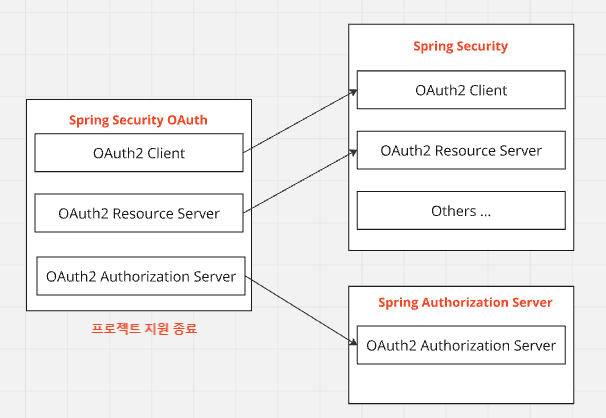

# 스프링의 OAuth2 관련 프로젝트들

#### 스프링 프로젝트 관계

- <a href="https://spring.io/projects/spring-security" target="_blank">Spring Security</a>
  - 스프링 기반 애플리케이션을 보호하기 위한 표준
  - 인증, 권한부여 기능 제공
  - 여기에는 OAuth2 Client, OAuth2 Resource Server 가 포함된다.
- <a href="https://spring.io/projects/spring-authorization-server" target="_blank">Spring Authorization Server</a>
  - 본래 Spring Security OAuth Project에 포함되어 있었으나, 프로젝트 유지보수 수명이 끝남
  - Client/Resource Server 는 시큐리티 프로젝트로 분리됨
  - OAuth2 Authorization Server 에 해당하는 프로젝트는 이곳으로 분리됨
  - 동작은 Spring Security 에 기반함

---

#### OAuth2 Client 모듈
- OAuth 2.0 인가 프레임워크의 역할 중, '클라이언트'의 기능을 필터 기반으로 구현한 모듈
- 클라이언트의 역할?
  - 인가서버 및 리소스 서버와의 통신을 담당
  - 제일 많이 사용되는 authorization_code grant_type 방식 기준, 소셜 서비스(Google, Kakao, ...)의 인가서버와 통신하여 최종사용자(리소스 소유자)에 대한 권한 부여를 허가받고, 소셜 서비스측의 리소스 서버와 통신하여(또는 oidc 기준 리소스 서버와 통신 없이 id 토큰에 포함된 사용자 정보를 기반으로)
  최종사용자(리소스 소유자)의 정보를 대신하여 얻어올 수 있음. 

---

#### OAuth2 Resource Server 모듈
- OAuth2 2.0 인가 프레임워크의 역할 중, '리소스 서버'의 기능을 필터 기반으로 구현한 모듈
- 실제 리소스 소유자가 보유한 리소스가 위치해 있음
- 클라이언트의 접근을 제한하는 인가 정책을 설정할 수 있고, 인가서버에서 발급한 액세스 토큰의 유효성을 검증하고
접근 범위에 따라 적절한 자원을 제공할 수 있도록 설정할 수 있다.

---

#### OAuth2 Authorization Server
- OAuth 2.0 인가 프레임워크의 역할 중, '인가 서버'의 기능을 필터 기반으로 구현한 모듈
- 인증을 통해 자격 증명을 제공하여 리소스 서버에 접근할 수 있도록 지원

---
